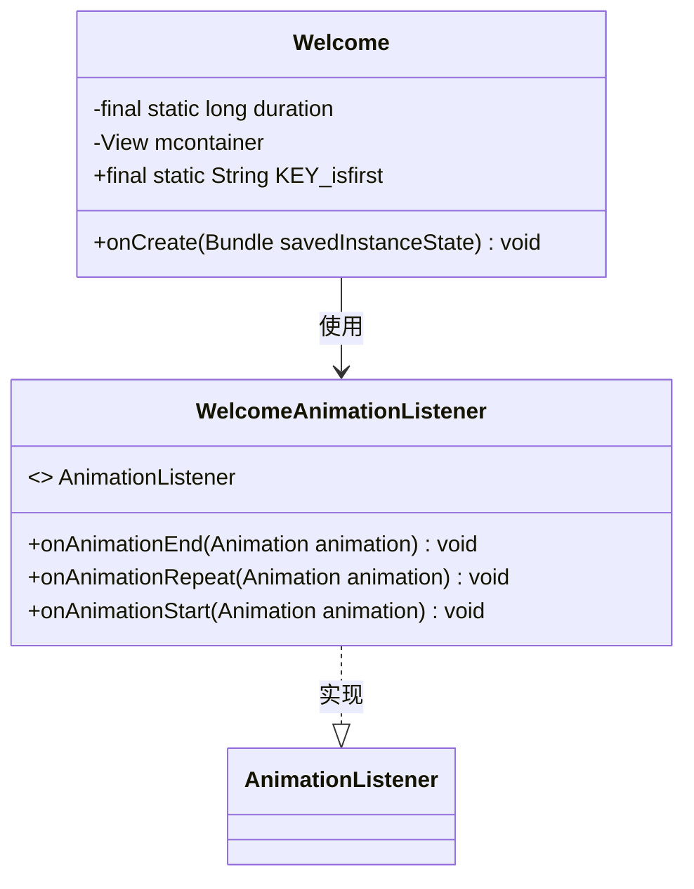
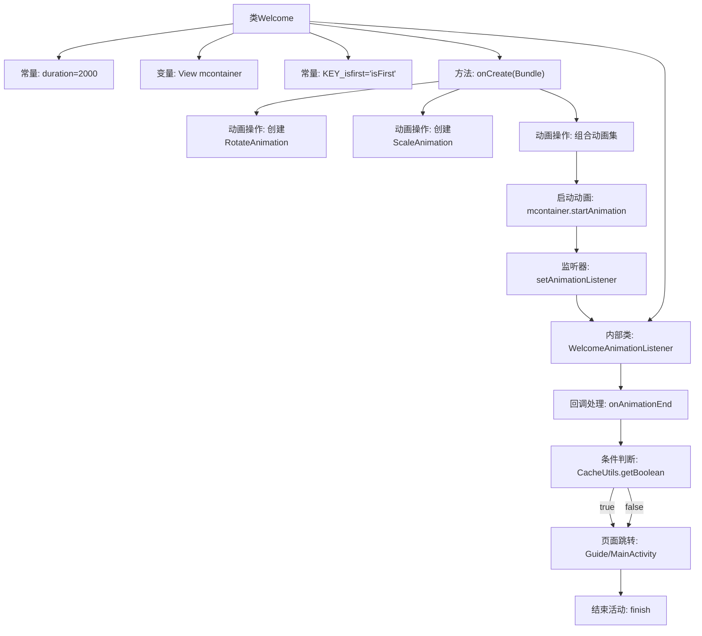

# 基础信息

|      |      |
|------|------|
| 名称 | Welcome |
| 编码语言 | .java |
| 代码路径 | happycat/src/com/happycat/Welcome.java |
| 包名 | com.happycat |
| 依赖项 | ['com.example.happucat.R', 'com.happycat.util.CacheUtils', 'android.os.Bundle', 'android.app.Activity', 'android.content.Intent', 'android.view.View', 'android.view.Window', 'android.view.animation.Animation', 'android.view.animation.Animation.AnimationListener', 'android.view.animation.AnimationSet', 'android.view.animation.RotateAnimation', 'android.view.animation.ScaleAnimation'] |
| 概述说明 | 欢迎页Activity类，含旋转缩放动画，首次登录跳引导页，否则进主页。 |

# 说明

这是一个欢迎页面的Activity实现，包含一个持续2000毫秒的组合动画效果。动画由旋转和缩放两部分组成，均以视图中心为轴心。页面首次启动时会检查是否为第一次登录，若是则跳转至引导页Guide，否则跳转至主页面MainActivity。动画结束后自动关闭当前页面。关键变量包括动画时长duration和首次登录标记KEY_isfirst。

# 类列表 Class Summary

| 名称   | 类型  | 说明 |
|-------|------|-------------|
| Welcome | class | 欢迎页Activity类，含旋转缩放动画，首次登录跳转引导页，否则进主页。动画时长2秒，监听动画结束执行跳转。 |

## 类 Welcome

|      |      |
|------|------|
| 访问范围 | public |
| 类型 | class |
| 名称 | Welcome |
| 说明 | 欢迎页Activity类，含旋转缩放动画，首次登录跳转引导页，否则进主页。动画时长2秒，监听动画结束执行跳转。 |

### UML类图

类图描述：
该图展示了Android中Welcome活动类及其内部动画监听器的结构。Welcome类继承自Activity，包含持续时间常量、视图容器和首次登录标记，主要处理欢迎页面的创建与动画效果。WelcomeAnimationListener实现了AnimationListener接口，用于处理动画事件，根据是否首次登录决定跳转到引导页或主页。两者通过依赖关系关联，体现了Android中活动与动画监听器的典型交互模式。

### 内部方法调用关系图

这段代码是Android平台的一个欢迎页Activity实现，主要功能是展示2秒的组合动画（旋转+缩放）后，根据是否首次启动跳转到不同页面。流程图清晰展示了从初始化视图、创建动画、设置监听器到最终页面跳转的完整流程，其中关键路径包括动画组合、监听器回调处理和条件跳转逻辑。代码通过CacheUtils判断应用首次启动状态，分别导向引导页或主页，最后销毁当前Activity。

### 字段列表 Field List

| 名称  | 类型  | 说明 |
|-------|-------|------|
| mcontainer | View | 私有视图容器变量mcontainer |
| duration = 2000 | long | 定义了一个私有静态长整型常量duration，值为2000。 |
| KEY_isfirst="isFirst" | String | 静态常量字符串KEY_isfirst，值为"isFirst"。 |

### 方法列表

| 名称  | 类型  | 说明 |
|-------|-------|------|
| onCreate | void | Android Activity创建时去除标题并设置旋转缩放动画组合，监听动画状态。 |

