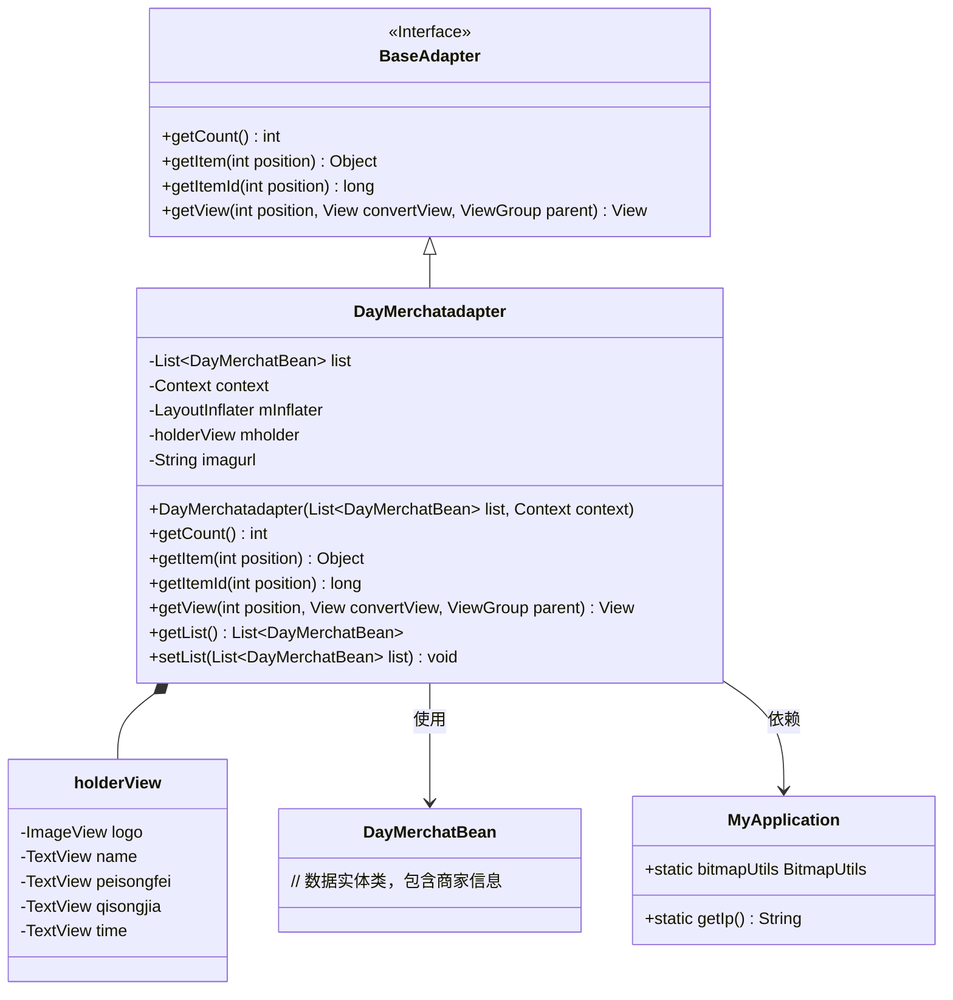
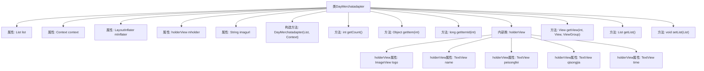

# 基础信息

|      |      |
|------|------|
| 名称 | DayMerchatadapter |
| 编码语言 | .java |
| 代码路径 | happycat/src/com/happycat/adapter/DayMerchatadapter.java |
| 包名 | com.happycat.adapter |
| 依赖项 | ['java.util.List', 'com.example.happucat.R', 'com.happycat.Bean.DayMerchatBean', 'com.happycat.Bean.Goods', 'com.happycat.util.MyApplication', 'android.R.integer', 'android.content.Context', 'android.util.Log', 'android.view.LayoutInflater', 'android.view.View', 'android.view.ViewGroup', 'android.widget.BaseAdapter', 'android.widget.ImageView', 'android.widget.TextView'] |
| 概述说明 | DayMerchatadapter是Android适配器类，用于展示商家列表，包含名称、配送费、起送价和送达时间等信息，支持图片加载和视图复用。 |

# 说明

DayMerchatadapter是一个继承自BaseAdapter的自定义适配器，用于在Android应用中展示商家列表数据。它接收一个DayMerchatBean对象列表和上下文Context作为构造参数，并通过LayoutInflater加载布局。适配器内部定义了一个holderView类，包含商家logo、名称、配送费、起送价和送达时间等视图组件。getView方法负责视图的复用和数据绑定，将商家信息设置到对应视图上，并使用MyApplication.bitmapUtils加载远程图片。此外，提供了获取和设置列表数据的方法。

# 类列表 Class Summary

| 名称   | 类型  | 说明 |
|-------|------|-------------|
| DayMerchatadapter | class | DayMerchatadapter是Android适配器类，用于展示商家列表，包含名称、配送费、起送价和送达时间等信息，支持图片加载和列表项复用。 |

## 类 DayMerchatadapter

|      |      |
|------|------|
| 访问范围 | public |
| 类型 | class |
| 名称 | DayMerchatadapter |
| 说明 | DayMerchatadapter是Android适配器类，用于展示商家列表，包含名称、配送费、起送价和送达时间等信息，支持图片加载和列表项复用。 |

### UML类图

这段代码展示了一个Android自定义适配器DayMerchatadapter，继承自BaseAdapter，用于在ListView中显示商家列表数据。适配器内部使用holderView模式优化视图性能，通过MyApplication获取网络图片地址和图片加载工具。类图清晰地呈现了适配器与数据实体、工具类之间的关系，以及内部视图持有者的结构。

### 内部方法调用关系图

这段代码是一个Android自定义适配器类，继承自BaseAdapter，主要用于在ListView中显示商家列表数据。核心功能包括数据绑定(getView方法)、视图复用机制(holderView模式)、以及基础适配器方法实现(getCount/getItem等)。通过LayoutInflater动态加载布局，将商家名称、配送费、起送价等信息绑定到对应视图，并使用图片加载工具显示商家logo。内部类holderView用于优化列表性能，避免重复查找视图。

### 字段列表 Field List

| 名称  | 类型  | 说明 |
|-------|-------|------|
| mholder | holderView | 变量mholder属于holderView类型。 |
| context | Context | 定义Context类型的变量context。 |
| list | List<DayMerchatBean> | DayMerchatBean对象列表。 |
| mInflater | LayoutInflater | LayoutInflater用于将XML布局文件实例化为对应的View对象。 |
| imagurl=" http://" + MyApplication.getIp()			+ ":8080//happycat/upimage/" | String | 代码片段定义了一个字符串变量imagurl，通过拼接协议、IP地址和路径生成图片URL。 |

### 方法列表

| 名称  | 类型  | 说明 |
|-------|-------|------|
| getView | View | Android列表项视图适配方法，复用convertView优化性能，动态设置商家名称、配送费、起送价、送达时间和Logo图片。 |
| getItem | Object | 方法getItem返回列表中指定位置的元素。参数position为索引，返回对应元素。 |
| getCount | int | 方法getCount返回列表list的大小。 |
| getItemId | long | 方法getItemId返回列表项的ID，此处直接返回位置值position。 |
| getList | List<DayMerchatBean> | 方法返回一个DayMerchatBean类型的列表。 |
| setList | void | 方法setList接收一个DayMerchatBean类型的List参数，并将其赋值给当前对象的list属性。 |

