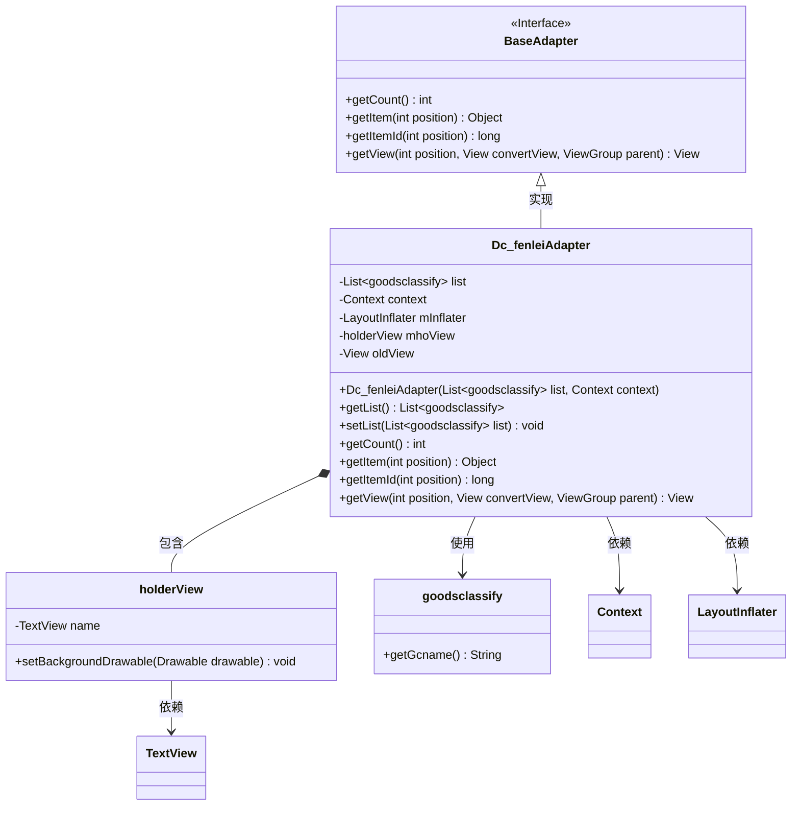
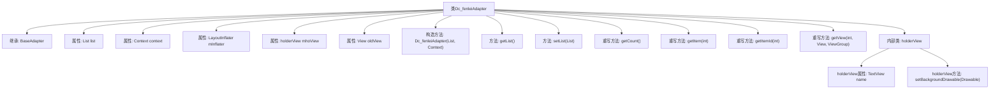

# 基础信息

|      |      |
|------|------|
| 名称 | Dc_fenleiAdapter |
| 编码语言 | .java |
| 代码路径 | happycat/src/com/happycat/adapter/Dc_fenleiAdapter.java |
| 包名 | com.happycat.adapter |
| 依赖项 | ['java.util.List', 'com.example.happucat.R', 'com.happycat.Bean.goodsclassify', 'android.content.Context', 'android.graphics.drawable.Drawable', 'android.view.LayoutInflater', 'android.view.View', 'android.view.View.OnClickListener', 'android.view.ViewGroup', 'android.widget.BaseAdapter', 'android.widget.TextView'] |
| 概述说明 | Dc_fenleiAdapter是Android列表适配器，用于展示goodsclassify数据列表，包含视图复用和holder模式优化。 |

# 说明

Dc_fenleiAdapter是一个继承自BaseAdapter的自定义适配器类，用于在Android应用中展示商品分类列表。它包含一个goodsclassify类型的列表数据list，通过构造函数初始化数据和上下文context。适配器提供了获取列表大小、获取指定位置数据项的方法。内部类holderView用于缓存视图控件，包含一个TextView成员name。getView方法实现了视图的复用逻辑，当convertView为空时加载布局并初始化holderView，否则重用已有视图，最后设置当前分类名称并返回视图。注释部分展示了未实现的点击事件处理逻辑，涉及视图背景切换功能。

# 类列表 Class Summary

| 名称   | 类型  | 说明 |
|-------|------|-------------|
| Dc_fenleiAdapter | class | Dc_fenleiAdapter是Android自定义适配器，用于展示商品分类列表，包含数据绑定和视图复用逻辑。 |

## 类 Dc_fenleiAdapter

|      |      |
|------|------|
| 访问范围 | public |
| 类型 | class |
| 名称 | Dc_fenleiAdapter |
| 说明 | Dc_fenleiAdapter是Android自定义适配器，用于展示商品分类列表，包含数据绑定和视图复用逻辑。 |

### UML类图

类图描述：
Dc_fenleiAdapter继承自BaseAdapter，用于商品分类列表的数据适配。它包含一个内部类holderView用于视图缓存优化，持有TextView控件。适配器通过List<goodsclassify>存储数据，利用LayoutInflater动态加载布局。核心方法getView()实现了视图复用机制，通过convertView和setTag/getTag减少重复创建视图的开销。注释部分展示了未实现的点击状态切换逻辑，当前版本仅完成基础文本显示功能。

### 内部方法调用关系图

这段代码是Android开发中一个典型的自定义Adapter实现，用于ListView/RecyclerView的数据绑定。主要功能包括：管理商品分类数据列表(list)，通过getView()方法实现视图复用逻辑，使用holderView模式优化性能。构造方法初始化布局填充器(mInflater)，getView()根据position设置对应商品分类名称，并处理视图复用时的tag存储逻辑。

### 字段列表 Field List

| 名称  | 类型  | 说明 |
|-------|-------|------|
| oldView = null | View | 声明一个名为oldView的视图变量，初始化为null。 |
| mInflater | LayoutInflater | 布局填充器对象，用于动态加载XML布局文件为视图对象。 |
| list | List<goodsclassify> | 定义一个商品分类列表变量list。 |
| context | Context | 定义上下文对象变量context。 |
| mhoView | holderView | 变量holderView的类型为mhoView。 |

### 方法列表

| 名称  | 类型  | 说明 |
|-------|-------|------|
| getView | View | 这是一个Android列表项视图适配方法，检查复用视图并设置分类名称文本，最后返回视图对象。 |
| getCount | int | 方法重写getCount，返回列表list的大小。 |
| getItem | Object | 方法getItem返回列表中指定位置的元素。 |
| setList | void | 设置商品分类列表的方法，将传入的列表赋值给当前对象的list属性。 |
| getList | List<goodsclassify> | 方法返回商品分类列表。 |
| getItemId | long | 方法getItemId返回指定位置的ID，默认实现直接返回位置值。 |

