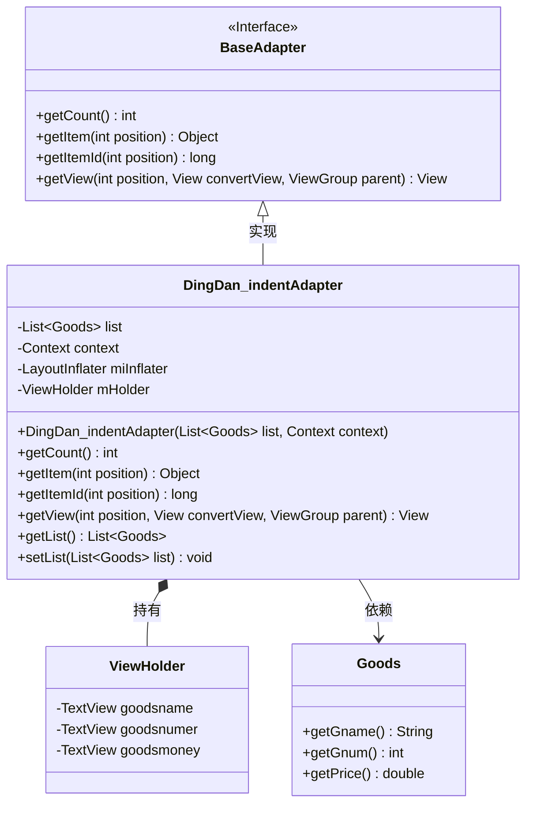
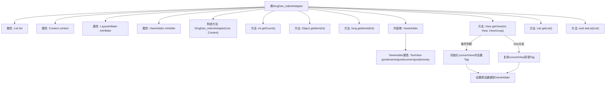

# 基础信息

|      |      |
|------|------|
| 名称 | DingDan_indentAdapter |
| 编码语言 | .java |
| 代码路径 | happycat/src/com/happycat/adapter/DingDan_indentAdapter.java |
| 包名 | com.happycat.adapter |
| 依赖项 | ['java.util.List', 'com.example.happucat.R', 'com.example.happucat.R.string', 'com.happycat.Bean.Goods', 'com.happycat.Bean.PingjiaBean', 'com.happycat.util.MyApplication', 'android.content.Context', 'android.view.LayoutInflater', 'android.view.View', 'android.view.ViewGroup', 'android.widget.BaseAdapter', 'android.widget.ImageView', 'android.widget.RadioButton', 'android.widget.TextView'] |
| 概述说明 | 自定义适配器类DingDan_indentAdapter继承BaseAdapter，用于订单商品列表展示，包含数据绑定和视图复用逻辑。 |

# 说明

DingDan_indentAdapter是一个继承自BaseAdapter的自定义适配器类，用于在Android应用中展示订单商品列表。它接收一个Goods对象列表和Context作为构造参数，并通过LayoutInflater加载布局。适配器内部定义了ViewHolder类来缓存视图控件，包含商品名称、数量和金额的TextView。getView方法实现了视图复用逻辑，首次加载时初始化控件并设置Tag，后续直接复用。数据绑定阶段将商品名称、数量及总金额（单价乘以数量）设置到对应控件上。类还提供了获取和设置商品列表的方法。该适配器主要用于优化订单列表的显示性能。

# 类列表 Class Summary

| 名称   | 类型  | 说明 |
|-------|------|-------------|
| DingDan_indentAdapter | class | 自定义订单列表适配器，继承BaseAdapter，包含商品列表、上下文和布局填充器，实现列表项视图复用，显示商品名称、数量和总价。 |

## 类 DingDan_indentAdapter

|      |      |
|------|------|
| 访问范围 | public |
| 类型 | class |
| 名称 | DingDan_indentAdapter |
| 说明 | 自定义订单列表适配器，继承BaseAdapter，包含商品列表、上下文和布局填充器，实现列表项视图复用，显示商品名称、数量和总价。 |

### UML类图

该代码展示了一个Android订单列表适配器DingDan_indentAdapter，继承自BaseAdapter接口，用于管理商品数据在ListView中的显示。适配器内部使用ViewHolder模式优化性能，包含商品名称、数量和金额的TextView控件。通过LayoutInflater动态加载布局，并实现数据绑定逻辑。类图清晰地反映了适配器与数据模型Goods、视图容器ViewHolder的关联关系，以及其作为BaseAdapter实现类的层级结构。

### 内部方法调用关系图

这段代码是Android开发中用于显示订单列表的自定义适配器，继承自BaseAdapter。主要功能包括：通过构造方法初始化数据和布局填充器，实现getView方法进行列表项视图的复用（通过ViewHolder模式优化性能），动态绑定商品名称、数量和金额数据。适配器还提供了基础的列表数据访问和修改方法，通过内部类ViewHolder管理列表项视图组件，有效避免重复查找视图资源。

### 字段列表 Field List

| 名称  | 类型  | 说明 |
|-------|-------|------|
| context | Context | 定义Context类型的上下文变量context。 |
| mHolder | ViewHolder | 定义ViewHolder变量mHolder，用于列表项视图复用优化。 |
| miInflater | LayoutInflater | 布局填充器实例变量声明。 |
| list | List<Goods> | 声明一个名为list的Goods对象列表。 |

### 方法列表

| 名称  | 类型  | 说明 |
|-------|-------|------|
| getList | List<Goods> | 方法返回商品列表。 |
| getView | View | 重写getView方法，初始化或复用列表项布局，设置商品名称、数量、价格并返回视图。 |
| getCount | int | 方法getCount返回列表list的大小。 |
| getItem | Object | 这是一个Java方法，重写getItem函数，根据传入的位置参数返回列表中对应位置的元素。 |
| getItemId | long | 方法getItemId返回指定位置的ID，此处直接返回位置值。 |
| setList | void | 设置商品列表的方法，将传入的列表赋值给当前对象的list属性。 |

