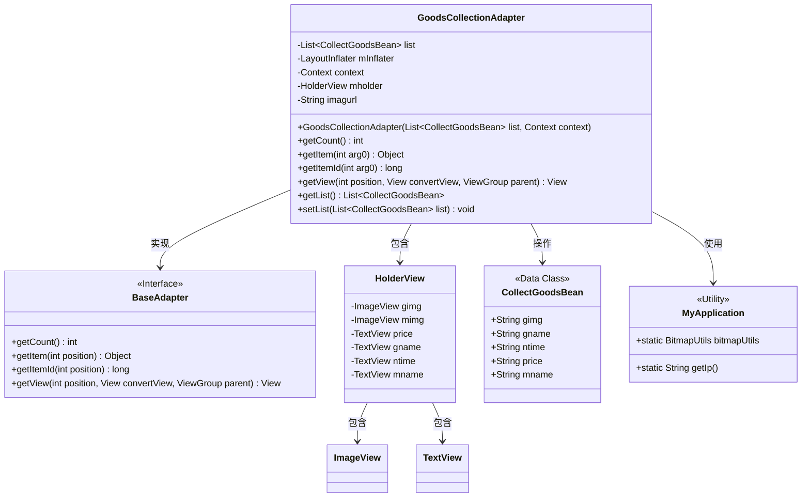
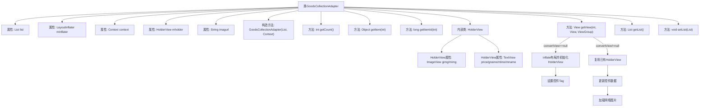

# 基础信息

|      |      |
|------|------|
| 名称 | GoodsCollectionAdapter |
| 编码语言 | .java |
| 代码路径 | happycat/src/com/happycat/adapter/GoodsCollectionAdapter.java |
| 包名 | com.happycat.adapter |
| 依赖项 | ['java.util.List', 'com.example.happucat.R', 'com.happycat.Bean.CollectBean', 'com.happycat.Bean.CollectGoodsBean', 'com.happycat.util.MyApplication', 'android.content.Context', 'android.util.Log', 'android.view.LayoutInflater', 'android.view.View', 'android.view.ViewGroup', 'android.widget.BaseAdapter', 'android.widget.ImageView', 'android.widget.TextView'] |
| 概述说明 | GoodsCollectionAdapter是Android适配器类，用于展示商品收藏列表，包含图片、名称、价格和时间，支持数据绑定和视图复用。 |

# 说明

GoodsCollectionAdapter是一个继承自BaseAdapter的自定义适配器类，用于在Android应用中展示商品收藏列表。它接收一个CollectGoodsBean类型的列表和上下文对象作为构造参数。适配器内部定义了一个HolderView类来缓存视图组件，包括商品图片、价格、名称和收藏时间等控件。getView方法负责填充列表项视图，设置商品信息并加载远程图片。适配器还提供了获取和设置列表数据的方法。图片URL通过拼接基础路径和商品图片路径生成。

# 类列表 Class Summary

| 名称   | 类型  | 说明 |
|-------|------|-------------|
| GoodsCollectionAdapter | class | GoodsCollectionAdapter是Android适配器类，用于展示收藏商品列表，包含图片、名称、价格和时间，通过BaseAdapter实现数据绑定和视图复用。 |

## 类 GoodsCollectionAdapter

|      |      |
|------|------|
| 访问范围 | public |
| 类型 | class |
| 名称 | GoodsCollectionAdapter |
| 说明 | GoodsCollectionAdapter是Android适配器类，用于展示收藏商品列表，包含图片、名称、价格和时间，通过BaseAdapter实现数据绑定和视图复用。 |

### UML类图

这段代码展示了一个Android适配器类GoodsCollectionAdapter，它继承自BaseAdapter用于在ListView中显示商品收藏数据。类图中包含适配器与数据模型CollectGoodsBean、视图持有者HolderView以及工具类MyApplication的关系。适配器通过getView方法将数据绑定到视图，利用ViewHolder模式优化性能，并通过MyApplication获取网络图片地址和图片加载工具。整个设计体现了典型的Android列表适配器模式，包含数据绑定、视图复用和外部资源访问等关键功能。

### 内部方法调用关系图

这段代码是Android中的自定义适配器类，用于将商品收藏数据绑定到ListView或GridView等列表视图。核心功能包括数据计数、项获取、视图创建和更新，特别处理了视图复用机制以提高性能。通过HolderView模式优化控件查找，动态构建包含商品图片、名称、价格和收藏时间的列表项，并支持通过URL加载远程图片。适配器还提供获取和设置数据列表的方法，便于外部操作数据源。

### 字段列表 Field List

| 名称  | 类型  | 说明 |
|-------|-------|------|
| context | Context | 定义上下文对象变量context。 |
| mInflater | LayoutInflater | 私有布局填充器mInflater。 |
| list | List<CollectGoodsBean> | 私有列表变量list，存储CollectGoodsBean类型对象。 |
| mholder | HolderView | HolderView类型的变量mholder。 |
| imagurl = " http://" + MyApplication.getIp() + ":8080/happycat/img/" | String | 代码拼接字符串生成图片URL，包含服务器IP和路径。 |

### 方法列表

| 名称  | 类型  | 说明 |
|-------|-------|------|
| getItem | Object | 该方法重写getItem，接收一个int参数arg0，返回list中对应索引arg0的元素。 |
| getItemId | long | 重写getItemId方法，直接返回输入参数arg0的值。 |
| getCount | int | 方法getCount返回列表list的大小。 |
| getView | View | 自定义适配器getView方法，复用视图优化性能，绑定商品图片、名称、价格和收藏时间数据到列表项视图。 |
| getList | List<CollectGoodsBean> | 方法返回一个商品收集列表。 |
| setList | void | 这是一个Java方法，用于设置类的成员变量list，参数为CollectGoodsBean类型的列表。 |

