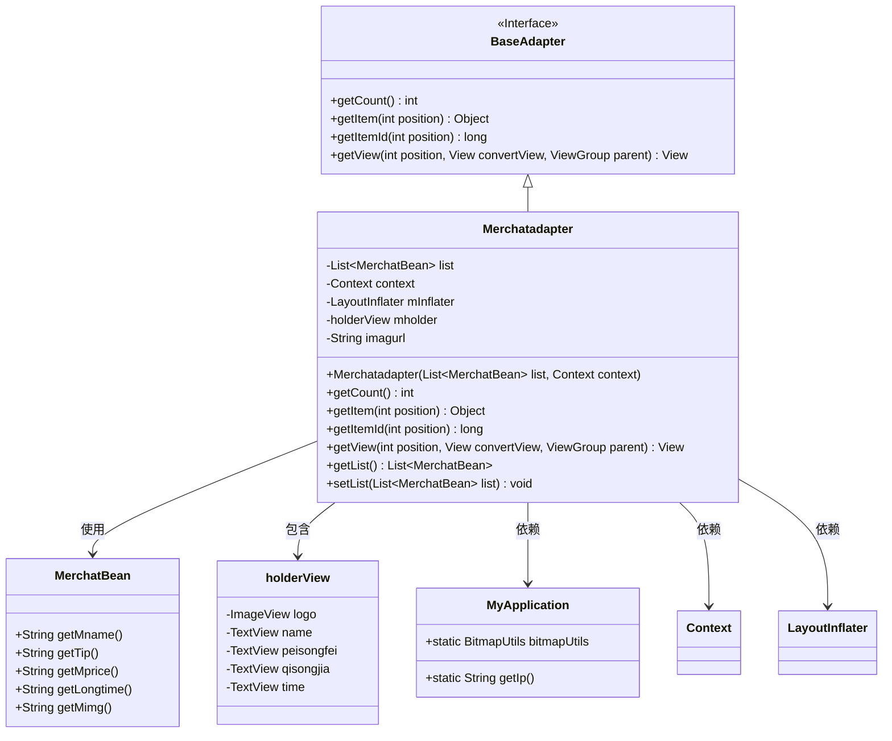
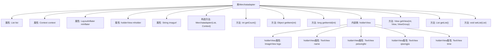

# 基础信息

|      |      |
|------|------|
| 名称 | Merchatadapter |
| 编码语言 | .java |
| 代码路径 | happycat/src/com/happycat/adapter/Merchatadapter.java |
| 包名 | com.happycat.adapter |
| 依赖项 | ['java.util.List', 'com.example.happucat.R', 'com.happycat.Bean.Goods', 'com.happycat.Bean.MerchatBean', 'com.happycat.util.MyApplication', 'android.R.integer', 'android.content.Context', 'android.util.Log', 'android.view.LayoutInflater', 'android.view.View', 'android.view.ViewGroup', 'android.widget.BaseAdapter', 'android.widget.ImageView', 'android.widget.TextView'] |
| 概述说明 | Merchatadapter是Android适配器类，继承BaseAdapter，用于展示商家列表数据，包含名称、配送费、起送价和送达时间等信息，使用ViewHolder优化性能。 |

# 说明

Merchatadapter是一个继承自BaseAdapter的自定义适配器类，用于在Android应用中展示商家列表数据。该类包含一个商家数据列表list和一个上下文context，通过LayoutInflater加载布局。适配器内部定义了holderView类来缓存视图控件，包括商家的logo、名称、配送费、起送价和送达时间等。getView方法负责将数据绑定到视图上，使用ViewHolder模式优化性能。图片通过MyApplication.bitmapUtils从指定URL加载。适配器还提供了获取和设置数据列表的方法。

# 类列表 Class Summary

| 名称   | 类型  | 说明 |
|-------|------|-------------|
| Merchatadapter | class | Merchatadapter是一个Android自定义适配器，用于展示商家列表。它继承BaseAdapter，包含商家名称、配送费、起送价和送达时间等信息，并使用ViewHolder优化性能。图片通过URL加载。 |

## 类 Merchatadapter

|      |      |
|------|------|
| 访问范围 | public |
| 类型 | class |
| 名称 | Merchatadapter |
| 说明 | Merchatadapter是一个Android自定义适配器，用于展示商家列表。它继承BaseAdapter，包含商家名称、配送费、起送价和送达时间等信息，并使用ViewHolder优化性能。图片通过URL加载。 |

### UML类图

该图展示了一个Android适配器类`Merchatadapter`的结构及其关联关系。该类继承自`BaseAdapter`接口，用于管理`MerchatBean`数据列表的显示。内部类`holderView`用于视图缓存优化，包含多个TextView和ImageView控件。适配器通过`MyApplication`获取网络图片地址和工具类，并依赖Android的`Context`和`LayoutInflater`进行视图渲染。整体设计实现了列表数据的高效绑定和显示优化。

### 内部方法调用关系图

该流程图展示了Merchatadapter类的完整结构，这是一个典型的Android适配器实现。作为BaseAdapter的子类，它包含5个核心属性（包括一个静态图片URL）、4个基础适配器方法重写（getCount/getItem/getItemId/getView）、2个列表操作方法，以及一个内部ViewHolder类。特别注意getView方法实现了视图复用机制，通过convertView判空和setTag/getTag优化列表性能，同时使用MyApplication.bitmapUtils进行图片异步加载，整体结构体现了Android列表适配器的最佳实践。

### 字段列表 Field List

| 名称  | 类型  | 说明 |
|-------|-------|------|
| mInflater | LayoutInflater | 布局加载器对象，用于动态加载XML布局文件到视图。 |
| context | Context | 声明一个Context类型的变量context。 |
| imagurl=" http://" + MyApplication.getIp()			+ ":8080//happycat/upimage/" | String | 代码片段定义了一个字符串变量imagurl，通过拼接HTTP协议、IP地址和路径，生成图片上传的完整URL地址。 |
| list | List<MerchatBean> | 存储商户对象的列表。 |
| mholder | holderView | 变量mholder属于holderView类型。 |

### 方法列表

| 名称  | 类型  | 说明 |
|-------|-------|------|
| getItem | Object | 方法getItem返回列表中指定位置的元素。参数position为索引，返回对应位置的对象。 |
| getItemId | long | 方法getItemId返回指定位置的ID，默认实现直接返回位置值。 |
| getView | View | Android适配器getView方法，复用convertView优化性能，绑定商家名称、配送费、起送价、送达时间和logo图片数据到列表项视图。 |
| getCount | int | 方法getCount返回列表大小，调用时输出日志"GETCOUNT"。 |
| getList | List<MerchatBean> | 方法返回一个MerchatBean类型的列表。 |
| setList | void | 设置商户列表，将传入的列表赋值给当前对象的list属性。 |

