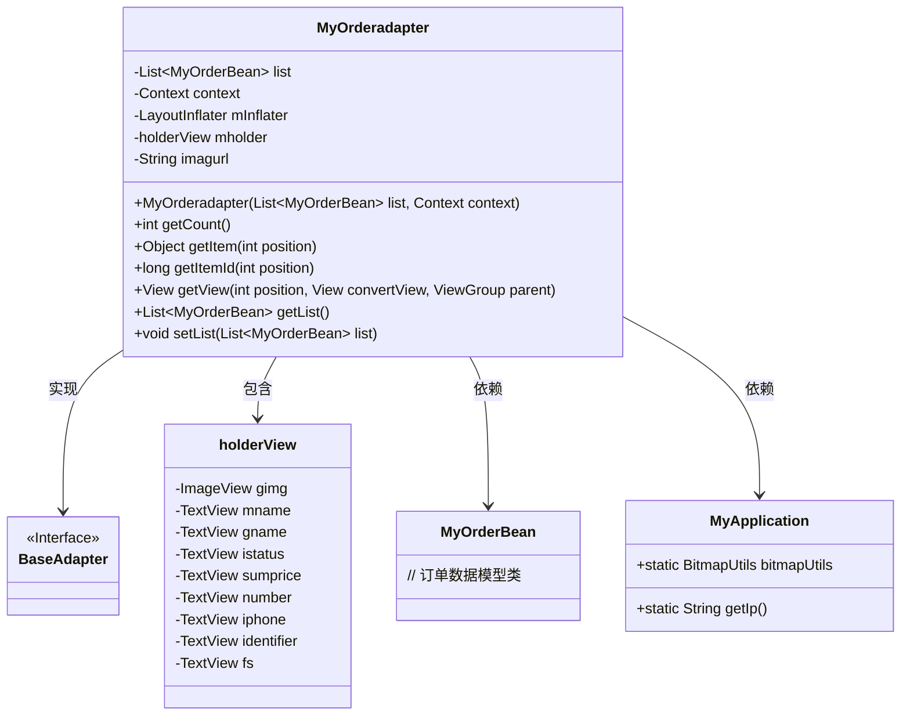

# 基础信息

|      |      |
|------|------|
| 名称 | MyOrderadapter |
| 编码语言 | .java |
| 代码路径 | happycat/src/com/happycat/adapter/MyOrderadapter.java |
| 包名 | com.happycat.adapter |
| 依赖项 | ['java.util.List', 'com.example.happucat.R', 'com.happycat.Bean.MyOrderBean', 'com.happycat.util.MyApplication', 'android.content.Context', 'android.view.LayoutInflater', 'android.view.View', 'android.view.ViewGroup', 'android.widget.BaseAdapter', 'android.widget.ImageView', 'android.widget.TextView'] |
| 概述说明 | MyOrderadapter是Android订单列表适配器，继承BaseAdapter，包含订单数据绑定、视图复用及图片加载功能。 |

# 说明

这是一个名为MyOrderadapter的自定义适配器类，继承自BaseAdapter，用于在Android应用中显示订单列表。它包含一个MyOrderBean对象列表和上下文对象作为构造参数。适配器通过holderView内部类管理列表项的视图组件，包括图片、订单名称、商品名称、订单状态、总价、数量、电话、订单号和支付方式等。getView方法负责填充列表项数据，使用LayoutInflater加载布局，并利用BitmapUtils显示商品图片。图片URL通过拼接基础路径和商品图片名生成。适配器还提供了获取和设置列表数据的方法。

# 类列表 Class Summary

| 名称   | 类型  | 说明 |
|-------|------|-------------|
| MyOrderadapter | class | 自定义订单适配器类，继承BaseAdapter，用于展示订单列表数据，包含视图复用和数据处理逻辑。 |

## 类 MyOrderadapter

|      |      |
|------|------|
| 访问范围 | public |
| 类型 | class |
| 名称 | MyOrderadapter |
| 说明 | 自定义订单适配器类，继承BaseAdapter，用于展示订单列表数据，包含视图复用和数据处理逻辑。 |

### UML类图

这段代码展示了一个Android自定义适配器`MyOrderadapter`，继承自`BaseAdapter`，用于在ListView中显示订单数据。适配器内部定义了`holderView`作为视图缓存容器，通过`getView()`方法实现视图复用和数据绑定。类图中清晰地呈现了适配器与数据模型`MyOrderBean`、工具类`MyApplication`的依赖关系，以及内部视图容器的组成结构，体现了典型的Android列表优化实现方式。

### 内部方法调用关系图

```mermaid
graph TD
    A["类MyOrderadapter继承BaseAdapter"]
    B["属性: List<MyOrderBean> list"]
    C["属性: Context context"]
    D["属性: LayoutInflater mInflater"]
    E["属性: holderView mholder"]
    F["属性: String imagurl"]
    G["构造方法: MyOrderadapter(List<MyOrderBean>, Context)"]
    H["方法: int getCount()"]
    I["方法: Object getItem(int)"]
    J["方法: long getItemId(int)"]
    K["内部类: holderView"]
    L["方法: View getView(int, View, ViewGroup)"]
    M["方法: List<MyOrderBean> getList()"]
    N["方法: void setList(List<MyOrderBean>)"]
    O["holderView属性: ImageView gimg"]
    P["holderView属性: 7个TextView"]

    A --> B
    A --> C
    A --> D
    A --> E
    A --> F
    A --> G
    A --> H
    A --> I
    A --> J
    A --> K
    A --> L
    A --> M
    A --> N
    K --> O
    K --> P
    L -->|"convertView==null"| Q["inflate布局R.layout.dingdan_all_listviewitem"]
    L -->|"convertView!=null"| R["从convertView获取Tag"]
    L --> S["设置holderView各控件数据"]
    L --> T["MyApplication.bitmapUtils.display加载图片"]
```

这段代码是一个Android自定义适配器类，用于在ListView中显示订单数据。流程图展示了类结构、属性和方法关系，重点描述了getView()方法的视图复用逻辑和数据绑定过程。适配器通过holderView实现视图缓存优化，从MyOrderBean对象获取数据并设置到各个UI控件，同时使用bitmapUtils异步加载网络图片。整个流程体现了Android列表视图的标准优化模式和数据绑定机制。

### 字段列表 Field List

| 名称  | 类型  | 说明 |
|-------|-------|------|
| mholder | holderView | 声明一个名为mholder的holderView类型变量。 |
| imagurl = " http://" + MyApplication.getIp() + ":8080/happycat/img/" | String | 代码拼接图片URL，使用应用IP地址和固定路径。 |
| list | List<MyOrderBean> | 存储MyOrderBean对象的列表。 |
| mInflater | LayoutInflater | 布局加载器对象，用于动态加载XML布局文件。 |
| context | Context | 定义Context类型的变量context。 |

### 方法列表

| 名称  | 类型  | 说明 |
|-------|-------|------|
| getItemId | long | 方法getItemId返回指定位置的ID，默认实现直接返回位置值。 |
| getList | List<MyOrderBean> | 这是一个Java方法，返回类型为List<MyOrderBean>，方法名为getList，直接返回成员变量list。 |
| setList | void | 方法setList接收一个MyOrderBean类型的List参数，并将其赋值给当前对象的list成员变量。 |
| getCount | int | 这是一个重写的getCount方法，返回列表大小。 |
| getItem | Object | 这是一个重写的getItem方法，根据位置参数返回列表中对应项。 |
| getView | View | 自定义适配器getView方法，复用视图并设置订单项数据，包括图片、名称、订单号、电话、数量、支付方式、价格和状态。 |

