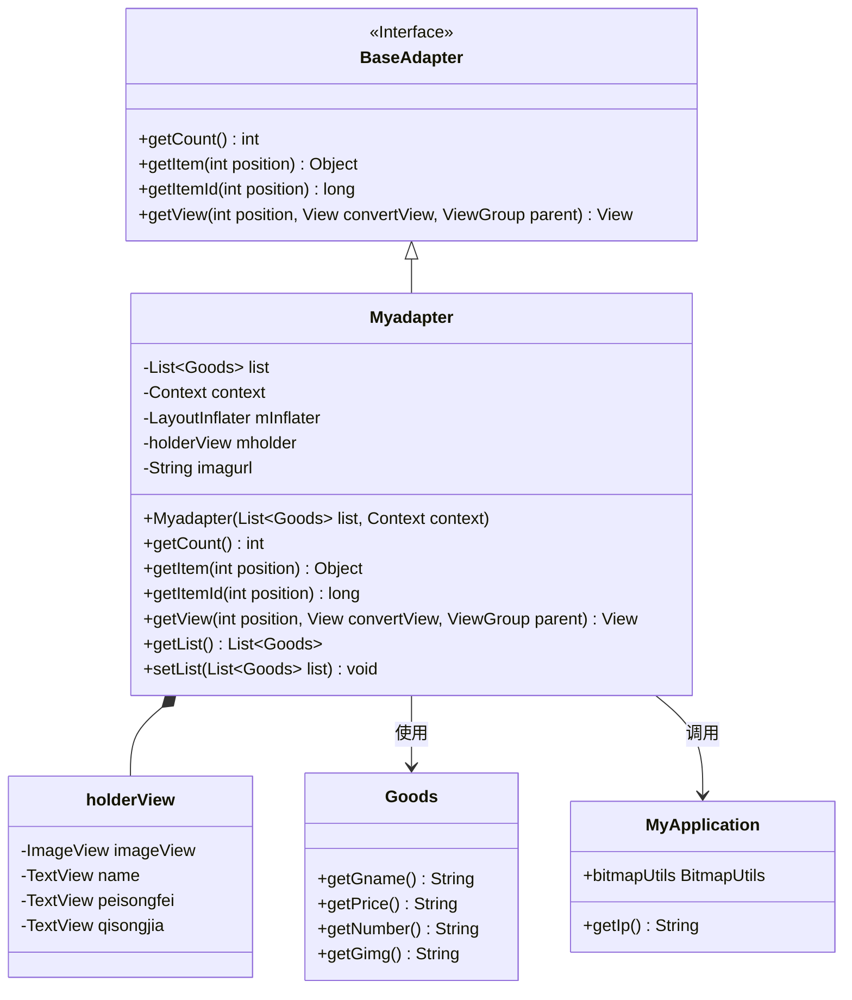

# 基础信息

|      |      |
|------|------|
| 名称 | Myadapter |
| 编码语言 | .java |
| 代码路径 | happycat/src/com/happycat/adapter/Myadapter.java |
| 包名 | com.happycat.adapter |
| 依赖项 | ['java.util.List', 'com.example.happucat.R', 'com.happycat.Bean.Goods', 'com.happycat.util.MyApplication', 'android.R.integer', 'android.content.Context', 'android.view.LayoutInflater', 'android.view.View', 'android.view.ViewGroup', 'android.widget.BaseAdapter', 'android.widget.ImageView', 'android.widget.TextView'] |
| 概述说明 | 自定义适配器Myadapter继承BaseAdapter，用于展示商品列表，包含图片、名称、配送费和起送价，支持视图复用和动态数据加载。 |

# 说明

这是一个名为Myadapter的自定义适配器类，继承自BaseAdapter，用于在Android应用中展示商品列表。适配器接收商品列表和上下文作为构造参数，使用LayoutInflater加载布局。内部定义holderView类缓存视图组件，包含ImageView和三个TextView。getView方法实现视图复用逻辑，设置商品名称、配送费和起送价，并通过MyApplication.bitmapUtils加载远程商品图片。图片URL由基础地址和商品图片路径拼接而成。适配器还提供获取和设置商品列表的方法。

# 类列表 Class Summary

| 名称   | 类型  | 说明 |
|-------|------|-------------|
| Myadapter | class | 自定义适配器Myadapter继承BaseAdapter，用于展示商品列表，包含图片、名称、配送费和起送价，支持视图复用和动态数据加载。 |

## 类 Myadapter

|      |      |
|------|------|
| 访问范围 | public |
| 类型 | class |
| 名称 | Myadapter |
| 说明 | 自定义适配器Myadapter继承BaseAdapter，用于展示商品列表，包含图片、名称、配送费和起送价，支持视图复用和动态数据加载。 |

### UML类图

该代码展示了一个Android自定义适配器Myadapter，继承自BaseAdapter，用于在ListView中显示商品列表。适配器包含内部类holderView用于视图缓存，通过LayoutInflater加载布局，并绑定商品数据到视图控件。MyApplication提供网络图片加载和IP配置功能，Goods类存储商品信息。适配器实现了列表项复用优化和动态数据绑定功能。

### 内部方法调用关系图

```mermaid
graph TD
    A["类Myadapter extends BaseAdapter"]
    B["属性: List<Goods> list"]
    C["属性: Context context"]
    D["属性: LayoutInflater mInflater"]
    E["属性: holderView mholder"]
    F["属性: String imagurl"]
    G["构造方法: Myadapter(List<Goods>, Context)"]
    H["方法: int getCount()"]
    I["方法: Object getItem(int)"]
    J["方法: long getItemId(int)"]
    K["内部类: holderView"]
    L["方法: View getView(int, View, ViewGroup)"]
    M["方法: List<Goods> getList()"]
    N["方法: void setList(List<Goods>)"]
    O["holderView属性: ImageView imageView"]
    P["holderView属性: TextView name"]
    Q["holderView属性: TextView peisongfei"]
    R["holderView属性: TextView qisongjia"]
    S["初始化: mInflater = LayoutInflater.from(context)"]
    T["视图操作: convertView.inflate/setTag"]
    U["数据绑定: setText/bitmapUtils.display"]

    A --> B
    A --> C
    A --> D
    A --> E
    A --> F
    A --> G
    A --> H
    A --> I
    A --> J
    A --> K
    A --> L
    A --> M
    A --> N
    K --> O
    K --> P
    K --> Q
    K --> R
    G --> S
    L --> T
    L --> U
```

这段代码实现了一个自定义适配器Myadapter，用于在Android中展示商品列表。流程图展示了类结构、属性、方法及其调用关系，重点描述了视图重用机制（通过holderView优化性能）和数据绑定过程。适配器通过getView方法动态处理每个列表项，包括视图初始化、控件缓存和商品数据（名称、配送费、起送价、图片）的绑定，其中图片通过URL远程加载。构造方法初始化布局填充器，其他方法提供基础的列表操作功能。

### 字段列表 Field List

| 名称  | 类型  | 说明 |
|-------|-------|------|
| imagurl="http://" + MyApplication.getIp()			+ ":8080/happycat/upimage/" | String | 代码片段定义了一个字符串变量imagurl，其值为拼接的HTTP URL，包含服务器IP地址和路径"/happycat/upimage/"，端口为8080。 |
| mholder | holderView | 声明一个名为mholder的holderView类型变量。 |
| list | List<Goods> | 声明一个名为list的Goods对象列表。 |
| mInflater | LayoutInflater | LayoutInflater用于将XML布局文件实例化为对应的View对象。 |
| context | Context | 定义Context类型的变量context。 |

### 方法列表

| 名称  | 类型  | 说明 |
|-------|-------|------|
| getItemId | long | 方法getItemId返回指定位置的ID，此处直接返回位置值。 |
| getItem | Object | 方法getItem返回列表中指定位置的元素。参数position为索引，返回对应元素。 |
| getCount | int | 方法getCount返回列表list的大小。 |
| getList | List<Goods> | 这是一个Java方法，返回名为list的Goods对象列表。 |
| getView | View | Android列表项视图适配方法：复用convertView优化性能，通过holder模式绑定控件，动态设置名称、配送费、起送价及图片URL数据。 |
| setList | void | 设置商品列表的方法，将传入的List<Goods>赋值给当前对象的list属性。 |

