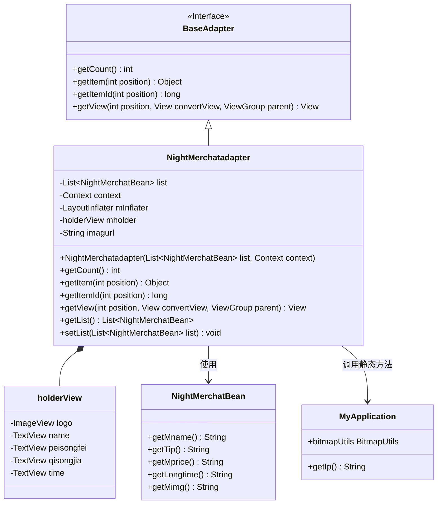
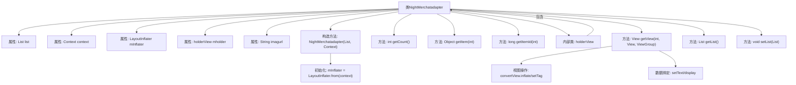

# 基础信息

|      |      |
|------|------|
| 名称 | NightMerchatadapter |
| 编码语言 | .java |
| 代码路径 | happycat/src/com/happycat/adapter/NightMerchatadapter.java |
| 包名 | com.happycat.adapter |
| 依赖项 | ['java.util.List', 'com.example.happucat.R', 'com.happycat.Bean.DayMerchatBean', 'com.happycat.Bean.Goods', 'com.happycat.Bean.NightMerchatBean', 'com.happycat.adapter.DayMerchatadapter.holderView', 'com.happycat.util.MyApplication', 'android.R.integer', 'android.content.Context', 'android.util.Log', 'android.view.LayoutInflater', 'android.view.View', 'android.view.ViewGroup', 'android.widget.BaseAdapter', 'android.widget.ImageView', 'android.widget.TextView'] |
| 概述说明 | NightMerchatadapter是一个Android适配器类，用于展示夜间商家列表，包含商家名称、配送费、起送价和送达时间等信息，使用ViewHolder优化性能。 |

# 说明

NightMerchatadapter是一个继承BaseAdapter的适配器类，用于管理NightMerchatBean列表数据的展示。它包含列表数据、上下文和布局填充器，通过holderView缓存视图组件以提高性能。适配器实现了获取列表项数量、位置和ID的方法，并在getView中处理视图的创建和数据的绑定，包括商家名称、配送费、起送价、送达时间和图片的显示。图片URL由基础地址和图片路径拼接而成。还提供了获取和设置列表数据的方法。

# 类列表 Class Summary

| 名称   | 类型  | 说明 |
|-------|------|-------------|
| NightMerchatadapter | class | NightMerchatadapter是一个Android适配器类，用于展示夜间商家列表，包含商家名称、配送费、起送价和送达时间等信息，通过holderView优化列表性能。 |

## 类 NightMerchatadapter

|      |      |
|------|------|
| 访问范围 | public |
| 类型 | class |
| 名称 | NightMerchatadapter |
| 说明 | NightMerchatadapter是一个Android适配器类，用于展示夜间商家列表，包含商家名称、配送费、起送价和送达时间等信息，通过holderView优化列表性能。 |

### UML类图

类图描述：
该图展示了一个Android适配器类NightMerchatadapter的结构，它继承自BaseAdapter接口并实现了列表视图的适配功能。类中包含内部类holderView用于视图缓存，通过NightMerchatBean获取数据，并依赖MyApplication处理图片加载。适配器主要管理商家列表数据的展示，包含配送费、起送价等信息的绑定，实现了典型的ListView优化模式（ViewHolder模式）和网络图片异步加载功能。

### 内部方法调用关系图

这段代码是一个Android自定义适配器类，用于在ListView中显示夜间商家列表数据。流程图展示了类结构关系，包括属性、构造方法、核心方法getView的实现逻辑，以及内部holderView类。适配器通过LayoutInflater加载布局，使用ViewHolder模式优化性能，并将数据绑定到列表项的各个视图组件上，最后通过bitmapUtils加载网络图片。整个过程实现了数据到视图的高效映射和显示。

### 字段列表 Field List

| 名称  | 类型  | 说明 |
|-------|-------|------|
| list | List<NightMerchatBean> | 定义一个名为list的列表，元素类型为NightMerchatBean。 |
| imagurl=" http://" + MyApplication.getIp()			+ ":8080//happycat/upimage/" | String | 代码片段定义了一个字符串变量imagurl，通过拼接协议头、IP地址和路径，生成一个指向happycat项目图片上传服务的URL。 |
| mholder | holderView | 变量holderView声明为mholder类型。 |
| context | Context | 定义Context类型的变量context。 |
| mInflater | LayoutInflater | LayoutInflater用于将XML布局文件实例化为View对象。 |

### 方法列表

| 名称  | 类型  | 说明 |
|-------|-------|------|
| getView | View | 自定义列表适配器方法，复用视图优化性能，动态设置商家名称、配送费、起送价、送达时间和Logo图片。 |
| getItem | Object | 方法getItem返回列表中指定位置的元素。参数为位置索引，返回对应元素。 |
| getCount | int | 方法getCount返回列表list的大小。 |
| getItemId | long | 方法重写，返回指定位置的ID，直接返回位置值。 |
| getList | List<NightMerchatBean> | 方法getList返回NightMerchatBean类型的列表list。 |
| setList | void | 方法setList接收一个NightMerchatBean类型的列表参数，并将其赋值给当前对象的list属性。 |

