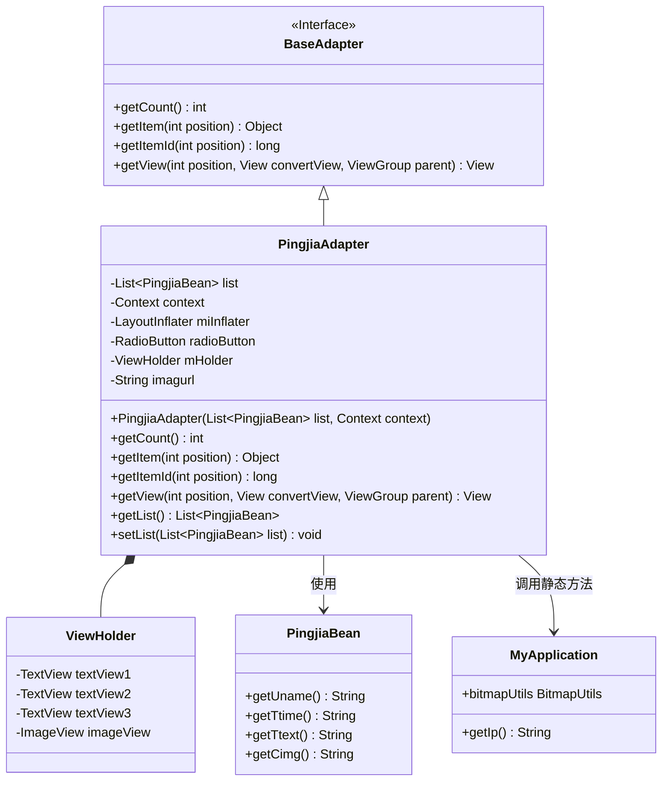
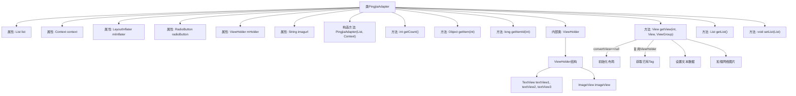

# 基础信息

|      |      |
|------|------|
| 名称 | PingjiaAdapter |
| 编码语言 | .java |
| 代码路径 | happycat/src/com/happycat/adapter/PingjiaAdapter.java |
| 包名 | com.happycat.adapter |
| 依赖项 | ['java.util.List', 'com.example.happucat.R', 'com.happycat.Bean.PingjiaBean', 'com.happycat.util.MyApplication', 'android.content.Context', 'android.view.LayoutInflater', 'android.view.View', 'android.view.ViewGroup', 'android.widget.BaseAdapter', 'android.widget.ImageView', 'android.widget.RadioButton', 'android.widget.TextView'] |
| 概述说明 | PingjiaAdapter是Android列表适配器，用于展示PingjiaBean数据列表，包含用户名、时间、内容及图片，使用ViewHolder优化性能。 |

# 说明

PingjiaAdapter是一个继承自BaseAdapter的自定义适配器类，用于在Android应用中展示评价列表数据。该类包含一个ViewHolder内部类，用于缓存视图组件以提高性能。适配器通过构造函数接收评价数据列表和上下文对象，并利用LayoutInflater加载布局。getView方法负责将数据绑定到列表项视图上，包括用户名、时间、评价内容和图片。图片通过MyApplication.bitmapUtils从指定URL加载显示。适配器还提供了获取和设置数据列表的方法。

# 类列表 Class Summary

| 名称   | 类型  | 说明 |
|-------|------|-------------|
| PingjiaAdapter | class | PingjiaAdapter是Android列表适配器，用于展示评价数据列表，包含用户名、时间、内容和图片，使用ViewHolder优化性能。 |

## 类 PingjiaAdapter

|      |      |
|------|------|
| 访问范围 | public |
| 类型 | class |
| 名称 | PingjiaAdapter |
| 说明 | PingjiaAdapter是Android列表适配器，用于展示评价数据列表，包含用户名、时间、内容和图片，使用ViewHolder优化性能。 |

### UML类图

这段代码展示了一个Android自定义适配器PingjiaAdapter，它继承自BaseAdapter用于展示评价数据列表。适配器内部使用ViewHolder模式优化性能，通过MyApplication类获取网络图片地址和图片加载工具。主要功能包括数据绑定、视图复用和图片异步加载，适用于ListView或GridView等列表视图的数据展示需求。

### 内部方法调用关系图

该流程图展示了PingjiaAdapter类的完整结构，包含6个成员属性、1个构造方法和5个核心方法。重点描述了getView()方法的逻辑流程：首先判断convertView是否为空来初始化或复用布局，然后设置三个TextView的文本内容，最后通过MyApplication工具类加载网络图片。内部类ViewHolder包含三个TextView和一个ImageView，用于实现ListView的视图复用机制。整个适配器用于将PingjiaBean数据列表绑定到ListView的每一项视图上。

### 字段列表 Field List

| 名称  | 类型  | 说明 |
|-------|-------|------|
| miInflater | LayoutInflater | 布局加载器实例声明。 |
| radioButton | RadioButton | 声明一个单选按钮变量radioButton。 |
| imagurl="http://" + MyApplication.getIp()			+ ":8080/happycat/upimage/" | String | 代码片段定义了一个字符串变量imagurl，其值为基于MyApplication.getIp()获取的IP地址拼接而成的HTTP图片URL路径，格式为"http://[IP]:8080/happycat/upimage/"。 |
| mHolder | ViewHolder | 定义ViewHolder变量mHolder，用于列表项视图的复用优化。 |
| context | Context | 定义上下文变量context。 |
| list | List<PingjiaBean> | 定义一个存储PingjiaBean对象的列表变量list。 |

### 方法列表

| 名称  | 类型  | 说明 |
|-------|-------|------|
| getItem | Object | 方法getItem返回列表中指定位置的元素。 |
| getItemId | long | 方法getItemId返回指定位置的ID，默认实现直接返回位置值。 |
| getCount | int | 重写getCount方法，返回列表大小。 |
| getView | View | ListView适配器getView方法，复用convertView优化性能，初始化或获取ViewHolder，设置文本和图片内容后返回视图。 |
| getList | List<PingjiaBean> | 方法返回一个PingjiaBean类型的列表。 |
| setList | void | 方法setList接收一个PingjiaBean类型的List参数，并将其赋值给当前对象的list属性。 |

