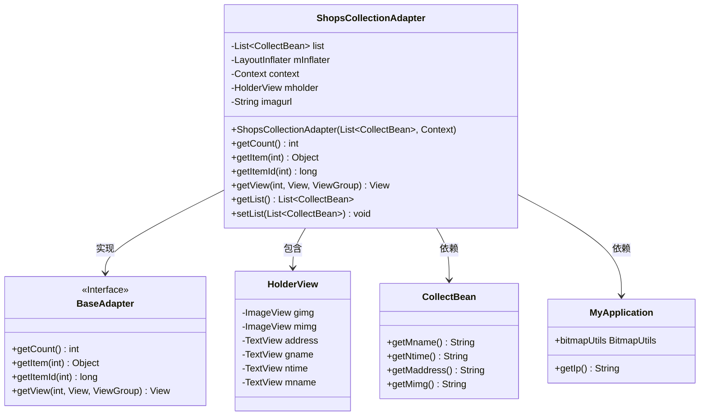

# 基础信息

|      |      |
|------|------|
| 名称 | ShopsCollectionAdapter |
| 编码语言 | .java |
| 代码路径 | happycat/src/com/happycat/adapter/ShopsCollectionAdapter.java |
| 包名 | com.happycat.adapter |
| 依赖项 | ['java.util.List', 'com.example.happucat.R', 'com.happycat.Bean.CollectBean', 'com.happycat.util.MyApplication', 'android.content.Context', 'android.util.Log', 'android.view.LayoutInflater', 'android.view.View', 'android.view.ViewGroup', 'android.widget.BaseAdapter', 'android.widget.ImageView', 'android.widget.TextView'] |
| 概述说明 | ShopsCollectionAdapter是Android适配器类，用于展示店铺收藏列表，包含图片、名称、地址和时间等数据，使用ViewHolder优化性能，通过BaseAdapter实现列表视图绑定。 |

# 说明

ShopsCollectionAdapter是一个继承自BaseAdapter的自定义适配器类，用于在Android应用中展示店铺收藏列表数据。该类包含一个内部类HolderView用于缓存视图组件，包括ImageView和TextView等控件。适配器通过构造函数接收数据列表和上下文对象，并重写了getCount、getItem、getItemId和getView等核心方法。在getView方法中实现了视图复用逻辑，通过LayoutInflater加载布局，并绑定数据到视图组件上。数据绑定包括设置店铺名称、地址、时间和图片等，图片URL通过拼接基础路径和相对路径生成。此外还提供了获取和设置数据列表的方法。

# 类列表 Class Summary

| 名称   | 类型  | 说明 |
|-------|------|-------------|
| ShopsCollectionAdapter | class | ShopsCollectionAdapter是Android适配器类，用于展示店铺收藏列表，包含图片、名称、地址和时间，使用ViewHolder优化性能，支持数据获取和设置。 |

## 类 ShopsCollectionAdapter

|      |      |
|------|------|
| 访问范围 | public |
| 类型 | class |
| 名称 | ShopsCollectionAdapter |
| 说明 | ShopsCollectionAdapter是Android适配器类，用于展示店铺收藏列表，包含图片、名称、地址和时间，使用ViewHolder优化性能，支持数据获取和设置。 |

### UML类图

这段代码展示了一个Android自定义适配器`ShopsCollectionAdapter`，它继承自`BaseAdapter`，用于管理店铺收藏列表数据的展示。适配器内部使用`HolderView`模式优化列表性能，通过`CollectBean`获取数据，并依赖`MyApplication`获取网络图片地址和图片加载工具。类图清晰地呈现了适配器与数据模型、工具类之间的关系，以及内部视图持有者的结构。

### 内部方法调用关系图

```mermaid
graph TD
    A["类ShopsCollectionAdapter"]
    B["属性: List<CollectBean> list"]
    C["属性: LayoutInflater mInflater"]
    D["属性: Context context"]
    E["属性: HolderView mholder"]
    F["属性: String imagurl"]
    G["构造方法: ShopsCollectionAdapter(List<CollectBean>, Context)"]
    H["方法: int getCount()"]
    I["方法: Object getItem(int)"]
    J["方法: long getItemId(int)"]
    K["内部类: HolderView"]
    L["方法: View getView(int, View, ViewGroup)"]
    M["方法: List<CollectBean> getList()"]
    N["方法: void setList(List<CollectBean>)"]
    O["HolderView属性: ImageView gimg,mimg"]
    P["HolderView属性: TextView address,gname,ntime,mname"]
    Q["操作: mInflater.inflate布局"]
    R["操作: findViewById绑定控件"]
    S["操作: setText设置文本"]
    T["操作: bitmapUtils.display加载图片"]

    A --> B
    A --> C
    A --> D
    A --> E
    A --> F
    A --> G
    A --> H
    A --> I
    A --> J
    A --> K
    A --> L
    A --> M
    A --> N
    K --> O
    K --> P
    L --> Q
    L --> R
    L --> S
    L --> T
```

这段代码是Android开发中的自定义适配器类，继承自BaseAdapter，主要用于管理店铺收藏列表的数据展示。核心功能包括通过getView方法实现列表项的视图复用，使用ViewHolder模式优化性能，动态加载网络图片，并封装了对CollectBean数据集合的操作。适配器通过LayoutInflater加载布局文件，将数据绑定到列表项的各个视图控件上，同时处理了视图回收和重用的逻辑。

### 字段列表 Field List

| 名称  | 类型  | 说明 |
|-------|-------|------|
| mInflater | LayoutInflater | 私有布局填充器mInflater |
| imagurl = " http://" + MyApplication.getIp() + ":8080/happycat/img/" | String | 代码定义字符串变量imagurl，拼接HTTP协议、应用IP地址、端口8080及路径/happycat/img/。 |
| list | List<CollectBean> | 私有集合变量list，存储CollectBean类型对象。 |
| mholder | HolderView | 定义变量mholder，类型为HolderView。 |
| context | Context | 上下文对象，用于存储应用或系统运行时的环境信息。 |

### 方法列表

| 名称  | 类型  | 说明 |
|-------|-------|------|
| getItemId | long | 重写getItemId方法，直接返回输入参数arg0。 |
| getCount | int | 这是一个重写的getCount方法，返回列表list的大小。 |
| getItem | Object | 方法重写，返回列表中指定位置的元素。 |
| getList | List<CollectBean> | 获取CollectBean类型的列表数据。 |
| setList | void | 方法setList接收一个CollectBean类型的列表参数，并将其赋值给当前对象的list属性。 |
| getView | View | 重写getView方法，复用convertView优化性能，初始化视图控件并设置数据，包括图片、名称、时间和地址，最后返回视图。 |

