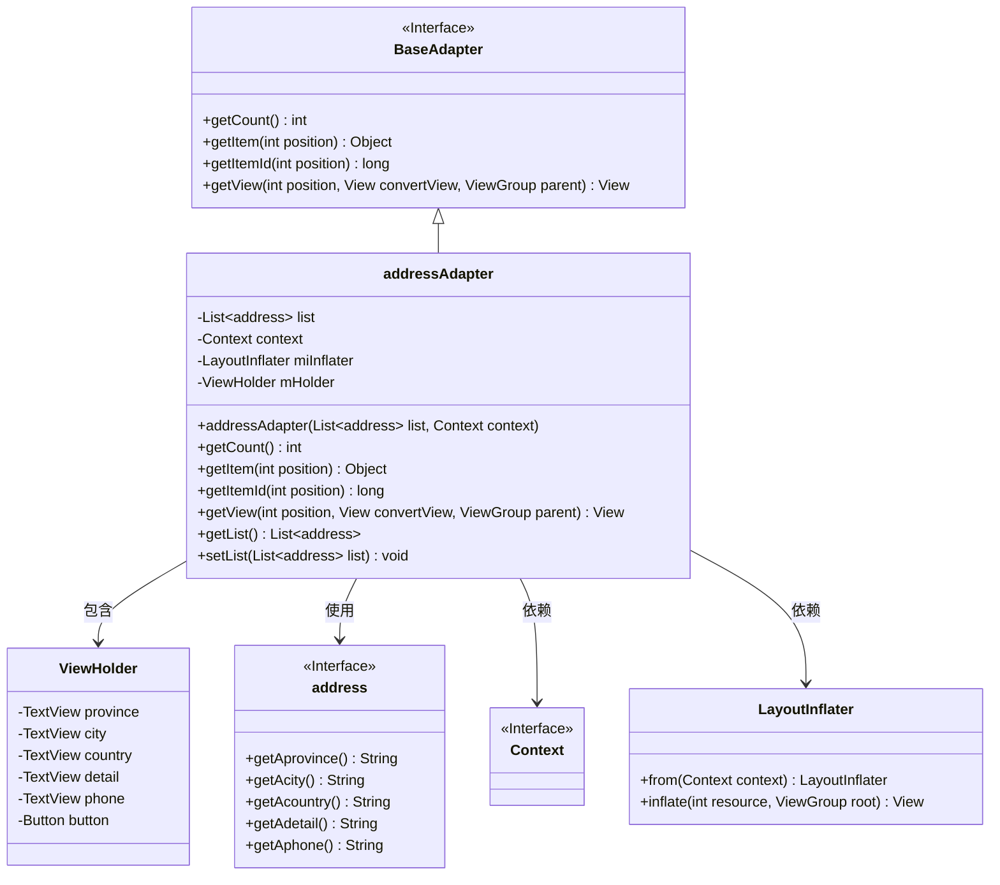
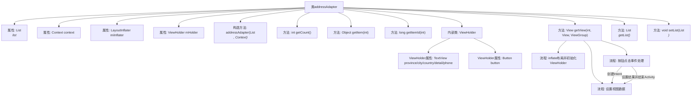

# 基础信息

|      |      |
|------|------|
| 名称 | addressAdapter |
| 编码语言 | .java |
| 代码路径 | happycat/src/com/happycat/adapter/addressAdapter.java |
| 包名 | com.happycat.adapter |
| 依赖项 | ['java.util.List', 'com.example.happucat.R', 'com.happycat.AddressActivity', 'com.happycat.Bean.address', 'com.happycat.adapter.PingjiaAdapter.ViewHolder', 'android.app.Activity', 'android.content.Context', 'android.content.Intent', 'android.view.LayoutInflater', 'android.view.View', 'android.view.View.OnClickListener', 'android.view.ViewGroup', 'android.widget.BaseAdapter', 'android.widget.Button', 'android.widget.LinearLayout', 'android.widget.TextView'] |
| 概述说明 | addressAdapter是Android适配器类，用于管理地址列表显示。包含ViewHolder优化视图复用，处理列表项点击事件返回完整地址信息。 |

# 说明

addressAdapter是一个继承自BaseAdapter的自定义适配器类，用于在Android应用中展示地址列表。它包含一个address对象列表和上下文对象，通过LayoutInflater加载布局。适配器实现了getCount、getItem和getItemId方法以支持列表操作。内部类ViewHolder用于缓存视图组件，包括省份、城市、区县、详细地址、电话等TextView和一个确认按钮。getView方法负责视图的初始化和数据绑定，当按钮点击时，会构建地址字符串并通过Intent返回结果。适配器还提供了获取和设置列表的方法。

# 类列表 Class Summary

| 名称   | 类型  | 说明 |
|-------|------|-------------|
| addressAdapter | class | 这是一个Android自定义适配器类，用于展示地址列表。它继承BaseAdapter，包含列表数据绑定、视图复用逻辑，以及按钮点击事件处理，最终返回选中的地址信息。 |

## 类 addressAdapter

|      |      |
|------|------|
| 访问范围 | public |
| 类型 | class |
| 名称 | addressAdapter |
| 说明 | 这是一个Android自定义适配器类，用于展示地址列表。它继承BaseAdapter，包含列表数据绑定、视图复用逻辑，以及按钮点击事件处理，最终返回选中的地址信息。 |

### UML类图

这段代码展示了一个Android自定义适配器`addressAdapter`，它继承自`BaseAdapter`接口，用于管理地址列表数据的展示。适配器包含内部类`ViewHolder`用于视图缓存优化，通过`getView()`方法动态绑定地址数据到UI组件，并实现按钮点击事件处理。类图清晰地呈现了适配器与数据模型(address)、Android系统组件(Context/LayoutInflater)的依赖关系，以及视图持有者的内部结构。

### 内部方法调用关系图

这段代码是一个Android自定义适配器类，用于管理地址列表的显示和交互。流程图展示了类结构、属性关系以及核心方法调用链。适配器继承自BaseAdapter，包含数据绑定、视图复用和点击事件处理等关键功能。ViewHolder模式优化了列表性能，getView方法实现了视图初始化和数据填充逻辑，按钮点击会触发地址信息回传并关闭当前Activity。整个设计体现了典型的Android列表适配器实现模式。

### 字段列表 Field List

| 名称  | 类型  | 说明 |
|-------|-------|------|
| mHolder | ViewHolder | 定义ViewHolder变量mHolder，用于列表项视图复用优化。 |
| miInflater | LayoutInflater | 布局加载器实例声明。 |
| context | Context | 定义上下文变量context。 |
| list | List<address> | 声明一个名为list的地址列表变量。 |

### 方法列表

| 名称  | 类型  | 说明 |
|-------|-------|------|
| getList | List<address> | 方法返回地址列表。 |
| getItemId | long | 方法getItemId返回列表项的ID，直接使用位置参数作为ID。 |
| getItem | Object | 该方法返回列表中指定位置的元素。参数为位置索引，返回对应元素。 |
| getCount | int | 这是一个Java方法重写，返回列表大小作为计数结果。 |
| getView | View | 自定义列表适配器方法，初始化视图并绑定数据，点击按钮返回地址信息。 |
| setList | void | 设置对象中的地址列表属性。 |

