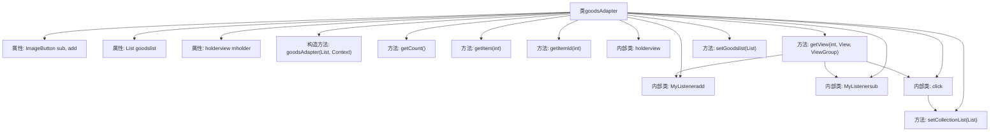

# 基础信息

|      |      |
|------|------|
| 名称 | goodsAdapter |
| 编码语言 | .java |
| 代码路径 | happycat/src/com/happycat/adapter/goodsAdapter.java |
| 包名 | com.happycat.adapter |
| 依赖项 | ['java.util.ArrayList', 'java.util.List', 'com.example.happucat.R', 'com.happycat.MerchatDataActivity', 'com.happycat.Bean.Goods', 'com.happycat.global.GlobalContacts', 'com.happycat.util.MyApplication', 'com.lidroid.xutils.HttpUtils', 'com.lidroid.xutils.exception.HttpException', 'com.lidroid.xutils.http.RequestParams', 'com.lidroid.xutils.http.ResponseInfo', 'com.lidroid.xutils.http.callback.RequestCallBack', 'com.lidroid.xutils.http.client.HttpRequest.HttpMethod', 'android.annotation.SuppressLint', 'android.content.Context', 'android.util.Log', 'android.view.LayoutInflater', 'android.view.View', 'android.view.View.OnClickListener', 'android.view.ViewGroup', 'android.widget.BaseAdapter', 'android.widget.ImageButton', 'android.widget.TextView', 'android.widget.Toast'] |
| 概述说明 | 商品适配器类，用于展示商品列表，包含加减按钮、收藏功能及购物车金额计算。 |

# 说明

该代码定义了一个名为goodsAdapter的类，继承自BaseAdapter，用于管理商品列表的显示和交互。主要功能包括：展示商品名称、价格、销量和购买数量；通过加减按钮调整购买数量并计算总金额和起送差额；支持收藏和取消收藏商品，并通过HTTP请求与服务器同步收藏状态。适配器还处理了用户登录状态的检查，确保未登录用户无法操作购买功能。通过自定义的holderview类缓存视图组件以提高性能。整体实现了商品列表的动态展示和用户交互功能。

# 类列表 Class Summary

| 名称   | 类型  | 说明 |
|-------|------|-------------|
| goodsAdapter | class | 商品适配器类，管理商品列表显示与交互，包括增减数量、收藏功能及购物车金额计算。 |


## 类 goodsAdapter

|      |      |
|------|------|
| 访问范围 | public |
| 类型 | class |
| 名称 | goodsAdapter |
| 说明 | 商品适配器类，管理商品列表显示与交互，包括增减数量、收藏功能及购物车金额计算。 |


### UML类图

```mermaid
classDiagram
    class BaseAdapter {
        <<Interface>>
        +getCount() int
        +getItem(int position) Object
        +getItemId(int position) long
        +getView(int position, View convertView, ViewGroup parent) View
    }

    class goodsAdapter {
        -ImageButton sub
        -ImageButton add
        -List~Goods~ goodslist
        -holderview mholder
        -Context context
        -LayoutInflater mInflater
        -double chae
        -TextView buycat_jine
        -TextView buycat_chae
        -TextView geshu
        -TextView gname
        -TextView gprice
        -TextView nume
        -ImageButton imaggood
        -List~Goods~ gList
        -int count
        -int collection
        -String url1
        -HttpUtils httpUtils
        -MerchatDataActivity merchatDataActivity
        -List~Integer~ collectionList
        +goodsAdapter(List~Goods~ goodslist, Context context)
        +getCount() int
        +getItem(int position) Object
        +getItemId(int position) long
        +getView(int position, View convertView, ViewGroup parent) View
        +getGoodslist() List~Goods~
        +setGoodslist(List~Goods~ goodslist) void
        +setgList(List~Goods~ gList) void
        +setCollectionList(List~Integer~ collectionList) void
    }

    class holderview {
        -TextView buycat_jine
        -TextView buycat_chae
    }

    class MyListeneradd {
        -int mPosition
        -TextView textView
        +MyListeneradd(int inPosition, TextView t)
        +onClick(View v) void
    }

    class MyListenersub {
        -int mPosition
        -TextView textView
        +MyListenersub(int inPosition, TextView t)
        +onClick(View v) void
    }

    class click {
        -int mPosition
        -ImageButton imageButton
        +click(int inPosition, ImageButton image)
        +onClick(View arg0) void
        -getInsertFromServer(int id, int collection) void
    }

    class Goods {
        // 假设Goods类存在，包含以下字段
        -String gname
        -double price
        -int number
        -int gnum
        -int id
        +getGname() String
        +getPrice() double
        +getNumber() int
        +getGnum() int
        +setGnum(int gnum) void
        +getId() int
    }

    class MerchatDataActivity {
        +getBuycat_chae() TextView
        +getBuycat_jine() TextView
        +getMqsf() double
    }

    goodsAdapter --> BaseAdapter : 实现
    goodsAdapter --> holderview : 包含
    goodsAdapter --> MyListeneradd : 创建
    goodsAdapter --> MyListenersub : 创建
    goodsAdapter --> click : 创建
    goodsAdapter --> Goods : 操作
    goodsAdapter --> MerchatDataActivity : 依赖
    MyListeneradd --> Goods : 操作
    MyListenersub --> Goods : 操作
    click --> Goods : 操作
```

这段代码是一个Android适配器类`goodsAdapter`，继承自`BaseAdapter`，用于管理商品列表的显示和交互。主要功能包括：商品列表展示、购物车金额计算、收藏状态切换、商品数量增减操作等。通过内部类`holderview`实现视图缓存，`MyListeneradd`和`MyListenersub`处理数量增减逻辑，`click`处理收藏状态切换。适配器与`MerchatDataActivity`交互获取上下文数据，并通过HTTP请求与服务器同步收藏状态。整体设计采用MVC模式，将数据、视图和控制器分离。


### 内部方法调用关系图



这段代码是一个Android适配器类`goodsAdapter`，继承自`BaseAdapter`，主要用于商品列表的展示和交互。适配器管理商品数据的显示，包括商品名称、价格、销量等信息，并处理用户交互如增减商品数量、收藏商品等操作。通过内部类`holderview`缓存视图组件，`MyListeneradd`和`MyListenersub`处理数量增减逻辑，`click`处理收藏状态切换及网络请求。整体流程包括视图初始化、数据绑定、用户交互处理和网络通信，实现了商品列表的动态展示和状态管理。

### 字段列表 Field List

| 名称  | 类型  | 说明 |
|-------|-------|------|
| gList | List<Goods> | 商品列表gList |
| mInflater | LayoutInflater | 布局加载器，用于动态加载XML布局文件到视图对象。 |
| goodslist | List<Goods> | 商品列表 |
| mholder | holderview | 定义变量mholder，类型为holderview。 |
| add | ImageButton | 定义两个图像按钮变量：sub和add。 |
| collection | int | 声明两个私有整型变量：count和collection。 |
| httpUtils | HttpUtils | HttpUtils工具类实例声明。 |
| geshu | TextView | 定义TextView变量geshu。 |
| context | Context | 定义Context类型的变量context。 |
| collectionList = new ArrayList<Integer>() | List<Integer> | 创建整数类型的动态数组集合。 |
| nume | TextView | 定义TextView变量nume。 |
| buycat_chae | TextView | 定义了两个TextView变量：buycat_jine和buycat_chae。 |
| gprice | TextView | TextView控件gprice用于显示文本内容。 |
| url1 | String | 声明了一个字符串变量url1。 |
| imaggood | ImageButton | 定义图像按钮控件imaggood。 |
| gname | TextView | 定义TextView变量gname。 |
| chae | double | 变量声明：双精度浮点型变量chae。 |
| merchatDataActivity | MerchatDataActivity | 私有成员变量merchatDataActivity，类型为MerchatDataActivity。 |

### 方法列表

| 名称  | 类型  | 说明 |
|-------|-------|------|
| setgList | void | 这是一个Java方法，用于设置类中的商品列表属性gList。方法接收一个Goods类型的List参数，并将其赋值给当前对象的gList成员变量。 |
| setCollectionList | void | 设置整数列表属性方法，将输入参数赋值给类的collectionList成员变量。 |
| getGoodslist | List<Goods> | 获取商品列表的方法，返回商品集合goodslist。 |
| getItem | Object | 方法getItem返回goodslist中指定位置的元素。 |
| getCount | int | 方法getCount返回goodslist的大小。 |
| getItemId | long | 方法getItemId返回列表项的ID，默认实现直接返回位置参数position。 |
| getView | View | 适配器getView方法：加载商品列表项布局，初始化视图控件，设置商品信息（名称、价格、销量等），处理收藏状态切换，绑定增减商品数量及收藏点击事件。 |
| setGoodslist | void | 设置商品列表的方法，将输入的商品列表赋值给当前对象的商品列表属性。 |


