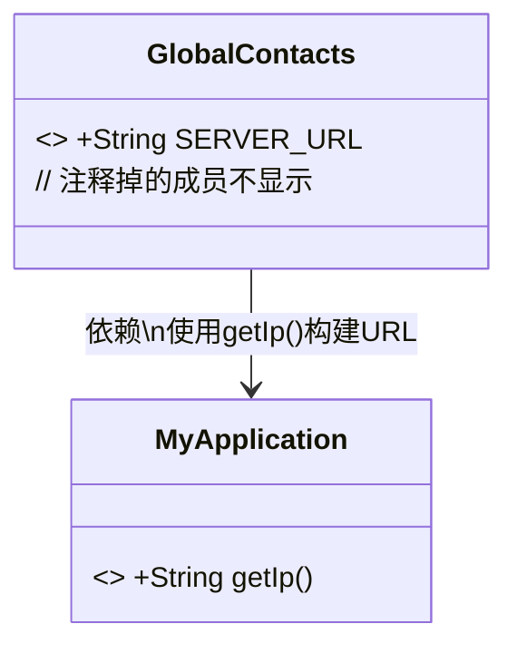
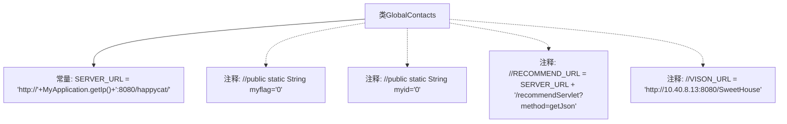

# 基础信息

|      |      |
|------|------|
| 名称 | GlobalContacts |
| 编码语言 | .java |
| 代码路径 | happycat/src/com/happycat/global/GlobalContacts.java |
| 包名 | com.happycat.global |
| 依赖项 | ['android.view.ViewDebug.FlagToString', 'com.happycat.util.MyApplication'] |
| 概述说明 | GlobalContacts类定义了服务器URL常量，基于MyApplication的IP动态生成，端口8080，路径为happycat。其他注释掉的代码未启用。 |

# 说明

GlobalContacts类定义了全局常量SERVER_URL，其值为动态拼接的HTTP地址，包含MyApplication.getIp()获取的IP和固定端口8080及路径/happycat/。注释显示该类曾包含其他静态变量和URL常量，但当前已被注释掉。

# 类列表 Class Summary

| 名称   | 类型  | 说明 |
|-------|------|-------------|
| GlobalContacts | class | GlobalContacts类定义了服务器URL，基于MyApplication的IP动态生成，端口8080，路径为happycat。其他注释掉的字段未使用。 |

## 类 GlobalContacts

|      |      |
|------|------|
| 访问范围 | public |
| 类型 | class |
| 名称 | GlobalContacts |
| 说明 | GlobalContacts类定义了服务器URL，基于MyApplication的IP动态生成，端口8080，路径为happycat。其他注释掉的字段未使用。 |

### UML类图

这段类图展示了GlobalContacts工具类与MyApplication类的关系。GlobalContacts包含一个不可修改的静态常量SERVER_URL，其值通过调用MyApplication.getIp()方法动态构建。虽然代码中包含多个被注释掉的静态成员，但根据规则只展示实际有效的SERVER_URL字段。该设计模式常用于集中管理全局配置，通过依赖MyApplication获取基础IP地址来构建完整的服务端URL。

### 内部方法调用关系图

该流程图展示了GlobalContacts类的结构，核心是定义了一个静态常量SERVER_URL，其值通过拼接字符串和调用MyApplication.getIp()方法动态生成。类中还包含四个被注释掉的成员变量/常量定义，包括myflag、myid、RECOMMEND_URL和VISON_URL，这些注释可能表示未启用的功能或待开发的配置项。流程图清晰区分了实际生效的代码和被注释的代码，突出了当前有效的服务器URL配置。

### 字段列表 Field List

| 名称  | 类型  | 说明 |
|-------|-------|------|
| SERVER_URL = "http://"+MyApplication.getIp()+":8080/happycat/" | String | 定义静态常量SERVER_URL，值为基于MyApplication.getIp()动态拼接的HTTP服务地址，端口8080，路径/happycat/。 |

### 方法列表

| 名称  | 类型  | 说明 |
|-------|-------|------|

