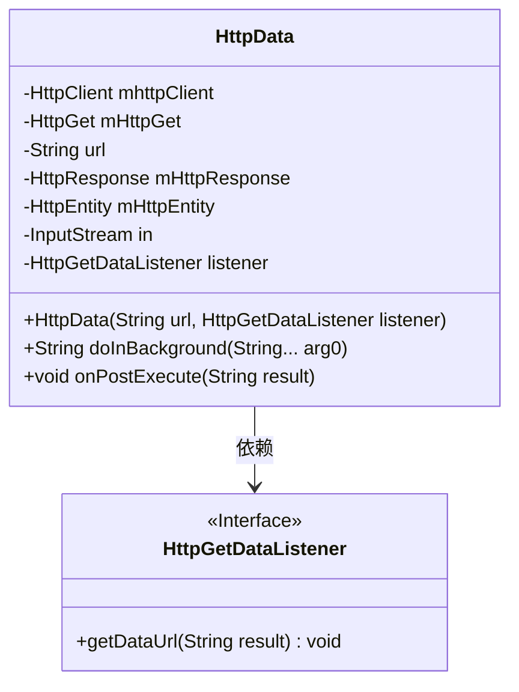
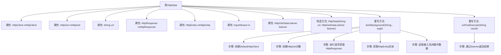

# 基础信息

|      |      |
|------|------|
| 名称 | HttpData |
| 编码语言 | .java |
| 代码路径 | happycat/src/com/happycat/tuling/HttpData.java |
| 包名 | com.happycat.tuling |
| 依赖项 | ['java.io.BufferedReader', 'java.io.InputStream', 'java.io.InputStreamReader', 'org.apache.http.HttpEntity', 'org.apache.http.HttpResponse', 'org.apache.http.client.HttpClient', 'org.apache.http.client.methods.HttpGet', 'org.apache.http.impl.client.DefaultHttpClient', 'android.os.AsyncTask'] |
| 概述说明 | HttpData类继承AsyncTask，通过HttpGet请求URL数据，使用BufferedReader读取响应内容，最后通过接口返回结果。 |

# 说明

HttpData类继承AsyncTask，用于异步HTTP GET请求。构造函数接收URL和监听器。doInBackground方法创建HttpClient和HttpGet对象，执行请求并读取响应数据，通过BufferedReader逐行读取到StringBuffer后返回。onPostExecute方法通过监听器接口返回结果。异常处理部分为空。

# 类列表 Class Summary

| 名称   | 类型  | 说明 |
|-------|------|-------------|
| HttpData | class | HttpData类继承AsyncTask，通过HttpGet异步请求URL数据，使用BufferedReader读取响应内容，通过接口返回结果。 |

## 类 HttpData

|      |      |
|------|------|
| 访问范围 | public |
| 类型 | class |
| 名称 | HttpData |
| 说明 | HttpData类继承AsyncTask，通过HttpGet异步请求URL数据，使用BufferedReader读取响应内容，通过接口返回结果。 |

### UML类图

这段代码展示了一个基于Android AsyncTask的HTTP数据获取类HttpData，它通过HttpGet方式异步获取网络数据。类中包含核心HTTP组件（HttpClient/HttpGet/HttpResponse等），通过实现AsyncTask的三个关键方法（doInBackground和onPostExecute）完成网络请求和结果回调。通过HttpGetDataListener接口实现异步回调机制，将获取到的字符串数据返回给调用者。整个设计体现了Android网络请求的典型模式，需要注意异常处理和资源关闭等边缘情况。

### 内部方法调用关系图

这段代码是一个继承自AsyncTask的HttpData类，用于异步执行HTTP GET请求。流程图展示了类结构、属性关系以及核心方法doInBackground和onPostExecute的执行流程。doInBackground方法中依次创建HTTP客户端、发起请求、处理响应数据，最后通过BufferedReader读取返回内容；onPostExecute则通过接口回调将结果返回给调用者。整个过程实现了网络请求与UI线程的分离，符合Android异步任务处理规范。

### 字段列表 Field List

| 名称  | 类型  | 说明 |
|-------|-------|------|
| mHttpResponse | HttpResponse | 私有HttpResponse对象mHttpResponse。 |
| mHttpEntity | HttpEntity | 私有HTTP实体对象mHttpEntity。 |
| mHttpGet | HttpGet | 声明一个私有HttpGet对象变量mHttpGet。 |
| mhttpClient | HttpClient | 私有HttpClient实例变量mhttpClient。 |
| in | InputStream | 私有输入流变量in |
| listener | HttpGetDataListener | 私有HttpGetDataListener监听器实例。 |
| url | String | 私有字符串变量url，用于存储网址。 |

### 方法列表

| 名称  | 类型  | 说明 |
|-------|-------|------|
| onPostExecute | void | Android异步任务完成后通过接口回调返回结果数据。 |
| doInBackground | String | 异步HTTP请求处理，使用DefaultHttpClient执行HttpGet，读取响应内容并返回字符串，异常时返回null。 |

