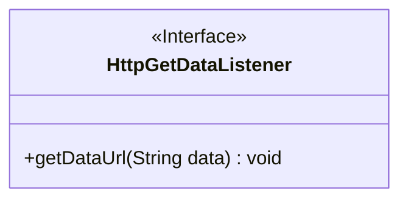
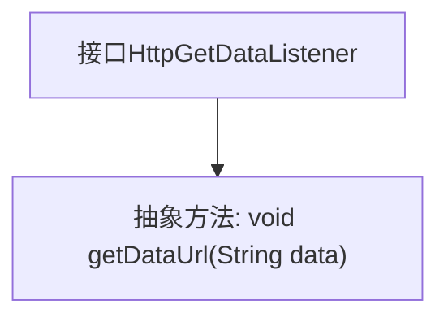

# 基础信息

|      |      |
|------|------|
| 名称 | HttpGetDataListener |
| 编码语言 | .java |
| 代码路径 | happycat/src/com/happycat/tuling/HttpGetDataListener.java |
| 包名 | com.happycat.tuling |
| 依赖项 | [] |
| 概述说明 | 接口HttpGetDataListener定义了一个方法getDataUrl，用于接收字符串类型的数据参数data。 |

# 说明

该内容定义了一个名为HttpGetDataListener的公共接口，其中包含一个名为getDataUrl的抽象方法。该方法接收一个String类型的参数data，不返回任何值。接口设计用于处理通过HTTP获取数据后的回调操作，允许实现类在获取数据时执行特定逻辑。

# 类列表 Class Summary

| 名称   | 类型  | 说明 |
|-------|------|-------------|
| HttpGetDataListener | interface | 接口HttpGetDataListener定义了一个方法getDataUrl，用于接收字符串数据。 |

## 类 HttpGetDataListener

|      |      |
|------|------|
| 访问范围 | public |
| 类型 | interface |
| 名称 | HttpGetDataListener |
| 说明 | 接口HttpGetDataListener定义了一个方法getDataUrl，用于接收字符串数据。 |

### UML类图

这段代码定义了一个名为`HttpGetDataListener`的接口，其中包含一个抽象方法`getDataUrl`，该方法接收一个`String`类型参数`data`且无返回值。接口在类图中用`<<Interface>>`标记，方法默认为公有故用`+`前缀。该接口用于规范数据获取行为，实现类需提供具体的数据处理逻辑，适用于需要回调HTTP请求结果的场景。

### 内部方法调用关系图

这段流程图展示了HttpGetDataListener接口的结构，该接口定义了一个名为getDataUrl的抽象方法，接收String类型参数data且无返回值。作为接口，它强制实现类必须提供该方法的具体实现，常用于HTTP数据获取场景中的回调机制。图中清晰呈现了接口与方法之间的从属关系，符合面向对象设计中接口定义行为规范的原则。

### 字段列表 Field List

| 名称  | 类型  | 说明 |
|-------|-------|------|

### 方法列表

| 名称  | 类型  | 说明 |
|-------|-------|------|
| getDataUrl | void | 定义方法getDataUrl，接收字符串参数data，无返回值。 |

