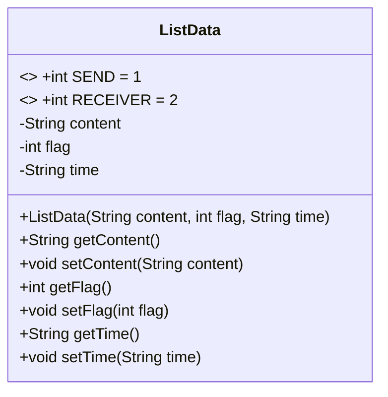
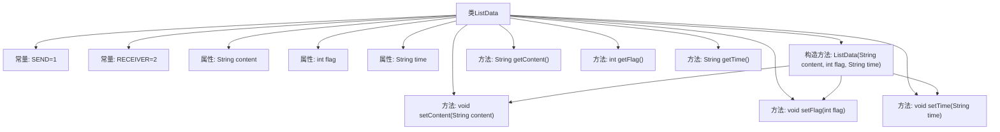

# 基础信息

|      |      |
|------|------|
| 名称 | ListData |
| 编码语言 | .java |
| 代码路径 | happycat/src/com/happycat/tuling/ListData.java |
| 包名 | com.happycat.tuling |
| 依赖项 | [] |
| 概述说明 | ListData类用于存储消息内容、类型（发送/接收）和时间，提供构造方法和getter/setter。 |

# 说明

ListData类用于管理消息数据，包含三个主要属性：content存储消息内容，flag标识消息类型（1为发送，2为接收），time记录消息时间。类提供构造方法和getter/setter方法，支持初始化及修改这三个属性。

# 类列表 Class Summary

| 名称   | 类型  | 说明 |
|-------|------|-------------|
| ListData | class | ListData类用于存储消息内容、类型（发送/接收）和时间，提供构造方法和getter/setter。 |

## 类 ListData

|      |      |
|------|------|
| 访问范围 | public |
| 类型 | class |
| 名称 | ListData |
| 说明 | ListData类用于存储消息内容、类型（发送/接收）和时间，提供构造方法和getter/setter。 |

### UML类图

这段代码定义了一个`ListData`类，用于表示消息数据。该类包含三个主要属性：`content`表示消息内容，`flag`标识消息类型（发送或接收，通过常量`SEND`和`RECEIVER`区分），`time`记录消息时间。类提供了完整的构造方法和getter/setter方法，用于封装和操作这些属性。这是一个典型的数据封装类，适用于消息列表等需要区分发送和接收场景的应用程序。

### 内部方法调用关系图

该流程图展示了ListData类的完整结构，包含两个消息类型的常量定义(SEND/RECEIVER)、三个核心属性(content/flag/time)以及相关方法。构造方法通过调用setter方法初始化对象，每个属性都有对应的getter/setter方法用于封装访问。箭头清晰表示了类成员间的从属关系和方法调用链，特别突出了构造方法对setter的内部调用逻辑。

### 字段列表 Field List

| 名称  | 类型  | 说明 |
|-------|-------|------|
| time | String | 私有字符串变量time，用于存储时间信息。 |
| flag | int | 私有整型变量flag |
| SEND=1 | int | 定义静态常量SEND，值为1。 |
| RECEIVER=2 | int | 定义静态常量RECEIVER，值为2。 |
| content | String | 私有字符串变量content。 |

### 方法列表

| 名称  | 类型  | 说明 |
|-------|-------|------|
| setContent | void | 设置内容属性的方法，将输入字符串赋值给类变量content。 |
| getContent | String | 方法返回字符串类型变量content的值。 |
| setTime | void | 这是一个Java方法，用于设置对象的time属性，接受一个字符串参数time。 |
| setFlag | void | 设置整型标志值的方法。 |
| getFlag | int | 获取flag值的公共方法。 |
| getTime | String | 获取时间字符串的方法。 |

