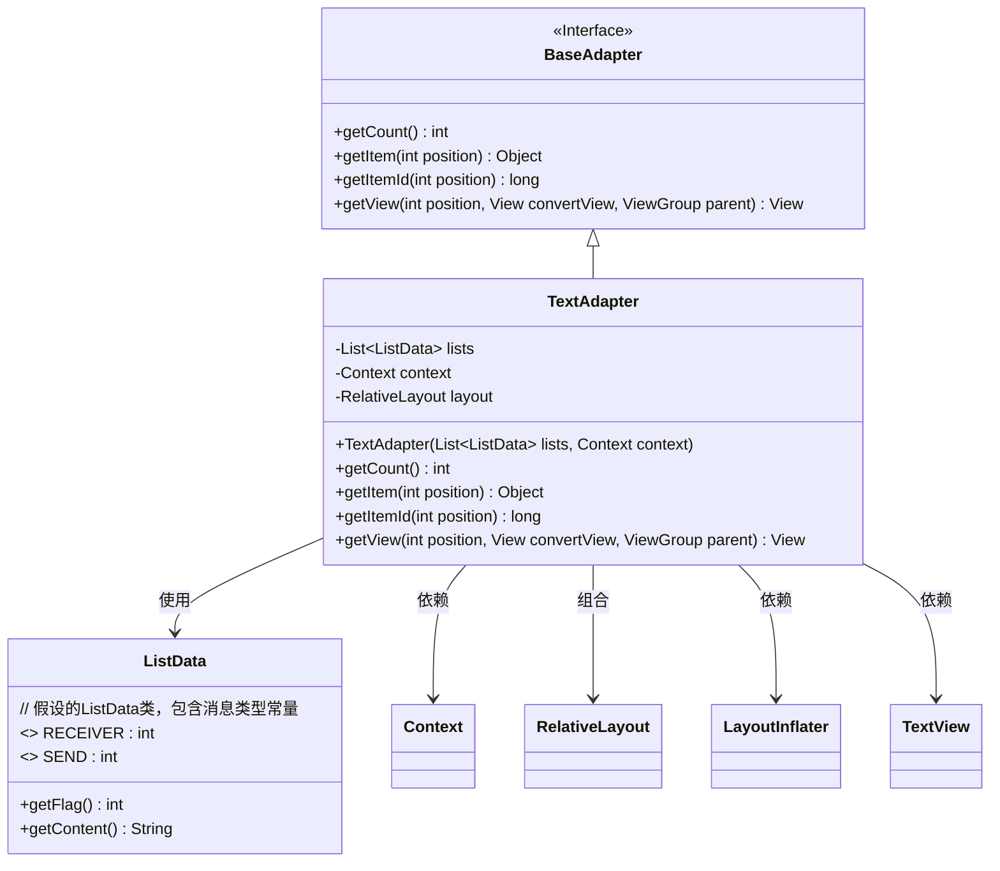
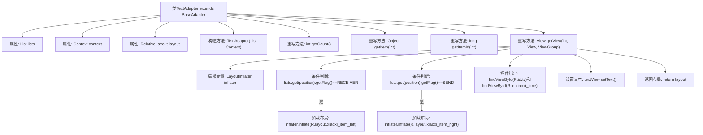

# 基础信息

|      |      |
|------|------|
| 名称 | TextAdapter |
| 编码语言 | .java |
| 代码路径 | happycat/src/com/happycat/tuling/TextAdapter.java |
| 包名 | com.happycat.tuling |
| 依赖项 | ['java.util.List', 'com.example.happucat.R', 'android.content.Context', 'android.view.LayoutInflater', 'android.view.View', 'android.view.ViewGroup', 'android.widget.BaseAdapter', 'android.widget.RelativeLayout', 'android.widget.TextView'] |
| 概述说明 | TextAdapter继承BaseAdapter，用于显示消息列表。根据消息类型加载不同布局，设置内容和时间，返回对应视图。关键方法：getCount、getItem、getView。 |

# 说明

TextAdapter是一个继承自BaseAdapter的适配器类，用于管理ListData类型的数据列表。它包含lists和context两个成员变量，通过构造函数初始化。适配器实现了四个关键方法：getCount返回列表大小，getItem和getItemId分别获取指定位置的数据项和ID。getView方法根据数据项的Flag值（RECEIVER或SEND）动态加载不同的布局（xiaoxi_item_left或xiaoxi_item_right），并设置文本内容和时间显示。

# 类列表 Class Summary

| 名称   | 类型  | 说明 |
|-------|------|-------------|
| TextAdapter | class | TextAdapter继承BaseAdapter，根据数据标志位动态加载左右布局，显示消息内容和时间。 |

## 类 TextAdapter

|      |      |
|------|------|
| 访问范围 | public |
| 类型 | class |
| 名称 | TextAdapter |
| 说明 | TextAdapter继承BaseAdapter，根据数据标志位动态加载左右布局，显示消息内容和时间。 |

### UML类图

这段类图展示了TextAdapter继承自BaseAdapter接口，并实现了其核心方法。TextAdapter用于管理ListData类型的数据列表，根据消息类型(RECEIVER/SEND)动态加载不同布局(xiaoxi_item_left/right)，并填充消息内容和时间。它依赖于Android的Context、RelativeLayout、LayoutInflater和TextView等组件，体现了典型的Android列表适配器模式，用于在ListView或RecyclerView中展示多样化的消息界面。

### 内部方法调用关系图

这段代码是一个Android适配器类TextAdapter，继承自BaseAdapter，用于在ListView中显示不同类型的消息布局。流程图展示了类结构、属性、构造方法和重写的四个关键方法。其中getView()方法根据数据标志位动态加载左右消息布局（RECEIVER/SEND），绑定控件并设置文本内容，最后返回填充好的视图。整个过程清晰地反映了适配器模式中数据与视图的绑定逻辑。

### 字段列表 Field List

| 名称  | 类型  | 说明 |
|-------|-------|------|
| context | Context | 私有上下文变量声明 |
| layout | RelativeLayout | 私有相对布局控件变量layout。 |
| lists | List<ListData> | 私有列表变量，存储ListData类型的多个列表。 |

### 方法列表

| 名称  | 类型  | 说明 |
|-------|-------|------|
| getItem | Object | 方法getItem返回列表中指定位置的元素。参数position为索引，lists为数据源。 |
| getCount | int | 方法getCount返回列表lists的元素数量。 |
| getItemId | long | 方法返回列表项的ID，直接使用位置参数作为ID值。 |
| getView | View | 该方法根据数据标志动态加载左右聊天布局，设置内容后返回视图。关键点：判断标志、加载对应布局、填充内容。 |

