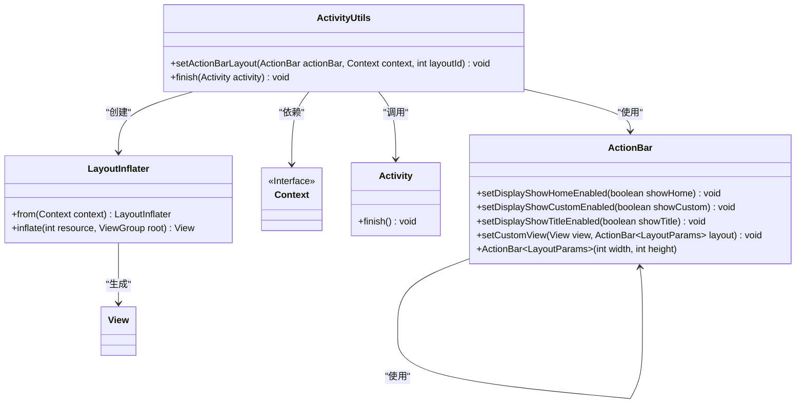
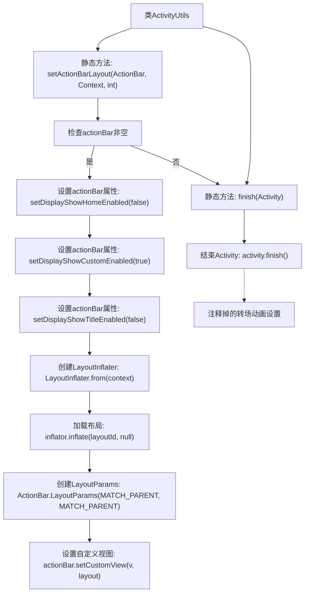

# 基础信息

|      |      |
|------|------|
| 名称 | ActivitiyUtils |
| 编码语言 | .java |
| 代码路径 | happycat/src/com/happycat/util/ActivitiyUtils.java |
| 包名 | com.happycat.util |
| 依赖项 | ['android.app.ActionBar', 'android.app.Activity', 'android.app.ActionBar.LayoutParams', 'android.content.Context', 'android.view.LayoutInflater', 'android.view.View'] |
| 概述说明 | ActivitiyUtils类提供两个静态方法：setActionBarLayout用于自定义ActionBar布局，finish用于结束Activity。 |

# 说明

ActivitiyUtils类包含两个静态方法。setActionBarLayout方法用于配置ActionBar的自定义布局，包括禁用默认显示选项、通过LayoutInflater加载指定布局文件、设置全屏布局参数并应用自定义视图。finish方法用于结束当前Activity，包含注释掉的页面切换动画代码。两个方法都进行了空安全判断或直接调用系统API。

# 类列表 Class Summary

| 名称   | 类型  | 说明 |
|-------|------|-------------|
| ActivitiyUtils | class | ActivitiyUtils类提供两个静态方法：setActionBarLayout用于自定义ActionBar布局，finish用于结束Activity。 |

## 类 ActivitiyUtils

|      |      |
|------|------|
| 访问范围 | public |
| 类型 | class |
| 名称 | ActivitiyUtils |
| 说明 | ActivitiyUtils类提供两个静态方法：setActionBarLayout用于自定义ActionBar布局，finish用于结束Activity。 |

### UML类图

类图描述：该图展示了ActivityUtils工具类的结构及其关联关系。ActivityUtils提供两个静态方法：setActionBarLayout用于自定义ActionBar布局（依赖ActionBar、Context和LayoutInflater），finish用于关闭Activity。ActionBar通过LayoutParams设置自定义视图参数，LayoutInflater负责将XML布局转换为View对象。所有类通过清晰的依赖关系连接，体现了Android界面控制的典型模式。

### 内部方法调用关系图

这段代码流程图展示了ActivityUtils工具类的两个核心功能：1) 自定义ActionBar布局的配置流程，包括空值检查、属性设置、视图加载和参数配置；2) Activity结束方法及其被注释掉的转场动画设置。图中清晰呈现了条件分支和连续调用的关系，特别是setActionBarLayout方法中从参数验证到最终视图设置的完整过程，以及finish方法的简单调用链。

### 字段列表 Field List

| 名称  | 类型  | 说明 |
|-------|-------|------|

### 方法列表

| 名称  | 类型  | 说明 |
|-------|-------|------|
| setActionBarLayout | void | 设置ActionBar自定义布局，禁用默认标题和图标，启用自定义视图并填充指定布局。 |
| finish | void | 静态方法finish用于关闭指定Activity，可选添加转场动画（示例中被注释）。 |

