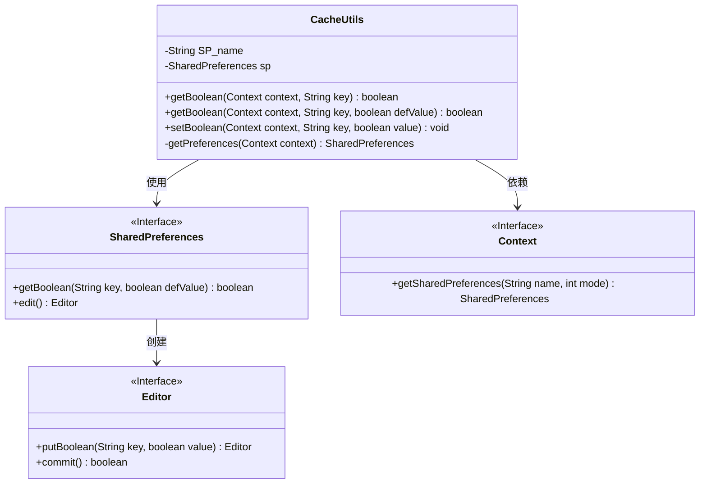
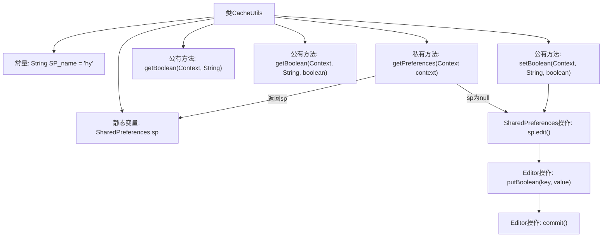

# 基础信息

|      |      |
|------|------|
| 名称 | CacheUtils |
| 编码语言 | .java |
| 代码路径 | happycat/src/com/happycat/util/CacheUtils.java |
| 包名 | com.happycat.util |
| 依赖项 | ['android.content.Context', 'android.content.SharedPreferences', 'android.content.SharedPreferences.Editor'] |
| 概述说明 | CacheUtils类封装SharedPreferences操作，提供获取和设置布尔类型缓存的方法，支持默认值设置。 |

# 说明

这是一个名为CacheUtils的工具类，用于管理Android应用的SharedPreferences缓存操作。类中包含一个静态常量SP_name作为SharedPreferences文件名，以及一个静态SharedPreferences对象sp。提供了获取和设置Boolean类型缓存数据的方法：getBoolean方法有两个重载版本，可指定默认值或不指定（默认为false）；setBoolean方法用于存储Boolean值。所有方法都通过getPreferences方法获取SharedPreferences实例，确保单例模式。设置操作通过Editor完成并立即提交。

# 类列表 Class Summary

| 名称   | 类型  | 说明 |
|-------|------|-------------|
| CacheUtils | class | CacheUtils类提供SharedPreferences的布尔值读写功能，支持默认值设置，单例模式优化性能。 |

## 类 CacheUtils

|      |      |
|------|------|
| 访问范围 | public |
| 类型 | class |
| 名称 | CacheUtils |
| 说明 | CacheUtils类提供SharedPreferences的布尔值读写功能，支持默认值设置，单例模式优化性能。 |

### UML类图

这段代码展示了一个Android缓存工具类CacheUtils，它通过SharedPreferences接口实现布尔类型数据的存储和读取。类图中包含CacheUtils核心类及其依赖的Android系统接口：SharedPreferences用于数据存取，Editor用于数据编辑，Context用于获取SharedPreferences实例。CacheUtils采用单例模式管理SharedPreferences实例，提供重载的getBoolean方法和setBoolean方法，支持默认值设置和布尔值存储功能。

### 内部方法调用关系图

这段代码展示了一个Android工具类CacheUtils，用于管理SharedPreferences的布尔类型数据缓存。核心逻辑包含三个层级：1) 类结构包含常量和静态变量声明；2) 通过getPreferences方法实现SharedPreferences的单例初始化；3) 提供两组getBoolean方法（带/不带默认值）和setBoolean方法来实现数据的读写操作。所有方法都通过getPreferences获取SharedPreferences实例，其中setBoolean方法还涉及Editor的putBoolean和commit操作。流程图清晰展现了类成员关系和方法调用链。

### 字段列表 Field List

| 名称  | 类型  | 说明 |
|-------|-------|------|
| sp | SharedPreferences | 私有静态共享偏好对象sp。 |
| SP_name = "hy" | String | 私有静态常量字符串SP_name，值为"hy"。 |

### 方法列表

| 名称  | 类型  | 说明 |
|-------|-------|------|
| setBoolean | void | 静态方法setBoolean用于在SharedPreferences中存储布尔值，接收上下文、键名和布尔值参数，通过编辑器提交修改。 |
| getBoolean | boolean | 从SharedPreferences读取布尔值，默认返回false。 |
| getBoolean | boolean | 从SharedPreferences读取布尔值，默认返回defValue。 |
| getPreferences | SharedPreferences | 获取SharedPreferences单例，若未初始化则创建私有模式实例并返回。 |

