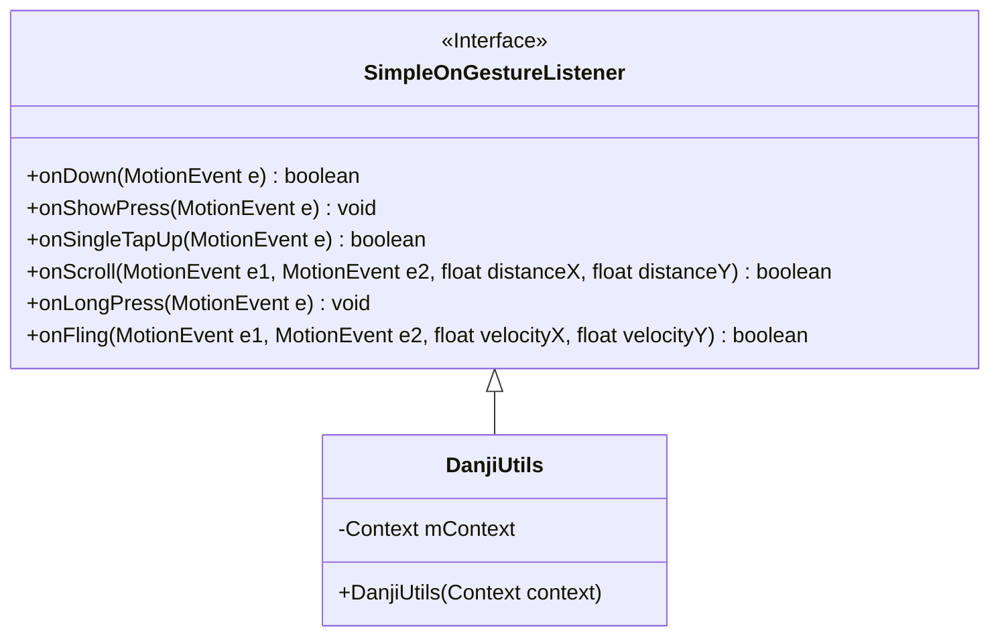

# 基础信息

|      |      |
|------|------|
| 名称 | DanjiUtils |
| 编码语言 | .java |
| 代码路径 | happycat/src/com/happycat/util/DanjiUtils.java |
| 包名 | com.happycat.util |
| 依赖项 | ['android.content.Context', 'android.view.MotionEvent', 'android.view.GestureDetector.SimpleOnGestureListener', 'android.widget.Toast'] |
| 概述说明 | DanjiUtils类继承SimpleOnGestureListener，包含多种手势事件处理，如单击、双击、长按、滚动等，通过Toast显示动作类型。 |

# 说明

DanjiUtils类继承自SimpleOnGestureListener，用于处理手势事件。该类接收Context参数进行初始化。注释中详细描述了多种手势触发条件及对应行为：包括单击、短按、抬起、滚动、长按、滑动等基础手势，以及双击、双击事件和单击确认等双击监听器接口。所有被注释的方法均通过Toast显示当前动作类型，其中部分方法返回布尔值表示是否消费事件。

# 类列表 Class Summary

| 名称   | 类型  | 说明 |
|-------|------|-------------|
| DanjiUtils | class | DanjiUtils类继承SimpleOnGestureListener，处理手势事件如单击、双击、滚动等，通过Toast显示动作类型。 |

## 类 DanjiUtils

|      |      |
|------|------|
| 访问范围 | public |
| 类型 | class |
| 名称 | DanjiUtils |
| 说明 | DanjiUtils类继承SimpleOnGestureListener，处理手势事件如单击、双击、滚动等，通过Toast显示动作类型。 |

### UML类图

这段代码展示了一个Android手势工具类DanjiUtils，它继承自SimpleOnGestureListener接口。该类主要用于处理各种触摸事件，如单击、双击、长按、滑动等，但当前所有手势处理方法都被注释掉了。类中包含一个Context成员变量用于显示Toast提示，通过构造函数初始化。虽然所有具体实现被注释，但类结构清晰地展示了其作为手势监听器的基本框架，保留了所有可能的手势事件处理方法的签名。

### 内部方法调用关系图

```mermaid
graph TD
    A["类DanjiUtils"]
    B["继承: SimpleOnGestureListener"]
    C["属性: Context mContext"]
    D["构造方法: DanjiUtils(Context context)"]
    E["注释方法: onDown(MotionEvent e)"]
    F["注释方法: onShowPress(MotionEvent e)"]
    G["注释方法: onSingleTapUp(MotionEvent e)"]
    H["注释方法: onScroll(MotionEvent e1, e2, distanceX, distanceY)"]
    I["注释方法: onLongPress(MotionEvent e)"]
    J["注释方法: onFling(MotionEvent e1, e2, velocityX, velocityY)"]
    K["注释方法: onDoubleTap(MotionEvent e)"]
    L["注释方法: onDoubleTapEvent(MotionEvent e)"]
    M["注释方法: onSingleTapConfirmed(MotionEvent e)"]

    A --> B
    A --> C
    A --> D
    A -.-> E
    A -.-> F
    A -.-> G
    A -.-> H
    A -.-> I
    A -.-> J
    A -.-> K
    A -.-> L
    A -.-> M
```

这段代码展示了一个Android手势工具类DanjiUtils，它继承自SimpleOnGestureListener。该类包含一个Context属性和构造方法，同时注释了多个手势回调方法（如单击、双击、长按、滑动等）。所有手势处理方法都被注释掉，表明当前类未实现具体手势逻辑，但保留了可能的手势处理框架。每个注释方法都对应特定手势事件，通过Toast显示动作类型。

### 字段列表 Field List

| 名称  | 类型  | 说明 |
|-------|-------|------|
| mContext | Context | 私有上下文变量mContext。 |

### 方法列表

| 名称  | 类型  | 说明 |
|-------|-------|------|

