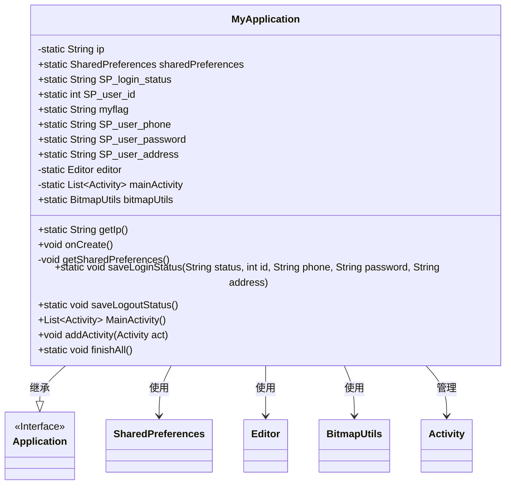

# 基础信息

|      |      |
|------|------|
| 名称 | MyApplication |
| 编码语言 | .java |
| 代码路径 | happycat/src/com/happycat/util/MyApplication.java |
| 包名 | com.happycat.util |
| 依赖项 | ['java.util.ArrayList', 'java.util.List', 'com.example.happucat.R', 'com.lidroid.xutils.BitmapUtils', 'android.app.Activity', 'android.app.Application', 'android.content.SharedPreferences', 'android.content.SharedPreferences.Editor'] |
| 概述说明 | MyApplication类继承Application，管理全局变量如IP、用户登录状态、ID、手机号等，使用SharedPreferences存储数据，提供登录登出状态保存方法，并管理Activity生命周期。 |

# 说明

该代码定义了一个名为MyApplication的类，继承自Application类，用于管理全局应用状态。主要功能包括：存储静态IP地址（192.168.191.1）；通过SharedPreferences管理用户登录状态、ID、手机号、密码和地址；提供图片加载工具BitmapUtils的初始化配置；维护活动列表并实现批量关闭功能。包含保存登录状态和注销状态的方法，通过SharedPreferences持久化用户数据。

# 类列表 Class Summary

| 名称   | 类型  | 说明 |
|-------|------|-------------|
| MyApplication | class | MyApplication类继承Application，管理全局IP、用户登录状态、ID、手机号等数据，使用SharedPreferences存储，提供登录登出状态保存及活动管理功能。 |


## 类 MyApplication

|      |      |
|------|------|
| 访问范围 | public |
| 类型 | class |
| 名称 | MyApplication |
| 说明 | MyApplication类继承Application，管理全局IP、用户登录状态、ID、手机号等数据，使用SharedPreferences存储，提供登录登出状态保存及活动管理功能。 |


### UML类图



类图描述：
MyApplication类继承自Application接口，是一个Android应用全局上下文类。它管理着应用的IP地址、用户登录状态(SP_login_status)、用户ID(SP_user_id)、手机号(SP_user_phone)等静态字段，通过SharedPreferences持久化存储这些数据。类中包含BitmapUtils用于图片加载，并维护一个Activity列表(mainActivity)用于统一管理应用中的Activity生命周期。提供了保存登录/登出状态、添加/销毁Activity等方法，是一个典型的应用全局状态管理类。


### 内部方法调用关系图

```mermaid
graph TD
    A["类MyApplication"]
    B["静态属性: String ip"]
    C["静态属性: SharedPreferences sharedPreferences"]
    D["静态属性: String SP_login_status"]
    E["静态属性: int SP_user_id"]
    F["静态属性: String myflag"]
    G["静态属性: String SP_user_phone"]
    H["静态属性: String SP_user_password"]
    I["静态属性: String SP_user_address"]
    J["静态属性: Editor editor"]
    K["静态属性: List<Activity> mainActivity"]
    L["静态属性: BitmapUtils bitmapUtils"]
    M["方法: static String getIp()"]
    N["重写方法: void onCreate()"]
    O["私有方法: void getSharedPreferences()"]
    P["静态方法: saveLoginStatus(String,int,String,String,String)"]
    Q["静态方法: saveLogoutStatus()"]
    R["方法: List<Activity> MainActivity()"]
    S["方法: void addActivity(Activity)"]
    T["静态方法: void finishAll()"]

    A --> B
    A --> C
    A --> D
    A --> E
    A --> F
    A --> G
    A --> H
    A --> I
    A --> J
    A --> K
    A --> L
    A --> M
    A --> N
    N --> O
    N --> L
    N --> "super.onCreate()"
    O --> C
    O --> J
    O --> "读取SP_login_status"
    O --> "读取SP_user_id"
    O --> "读取SP_user_phone"
    O --> "读取SP_user_password"
    O --> "读取SP_user_address"
    A --> P
    P --> "更新SP_login_status"
    P --> "更新SP_user_id"
    P --> "更新SP_user_phone"
    P --> "更新SP_user_password"
    P --> "更新SP_user_address"
    P --> "editor.commit()"
    A --> Q
    Q --> "重置登录状态"
    Q --> "editor.clear()"
    Q --> "editor.commit()"
    A --> R
    A --> S
    S --> "mainActivity.add(act)"
    A --> T
    T --> "遍历mainActivity"
    T --> "act.finish()"
    T --> "mainActivity=null"
```

这段代码是Android应用的基础类，继承自Application类，主要功能包括：管理全局变量（如IP地址、用户登录状态）、初始化图片加载工具BitmapUtils、处理SharedPreferences数据存储、以及管理Activity生命周期。通过静态方法和属性实现全局状态管理，包含登录状态保存/清除、Activity集合管理等功能，确保应用数据在全局范围内可访问和持久化。

### 字段列表 Field List

| 名称  | 类型  | 说明 |
|-------|-------|------|
| SP_user_phone | String | 静态字符串变量SP_user_phone，用于存储用户电话信息。 |
| mainActivity = new ArrayList<Activity>() | List<Activity> | 私有静态列表mainActivity，存储Activity类型对象。 |
| editor | Editor | 私有静态编辑器实例。 |
| SP_user_id=0 | int | 静态整型变量SP_user_id，初始值为0。 |
| sharedPreferences | SharedPreferences | 定义静态共享偏好对象sharedPreferences。 |
| SP_login_status | String | 静态字符串变量SP_login_status，用于存储登录状态。 |
| myflag="0" | String | 静态字符串变量myflag初始值为"0"。 |
| SP_user_address | String | 静态字符串变量，存储用户地址信息。 |
| ip = "192.168.191.1" | String | 私有静态字符串变量ip存储IP地址192.168.191.1。 |
| bitmapUtils | BitmapUtils | 声明一个静态BitmapUtils类实例变量bitmapUtils。 |
| SP_user_password = "SP_user_password" | String | 静态字符串常量，存储用户密码键名。 |

### 方法列表

| 名称  | 类型  | 说明 |
|-------|-------|------|
| getSharedPreferences | void | 获取SharedPreferences存储的登录状态、用户ID、电话、密码和地址信息。 |
| onCreate | void | 应用启动时初始化BitmapUtils，设置默认加载中和失败图片，并调用父类onCreate和获取SharedPreferences。 |
| saveLoginStatus | void | 保存登录状态方法，存储状态、ID、手机号、密码和地址到共享偏好中。 |
| saveLogoutStatus | void | 保存登出状态：设置登录状态为登出，清空用户ID和密码，保留用户电话，提交更改。 |
| MainActivity | List<Activity> | 获取主活动列表的方法，返回成员变量mainActivity。 |
| addActivity | void | 方法`addActivity`将传入的`Activity`对象添加到`mainActivity`集合中。 |
| finishAll | void | 结束所有未关闭的活动并清空主活动列表。 |
| getIp | String | 获取IP地址的静态方法。 |


