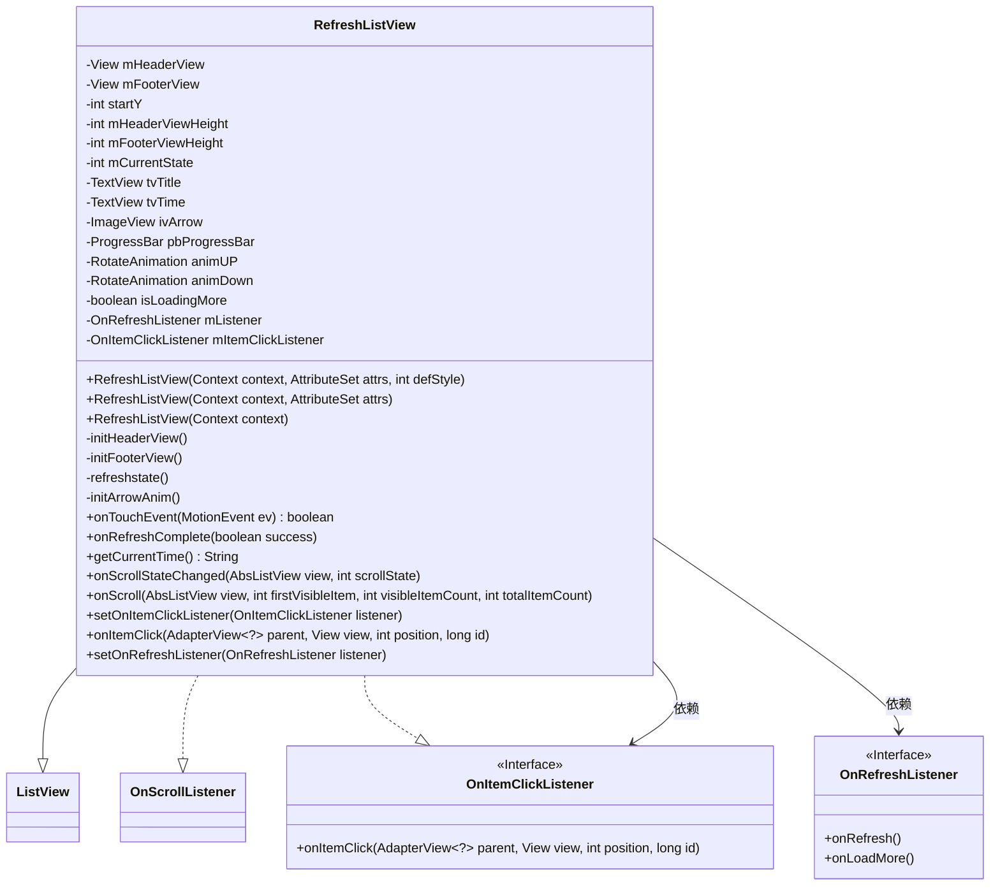
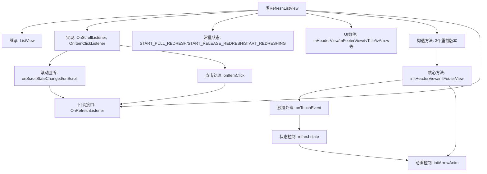

# 基础信息

|      |      |
|------|------|
| 名称 | RefreshListView |
| 编码语言 | .java |
| 代码路径 | happycat/src/com/happycat/util/RefreshListView.java |
| 包名 | com.happycat.util |
| 依赖项 | ['java.text.SimpleDateFormat', 'java.util.Date', 'com.example.happucat.R', 'android.content.Context', 'android.util.AttributeSet', 'android.view.MotionEvent', 'android.view.View', 'android.view.animation.Animation', 'android.view.animation.RotateAnimation', 'android.widget.AbsListView', 'android.widget.AbsListView.OnScrollListener', 'android.widget.AdapterView', 'android.widget.ImageView', 'android.widget.ListView', 'android.widget.ProgressBar', 'android.widget.TextView'] |
| 概述说明 | 自定义下拉刷新和上拉加载的ListView组件，包含状态管理、动画效果及事件监听接口。 |

# 说明

这是一个自定义的RefreshListView类，继承自ListView并实现了滚动和点击监听。它支持下拉刷新和上拉加载功能。类中定义了三种状态：下拉刷新、松开刷新和正在刷新。包含头布局和脚布局，分别用于显示刷新和加载更多内容。通过触摸事件处理下拉操作，使用动画效果切换箭头方向，提供接口回调处理刷新和加载逻辑。还包括时间显示、滚动到底部自动加载等功能，是一个功能完善的下拉刷新列表控件。

# 类列表 Class Summary

| 名称   | 类型  | 说明 |
|-------|------|-------------|
| RefreshListView | class | 自定义下拉刷新和上拉加载的ListView控件，包含头布局和脚布局，支持状态切换、动画效果及刷新回调接口。 |

## 类 RefreshListView

|      |      |
|------|------|
| 访问范围 | public |
| 类型 | class |
| 名称 | RefreshListView |
| 说明 | 自定义下拉刷新和上拉加载的ListView控件，包含头布局和脚布局，支持状态切换、动画效果及刷新回调接口。 |

### UML类图

这段代码实现了一个支持下拉刷新和上拉加载的自定义ListView组件。类图中展示了RefreshListView继承自ListView并实现了OnScrollListener和OnItemClickListener接口，同时定义了OnRefreshListener回调接口。该组件通过管理头布局和脚布局的显示状态，结合触摸事件处理和滚动监听，实现了完整的刷新加载功能，包含三种状态切换（下拉刷新、松开刷新、正在刷新）和动画效果。

### 内部方法调用关系图

该流程图展示了RefreshListView的核心结构和交互逻辑。类继承自ListView并实现两个监听器接口，通过三个构造方法初始化头/脚视图。核心功能包括触摸事件处理（onTouchEvent）、状态切换（refreshstate）和动画控制（initArrowAnim），通过OnRefreshListener接口实现刷新/加载回调。滚动监听和点击事件最终都会触发接口回调，形成完整的交互闭环。所有UI组件和状态常量共同支撑下拉刷新和上拉加载功能。

### 字段列表 Field List

| 名称  | 类型  | 说明 |
|-------|-------|------|
| mFooterViewHeight | int | 定义两个私有整型变量，分别记录头部和底部视图的高度。 |
| tvTime | TextView | 定义两个TextView变量：tvTitle和tvTime。 |
| START_REDRESHING = 2 | int | 定义私有静态常量START_REFRESHING，值为2，用于控制刷新操作的起始状态。 |
| mItemClickListener | OnItemClickListener | 定义项目点击监听器变量mItemClickListener。 |
| animUP | RotateAnimation | 私有旋转动画对象animUP |
| animDown | RotateAnimation | 旋转动画对象（向下旋转） |
| ivArrow | ImageView | 私有图像视图控件ivArrow。 |
| isLoadingMore | boolean | 布尔变量，表示是否正在加载更多数据。 |
| mListener | OnRefreshListener | 监听刷新事件的回调接口mListener。 |
| mFooterView | View | 声明两个私有视图变量：mHeaderView和mFooterView。 |
| startY = -1 | int | 私有整型变量startY初始化为-1。 |
| START_PULL_REDRESH = 0 | int | 定义静态常量START_PULL_REDRESH，初始值为0。 |
| mCurrentState = START_PULL_REDRESH | int | 当前状态变量初始化为开始下拉刷新状态。 |
| START_RELEASE_REDRESH = 1 | int | 静态常量START_RELEASE_REDRESH，值为1，用于控制释放刷新起始点。 |
| pbProgressBar | ProgressBar | 私有进度条控件pbProgressBar。 |

### 方法列表

| 名称  | 类型  | 说明 |
|-------|-------|------|
| initHeaderView | void | 初始化下拉刷新头部视图，包括标题、时间、箭头图标和进度条，设置初始高度和隐藏状态，并初始化箭头动画及默认刷新时间。 |
| getCurrentTime | String | 获取当前时间并格式化为"yyyy-MM-dd HH:mm:ss"的字符串。 |
| onTouchEvent | boolean | 处理触摸事件实现下拉刷新功能：记录起始位置，计算偏移量，根据移动距离改变头部视图padding和刷新状态，松开时触发刷新或隐藏头部。 |
| onScroll | void | 滚动监听方法，参数包括视图、首项位置、可见项数和总项数。 |
| onScrollStateChanged | void | 滑动监听方法，当滚动停止或惯性滑动时，若到达列表底部且未加载中，则显示底部视图并触发加载更多回调。 |
| onItemClick | void | 重写onItemClick方法，当点击列表项时，若监听器存在则调用其onItemClick方法，并调整position参数。 |
| refreshstate | void | 刷新状态控制方法：根据当前状态设置标题、箭头图标和进度条显示，执行相应动画或刷新操作。 |
| setOnItemClickListener | void | 重写setOnItemClickListener方法，调用父类设置监听器并保存外部传入的listener。 |
| setOnRefreshListener | void | 设置刷新监听器，将传入的syJsActivity赋值给mListener。 |
| initFooterView | void | 初始化列表底部视图，设置加载布局并测量高度，初始隐藏视图，添加滚动监听。 |
| initArrowAnim | void | 初始化箭头动画：创建向上旋转180度和向下复位动画，各持续200毫秒，动画完成后保持状态。 |
| onRefreshComplete | void | 刷新完成处理：若在加载更多则隐藏底部视图，否则重置顶部刷新状态，更新标题和箭头显示，隐藏进度条和头部视图，成功时更新刷新时间。 |

