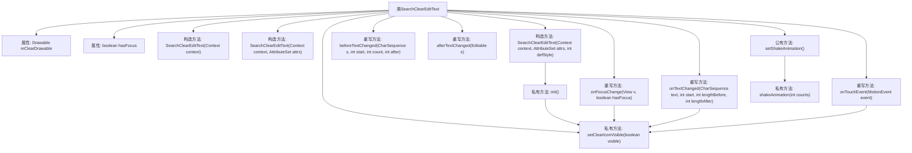

# 基础信息

|      |      |
|------|------|
| 名称 | SearchClearEditText |
| 编码语言 | .java |
| 代码路径 | happycat/src/com/happycat/util/SearchClearEditText.java |
| 包名 | com.happycat.util |
| 依赖项 | ['com.example.happucat.R', 'android.content.Context', 'android.graphics.drawable.Drawable', 'android.text.Editable', 'android.text.TextWatcher', 'android.util.AttributeSet', 'android.widget.EditText', 'android.view.MotionEvent', 'android.view.View', 'android.view.View.OnFocusChangeListener', 'android.view.animation.Animation', 'android.view.animation.CycleInterpolator', 'android.view.animation.TranslateAnimation'] |
| 概述说明 | 自定义EditText控件，实现清除按钮功能，支持焦点变化监听和文本变化监听，可设置抖动动画。 |

# 说明

SearchClearEditText是一个自定义EditText控件，实现了焦点变化监听和文本变化监听。它包含清除图标功能，当有焦点且文本非空时显示清除图标，点击可清空文本。初始化时设置右侧图标并绑定监听器。触摸事件处理图标点击区域判断，文本变化时动态控制图标可见性。还提供了抖动动画效果，通过TranslateAnimation实现水平晃动。整体实现了搜索框常见的交互功能。

# 类列表 Class Summary

| 名称   | 类型  | 说明 |
|-------|------|-------------|
| SearchClearEditText | class | 自定义EditText控件，实现清除按钮显示隐藏逻辑，支持触摸清除文本和焦点变化监听，包含抖动动画效果。 |


## 类 SearchClearEditText

|      |      |
|------|------|
| 访问范围 | public |
| 类型 | class |
| 名称 | SearchClearEditText |
| 说明 | 自定义EditText控件，实现清除按钮显示隐藏逻辑，支持触摸清除文本和焦点变化监听，包含抖动动画效果。 |


### UML类图

```mermaid
classDiagram
    class SearchClearEditText {
        -Drawable mClearDrawable
        -boolean hasFocus
        +SearchClearEditText(Context context)
        +SearchClearEditText(Context context, AttributeSet attrs)
        +SearchClearEditText(Context context, AttributeSet attrs, int defStyle)
        -init()
        +onTouchEvent(MotionEvent event) boolean
        -setClearIconVisible(boolean visible)
        +onFocusChange(View v, boolean hasFocus)
        +beforeTextChanged(CharSequence s, int start, int count, int after)
        +afterTextChanged(Editable s)
        +onTextChanged(CharSequence text, int start, int lengthBefore, int lengthAfter)
        +setShakeAnimation()
        -shakeAnimation(int counts) Animation
    }
    <<Interface>> OnFocusChangeListener
    <<Interface>> TextWatcher
    SearchClearEditText --|> EditText
    SearchClearEditText ..|> OnFocusChangeListener : 实现
    SearchClearEditText ..|> TextWatcher : 实现
```

这段代码定义了一个自定义的EditText控件SearchClearEditText，它继承自EditText并实现了OnFocusChangeListener和TextWatcher接口。主要功能包括：1) 右侧显示清除图标；2) 根据焦点状态和文本内容动态显示/隐藏清除图标；3) 点击清除图标清空文本；4) 支持抖动动画效果。类中包含私有成员变量mClearDrawable和hasFocus，以及初始化、事件处理和动画相关的方法。


### 内部方法调用关系图



这段代码实现了一个自定义的EditText控件，具有清除文本和动画效果功能。流程图展示了类结构，包括三个构造方法、初始化方法init()、触摸事件处理onTouchEvent()、清除图标显示控制setClearIconVisible()、焦点变化处理onFocusChange()、文本变化监听方法以及抖动动画相关方法。核心逻辑是通过监听焦点和文本变化来控制清除图标的显示，并在触摸事件中实现清除文本功能。

### 字段列表 Field List

| 名称  | 类型  | 说明 |
|-------|-------|------|
| mClearDrawable | Drawable | 私有成员变量mClearDrawable，类型为Drawable。 |
| hasFocus | boolean | 变量hasFocus表示是否拥有焦点，类型为布尔值。 |

### 方法列表

| 名称  | 类型  | 说明 |
|-------|-------|------|
| afterTextChanged | void | 这是一个Android的空方法重写，用于监听文本变化后的操作，当前未实现具体逻辑。 |
| setClearIconVisible | void | 方法`setClearIconVisible`控制清除图标显示。参数`visible`为真时设置右侧图标为`mClearDrawable`，否则置空。保持其他方向图标不变。 |
| init | void | 初始化方法：获取右侧图标，若无则使用搜索图标，设置图标边界，默认隐藏，添加焦点和文本变化监听。 |
| onTextChanged | void | 重写onTextChanged方法，当输入框有焦点且文本长度大于0时显示清除图标。 |
| onFocusChange | void | 重写焦点变化方法，有焦点时根据文本长度显示清除图标，无焦点时隐藏清除图标。 |
| shakeAnimation | Animation | 创建水平抖动动画，幅度10像素，循环次数可调，持续1秒。 |
| setShakeAnimation | void | 方法setShakeAnimation调用shakeAnimation(5)设置抖动动画效果。 |
| onTouchEvent | boolean | 触摸抬起时检查是否点击右侧图标区域，是则清空文本。 |
| beforeTextChanged | void | 重写beforeTextChanged方法，用于处理文本变化前的操作，参数包括字符序列、起始位置、变化前字符数和变化后字符数。 |


