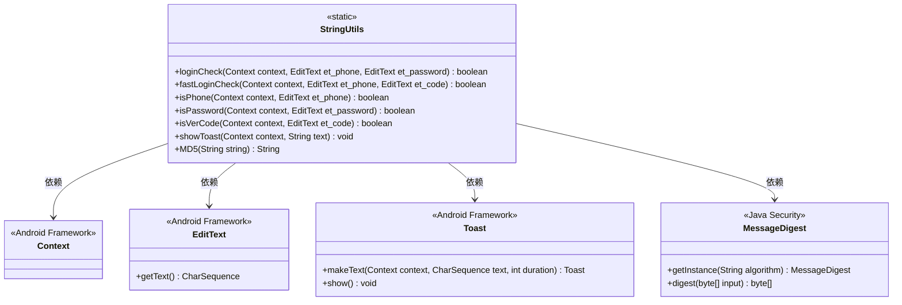
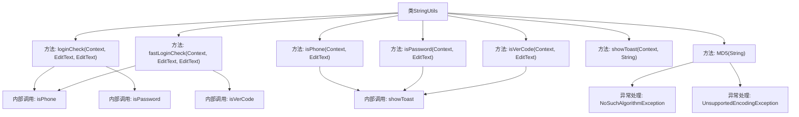

# 基础信息

|      |      |
|------|------|
| 名称 | StringUtils |
| 编码语言 | .java |
| 代码路径 | happycat/src/com/happycat/util/StringUtils.java |
| 包名 | com.happycat.util |
| 依赖项 | ['java.io.UnsupportedEncodingException', 'java.security.MessageDigest', 'java.security.NoSuchAlgorithmException', 'android.content.Context', 'android.util.Config', 'android.widget.EditText', 'android.widget.Toast'] |
| 概述说明 | StringUtils类提供登录验证功能，包括手机号、密码和验证码的格式检查，支持MD5加密，并包含Toast提示方法。 |

# 说明

该代码定义了一个名为StringUtils的工具类，包含多个静态方法用于验证用户输入。主要功能包括：loginCheck方法验证手机号和密码格式，fastLoginCheck方法验证手机号和验证码格式。isPhone方法检查手机号非空且符合指定格式，isPassword方法检查密码长度在6-16位之间，isVerCode方法验证4位验证码。所有验证失败时会通过showToast方法显示提示信息。此外还提供了MD5方法用于字符串加密，处理异常并返回加密后的十六进制字符串。

# 类列表 Class Summary

| 名称   | 类型  | 说明 |
|-------|------|-------------|
| StringUtils | class | StringUtils类提供登录验证功能，包括手机号、密码和验证码校验，支持MD5加密和Toast提示。 |

## 类 StringUtils

|      |      |
|------|------|
| 访问范围 | public |
| 类型 | class |
| 名称 | StringUtils |
| 说明 | StringUtils类提供登录验证功能，包括手机号、密码和验证码校验，支持MD5加密和Toast提示。 |

### UML类图

这段代码展示了一个Android工具类`StringUtils`，主要提供登录验证相关的静态方法。类图清晰地呈现了它与Android框架类(`Context`、`EditText`、`Toast`)和Java安全类(`MessageDigest`)的依赖关系。该类包含手机号/密码/验证码的格式验证方法，Toast提示功能以及MD5加密功能，所有方法均为静态方法，体现了工具类的典型特征。验证方法会通过EditText获取输入内容并进行正则匹配，验证失败时通过Toast显示错误信息。

### 内部方法调用关系图

这段代码展示了一个名为StringUtils的工具类，主要用于处理字符串相关的验证和加密操作。流程图清晰地展示了类中各个方法的调用关系，包括登录验证、快速登录验证、手机号验证、密码验证、验证码验证、Toast提示和MD5加密等功能。其中loginCheck和fastLoginCheck方法分别依赖isPhone/isPassword和isPhone/isVerCode进行验证，所有验证方法都会在失败时调用showToast显示错误提示。MD5方法包含异常处理逻辑，用于字符串加密。整个类结构紧凑，功能明确，适合用于Android应用的通用字符串处理场景。

### 字段列表 Field List

| 名称  | 类型  | 说明 |
|-------|-------|------|

### 方法列表

| 名称  | 类型  | 说明 |
|-------|-------|------|
| isPhone | boolean | 检查手机号是否为空及格式是否正确，空号或格式错误时提示并返回false，否则返回true。 |
| loginCheck | boolean | 静态方法loginCheck验证手机号和密码，返回布尔值。若任一验证失败则返回false，否则返回true。 |
| fastLoginCheck | boolean | 静态方法fastLoginCheck验证手机号和验证码，返回布尔值表示是否通过检查。 |
| isVerCode | boolean | 检查验证码是否为空或非4位数字，显示提示并返回验证结果。 |
| isPassword | boolean | 检查密码是否为空或长度不在6-16位之间，返回验证结果并提示。 |
| showToast | void | 这是一个静态方法，用于在Android中显示短暂Toast提示，接收上下文和文本参数。 |
| MD5 | String | 该方法用于对字符串进行MD5加密，生成16进制哈希值。处理异常返回null，成功则返回32位小写哈希字符串。 |

