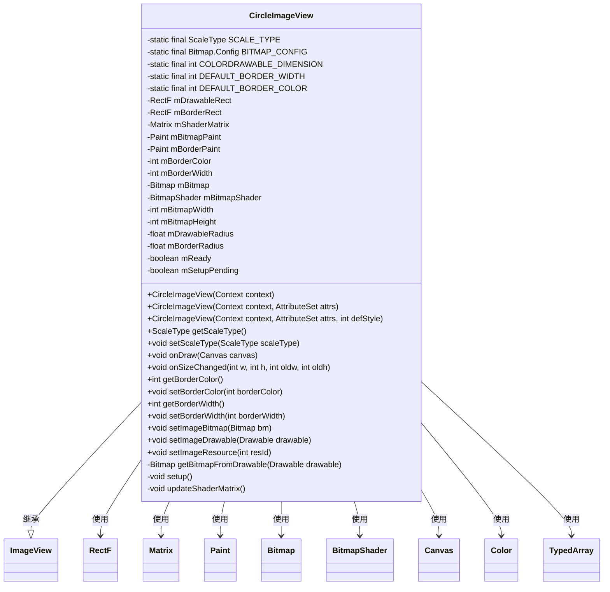
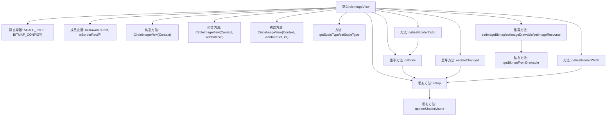

# 基础信息

|      |      |
|------|------|
| 名称 | CircleImageView |
| 编码语言 | .java |
| 代码路径 | happycat/src/com/happycat/view/CircleImageView.java |
| 包名 | com.happycat.view |
| 依赖项 | ['com.example.happucat.R', 'android.content.Context', 'android.content.res.TypedArray', 'android.graphics.Bitmap', 'android.graphics.BitmapShader', 'android.graphics.Canvas', 'android.graphics.Color', 'android.graphics.Matrix', 'android.graphics.Paint', 'android.graphics.RectF', 'android.graphics.Shader', 'android.graphics.drawable.BitmapDrawable', 'android.graphics.drawable.ColorDrawable', 'android.graphics.drawable.Drawable', 'android.util.AttributeSet', 'android.widget.ImageView'] |
| 概述说明 | CircleImageView是继承ImageView的自定义圆形图片控件，支持边框设置，通过BitmapShader实现圆形裁剪，固定ScaleType为CENTER_CROP，包含边框颜色和宽度属性，自动适配图片尺寸。 |

# 说明

CircleImageView是一个自定义圆形图像视图类，继承自ImageView。它强制使用CENTER_CROP缩放类型，支持可配置的边框宽度和颜色。核心实现包含：通过BitmapShader渲染圆形图像，使用Matrix调整图像比例和位置，维护两个圆形绘制区域（图像区域和边框区域）。类中处理了各种图像设置方式（Bitmap/Drawable/Resource），并在尺寸变化时自动重新计算布局。通过抗锯齿绘制和矩阵变换确保圆形图像显示质量，同时提供边框颜色和宽度的动态修改功能。

# 类列表 Class Summary

| 名称   | 类型  | 说明 |
|-------|------|-------------|
| CircleImageView | class | 圆形图片视图类，继承ImageView，支持边框设置，通过BitmapShader实现圆形裁剪，固定ScaleType为CENTER_CROP，包含边框颜色和宽度属性。 |

## 类 CircleImageView

|      |      |
|------|------|
| 访问范围 | public |
| 类型 | class |
| 名称 | CircleImageView |
| 说明 | 圆形图片视图类，继承ImageView，支持边框设置，通过BitmapShader实现圆形裁剪，固定ScaleType为CENTER_CROP，包含边框颜色和宽度属性。 |

### UML类图

这段代码描述了一个自定义的圆形图片视图类`CircleImageView`，它继承自`ImageView`，用于显示圆形图片并支持边框设置。类中包含多个私有常量、成员变量和方法，用于处理图片的绘制、边框设置、尺寸变化等逻辑。通过`setup()`和`updateShaderMatrix()`方法实现圆形图片的绘制和缩放，支持通过XML属性或代码动态设置边框宽度和颜色。

### 内部方法调用关系图

这段代码实现了一个圆形图片视图控件，继承自ImageView类。主要功能包括：通过构造方法初始化视图属性，处理不同类型的图片资源转换为Bitmap，使用BitmapShader实现圆形裁剪效果，支持边框宽度和颜色的自定义。核心逻辑集中在setup()方法中完成绘制参数计算，并通过updateShaderMatrix()方法调整图片缩放比例和位置。整个类通过维护多个矩形区域和半径参数，结合Canvas绘制实现圆形图片展示功能。

### 字段列表 Field List

| 名称  | 类型  | 说明 |
|-------|-------|------|
| mBitmap | Bitmap | 私有位图变量mBitmap。 |
| DEFAULT_BORDER_WIDTH = 0 | int | 定义静态常量DEFAULT_BORDER_WIDTH，默认边框宽度为0。 |
| mSetupPending | boolean | 变量mSetupPending是布尔类型，表示设置是否待处理。 |
| mBitmapPaint = new Paint() | Paint | 声明一个私有不可变的Paint对象mBitmapPaint并初始化。 |
| mShaderMatrix = new Matrix() | Matrix | 私有不可变矩阵变量mShaderMatrix，初始化为新Matrix对象。 |
| mBorderRect = new RectF() | RectF | 声明一个不可变的矩形区域对象mBorderRect，用于存储边框坐标。 |
| mBitmapHeight | int | 私有整型变量，存储位图高度。 |
| mBitmapShader | BitmapShader | 私有位图着色器变量mBitmapShader。 |
| mDrawableRect = new RectF() | RectF | 定义了一个不可变的矩形区域对象mDrawableRect，用于绘制图形。 |
| SCALE_TYPE = ScaleType.CENTER_CROP | ScaleType | 定义静态常量SCALE_TYPE，值为CENTER_CROP，表示图像居中裁剪缩放。 |
| COLORDRAWABLE_DIMENSION = 1 | int | 定义常量COLORDRAWABLE_DIMENSION，值为1。 |
| mReady | boolean | 私有布尔变量mReady，表示就绪状态。 |
| mBitmapWidth | int | 私有整型变量，存储位图宽度。 |
| DEFAULT_BORDER_COLOR = Color.BLACK | int | 定义静态常量DEFAULT_BORDER_COLOR，默认值为黑色。 |
| mBorderWidth = DEFAULT_BORDER_WIDTH | int | 私有整型变量mBorderWidth，默认值为DEFAULT_BORDER_WIDTH，用于存储边框宽度。 |
| mBorderPaint = new Paint() | Paint | 声明一个不可变的Paint对象mBorderPaint并初始化。 |
| BITMAP_CONFIG = Bitmap.Config.ARGB_8888 | Bitmap.Config | 定义静态常量BITMAP_CONFIG，使用ARGB_8888位图配置。 |
| mDrawableRadius | float | 私有浮点型变量，表示可绘制对象的半径。 |
| mBorderRadius | float | 私有浮点型变量，表示边框圆角半径。 |
| mBorderColor = DEFAULT_BORDER_COLOR | int | 私有整型变量mBorderColor，默认值为DEFAULT_BORDER_COLOR。 |

### 方法列表

| 名称  | 类型  | 说明 |
|-------|-------|------|
| onSizeChanged | void | 重写视图尺寸变化回调，调用父类方法后执行初始化操作。 |
| getBorderWidth | int | 获取边框宽度的方法，返回整型变量mBorderWidth的值。 |
| onDraw | void | 自定义绘制方法，若无图像则返回；否则在画布中心绘制两个同心圆，分别使用位图画笔和边框画笔。 |
| getBorderColor | int | 获取边框颜色值的方法，返回成员变量mBorderColor。 |
| setBorderWidth | void | 设置边框宽度方法：若新宽度与原值相同则直接返回，否则更新宽度并调用setup()。 |
| setImageBitmap | void | 重写setImageBitmap方法，调用父类方法后保存Bitmap并执行setup初始化。 |
| setImageDrawable | void | 重写setImageDrawable方法，调用父类方法后更新位图并初始化设置。 |
| setImageResource | void | 重写setImageResource方法，调用父类设置图片资源后，更新位图并初始化设置。 |
| getBitmapFromDrawable | Bitmap | 将Drawable转换为Bitmap：若为BitmapDrawable直接获取；否则创建对应尺寸的Bitmap并绘制内容，处理内存不足返回null。 |
| setScaleType | void | 重写setScaleType方法，仅支持特定缩放类型，否则抛出异常。 |
| getScaleType | ScaleType | Java方法重写，返回ScaleType类型的常量SCALE_TYPE。 |
| setBorderColor | void | 方法设置边框颜色，若颜色未变则直接返回；否则更新颜色并重绘。 |
| setup | void | 方法setup初始化位图着色器和边框绘制参数。检查mReady和mBitmap，设置抗锯齿、颜色、宽度等属性，计算边框和绘制区域尺寸，更新着色器矩阵并触发重绘。 |
| updateShaderMatrix | void | 该方法根据位图与绘制区域的比例计算缩放值，调整位移使位图居中，并应用矩阵变换到着色器。 |

