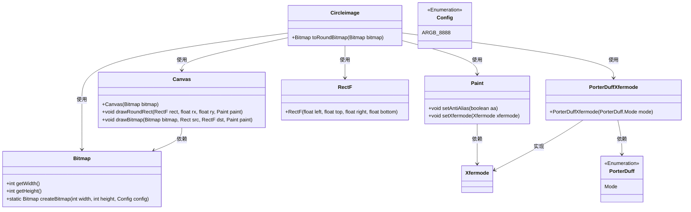
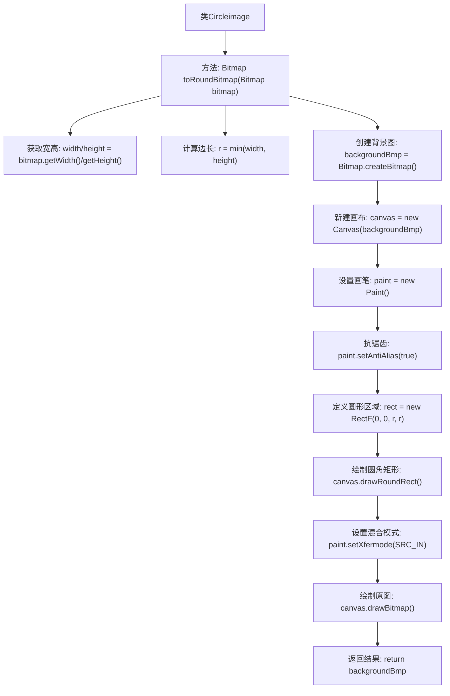

# 基础信息

|      |      |
|------|------|
| 名称 | Circleimage |
| 编码语言 | .java |
| 代码路径 | happycat/src/com/happycat/view/Circleimage.java |
| 包名 | com.happycat.view |
| 依赖项 | ['android.graphics.Bitmap', 'android.graphics.Bitmap.Config', 'android.graphics.Canvas', 'android.graphics.Paint', 'android.graphics.PorterDuff.Mode', 'android.graphics.PorterDuffXfermode', 'android.graphics.RectF'] |
| 概述说明 | 将矩形图片转换为圆形图片的方法，通过计算最短边作为直径，使用Canvas绘制圆形并裁剪多余部分。 |

# 说明

该代码定义了一个Circleimage类，包含一个toRoundBitmap方法，用于将输入的Bitmap图像转换为圆形。方法首先获取图像宽高，取较短边作为圆形直径。然后创建相同尺寸的新Bitmap作为画布，初始化Canvas和Paint对象并启用抗锯齿。通过绘制圆角矩形（圆角半径设为边长一半）形成圆形遮罩，使用SRC_IN模式裁剪原始图像，最终返回处理后的圆形Bitmap。整个过程不改变原始图像比例，确保输出为完美圆形。

# 类列表 Class Summary

| 名称   | 类型  | 说明 |
|-------|------|-------------|
| Circleimage | class | Circleimage类实现将Bitmap转为圆形图片，通过Canvas绘制圆形并裁剪多余部分。 |

## 类 Circleimage

|      |      |
|------|------|
| 访问范围 | public |
| 类型 | class |
| 名称 | Circleimage |
| 说明 | Circleimage类实现将Bitmap转为圆形图片，通过Canvas绘制圆形并裁剪多余部分。 |

### UML类图

这段代码实现了一个将方形图片转换为圆形图片的功能。Circleimage类通过toRoundBitmap方法接收Bitmap输入，使用Canvas和Paint进行图形处理，通过计算最短边确定圆形直径，创建新Bitmap作为画布，绘制圆角矩形并应用SRC_IN混合模式，最终输出圆形图片。该过程涉及多个Android图形处理类，包括Bitmap、Canvas、Paint和PorterDuffXfermode等，通过精确的坐标计算和图形混合操作实现圆形裁剪效果。

### 内部方法调用关系图

这段代码实现将任意矩形图片转换为圆形图片的功能。流程首先获取原始图片尺寸并确定圆形直径，然后创建透明背景位图，通过Canvas绘制圆形遮罩，再使用SRC_IN混合模式将原图裁剪为圆形。关键步骤包括：计算最小边长作为圆形直径、设置抗锯齿画笔、绘制圆形路径和应用源图像混合模式，最终生成边缘平滑的圆形图片。

### 字段列表 Field List

| 名称  | 类型  | 说明 |
|-------|-------|------|

### 方法列表

| 名称  | 类型  | 说明 |
|-------|-------|------|
| toRoundBitmap | Bitmap | 将位图转换为圆形：取最短边为直径，创建正方形画布，绘制圆形并裁剪多余部分，返回圆形位图。 |

