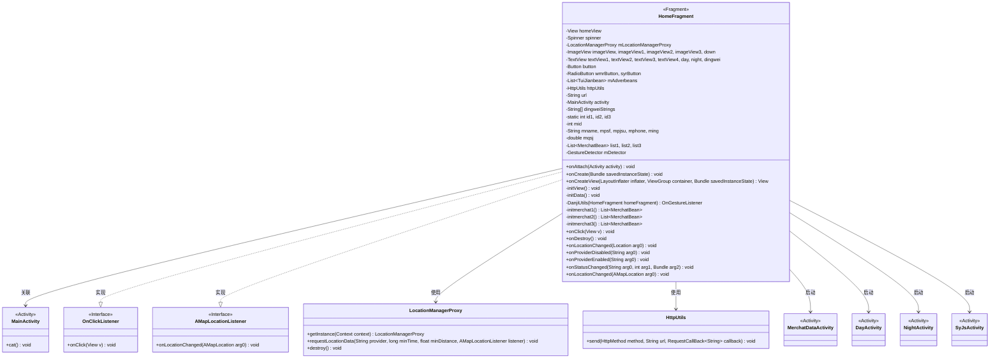
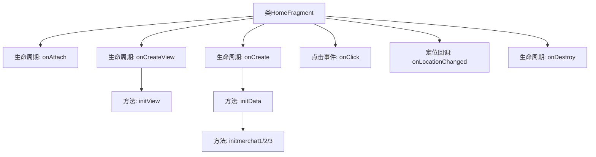

# 基础信息

|      |      |
|------|------|
| 名称 | HomeFragment |
| 编码语言 | .java |
| 代码路径 | happycat/src/com/happycay/fragments/HomeFragment.java |
| 包名 | com.happycay.fragments |
| 依赖项 | ['java.lang.reflect.Type', 'java.util.ArrayList', 'java.util.LinkedList', 'java.util.List', 'com.amap.api.location.AMapLocation', 'com.amap.api.location.AMapLocationListener', 'com.amap.api.location.LocationManagerProxy', 'com.amap.api.location.LocationProviderProxy', 'com.example.happucat.R', 'com.google.gson.Gson', 'com.google.gson.reflect.TypeToken', 'com.happycat.DayActivity', 'com.happycat.MainActivity', 'com.happycat.MerchatDataActivity', 'com.happycat.NightActivity', 'com.happycat.SyJsActivity', 'com.happycat.Bean.MerchatBean', 'com.happycat.Bean.TuiJianbean', 'com.happycat.util.DanjiUtils', 'com.happycat.util.MyApplication', 'com.lidroid.xutils.HttpUtils', 'com.lidroid.xutils.exception.HttpException', 'com.lidroid.xutils.http.ResponseInfo', 'com.lidroid.xutils.http.callback.RequestCallBack', 'com.lidroid.xutils.http.client.HttpRequest.HttpMethod', 'android.app.Activity', 'android.app.AlertDialog', 'android.content.DialogInterface', 'android.content.Intent', 'android.location.Location', 'android.os.Bundle', 'android.support.v4.app.Fragment', 'android.util.Log', 'android.view.GestureDetector', 'android.view.GestureDetector.OnGestureListener', 'android.view.LayoutInflater', 'android.view.MotionEvent', 'android.view.View', 'android.view.View.OnClickListener', 'android.view.ViewGroup', 'android.widget.AdapterView', 'android.widget.AdapterView.OnItemSelectedListener', 'android.widget.Button', 'android.widget.ImageView', 'android.widget.RadioButton', 'android.widget.Spinner', 'android.widget.TextView', 'android.widget.Toast'] |
| 概述说明 | HomeFragment是一个Android Fragment，实现点击监听和定位监听。包含视图初始化、定位功能、网络请求获取商家数据，并通过点击事件跳转到不同Activity。 |

# 说明

HomeFragment是一个Android碎片类，继承自Fragment并实现了OnClickListener和AMapLocationListener接口。主要功能包括初始化视图组件、处理用户点击事件、定位服务以及网络数据请求。类中定义了多个视图组件如ImageView、TextView、Button等，并设置了点击监听器。通过LocationManagerProxy实现定位功能，获取用户当前位置并显示。使用HttpUtils从服务器请求数据，解析JSON响应并更新UI。点击事件处理包括跳转到不同活动页面（如MerchatDataActivity、DayActivity等）以及显示城市选择对话框。类中还包含多个初始化数据的方法，如initData、initmerchat1等，用于从服务器获取商家信息并填充列表。定位回调方法onLocationChanged处理定位结果并更新UI。

# 类列表 Class Summary

| 名称   | 类型  | 说明 |
|-------|------|-------------|
| HomeFragment | class | HomeFragment实现定位和商家推荐功能，包含视图初始化、网络请求、点击事件处理及城市切换功能。 |

## 类 HomeFragment

|      |      |
|------|------|
| 访问范围 | public |
| 类型 | class |
| 名称 | HomeFragment |
| 说明 | HomeFragment实现定位和商家推荐功能，包含视图初始化、网络请求、点击事件处理及城市切换功能。 |

### UML类图

这段代码展示了一个Android的`HomeFragment`类，它继承自`Fragment`并实现了`OnClickListener`和`AMapLocationListener`接口。主要功能包括初始化视图、处理用户点击事件、进行网络请求获取数据、处理定位回调以及启动其他Activity。类图中清晰地展示了`HomeFragment`与相关类和接口的关系，包括其依赖的`LocationManagerProxy`和`HttpUtils`，以及通过点击事件启动的多个Activity。

### 内部方法调用关系图

这段代码实现了一个Android的HomeFragment，主要功能包括：1) 初始化视图组件和定位服务；2) 通过HTTP请求获取推荐商家数据并展示；3) 处理各种点击事件跳转到不同Activity；4) 实现城市定位和切换功能。流程图展示了从Fragment生命周期开始，到视图初始化、数据加载、事件处理的完整流程，最后在销毁时释放定位资源。核心模块包括数据初始化、商家信息获取和复杂的点击事件路由逻辑。

### 字段列表 Field List

| 名称  | 类型  | 说明 |
|-------|-------|------|
| mid | int | 声明整型变量mid。 |
| mLocationManagerProxy | LocationManagerProxy | LocationManagerProxy是管理位置服务的代理类实例。 |
| syrButton | RadioButton | 定义了两个单选按钮变量：wmrButton和syrButton。 |
| mqsj | double | 声明双精度浮点变量mqsj。 |
| id3 = 0 | int | 静态整型变量id3初始化为0。 |
| ming | String | 字符串变量：mname名称，mpsf平方英尺，mpjsu单价，mphone电话，ming收入。 |
| url | String | 声明一个私有字符串变量url。 |
| down | ImageView | 定义了五个ImageView变量：imageView、imageView1、imageView2、imageView3和down。 |
| httpUtils | HttpUtils | HttpUtils工具类实例声明。 |
| mDetector | GestureDetector | 手势检测器实例mDetector。 |
| homeView | View | 界面视图对象homeView |
| id2 = 0 | int | 声明并初始化静态整型变量id2，初始值为0。 |
| dingwei | TextView | 定义了七个TextView变量：textView1、textView2、textView3、textView4、day、night、dingwei。 |
| list3 | List<MerchatBean> | 三个商品列表：list1、list2、list3。 |
| spinner | Spinner | 声明一个名为spinner的Spinner类对象。 |
| dingweiStrings = new String[] { "苏州市", "南阳市", "濮阳市", "安阳市" } | String[] | 字符串数组包含四个城市名：苏州市、南阳市、濮阳市、安阳市。 |
| mAdverbeans | List<TuiJianbean> | 变量mAdverbeans是TuiJianbean类型的列表。 |
| button | Button | 声明一个按钮对象变量button。 |
| id1 = 0 | int | 声明并初始化静态整型变量id1，初始值为0。 |
| activity | MainActivity | MainActivity类的实例对象activity。 |

### 方法列表

| 名称  | 类型  | 说明 |
|-------|-------|------|
| initView | void | 初始化视图组件并设置点击监听器，包括多个ImageView、TextView、RadioButton及三个ArrayList。 |
| onProviderEnabled | void | 方法重写，当提供者启用时触发，当前为空实现。 |
| DanjiUtils | OnGestureListener | 方法DanjiUtils返回OnGestureListener，参数为HomeFragment，当前返回null。 |
| onProviderDisabled | void | 方法重写，当提供者被禁用时触发，当前为空实现。 |
| onClick | void | 代码实现了一个点击事件处理，根据不同视图ID执行不同操作：传递商户数据到MerchatDataActivity、跳转到Day/NightActivity、调用cat方法、跳转SyJsActivity或显示城市切换对话框。 |
| onCreateView | View | Android Fragment的onCreateView方法，通过inflater加载布局home.xml并初始化视图，返回视图对象homeView。 |
| onLocationChanged | void | 定位回调方法，处理成功定位结果，显示城市和区域信息。 |
| initmerchat1 | List<MerchatBean> | 方法initmerchat1通过HTTP GET请求获取商户数据，使用Gson解析JSON并返回商户列表。 |
| onLocationChanged | void | Android位置变化回调方法，需实现具体逻辑处理位置更新。 |
| onCreate | void | Android代码片段：初始化定位管理器并请求网络定位，设置回调监听，最后调用initData()。 |
| onStatusChanged | void | 这是一个Java方法重写，用于处理状态变化事件，当前为空实现。参数包括状态信息、状态码和附加数据。 |
| initmerchat2 | List<MerchatBean> | 方法initmerchat2通过HTTP GET请求获取商户数据，使用Gson解析JSON为MerchatBean列表并返回。失败时无处理，成功时将结果添加到list2。 |
| initData | void | 使用XUtils框架从服务器获取推荐数据，解析JSON并显示图片和文本，同时获取商家ID和详细信息。失败时记录错误日志。 |
| onAttach | void | 重写onAttach方法，将传入的Activity强制转换为MainActivity并赋值给成员变量activity。 |
| initmerchat3 | List<MerchatBean> | 该方法通过HTTP GET请求获取商户数据，使用Gson解析JSON并返回商户列表。 |
| onDestroy | void | Android组件销毁时释放定位资源，调用父类onDestroy并销毁定位管理器实例。 |

