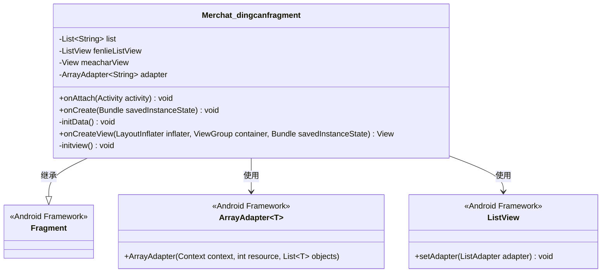
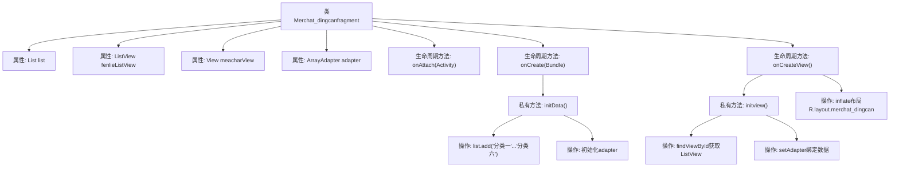

# 基础信息

|      |      |
|------|------|
| 名称 | Merchat_dingcanfragment |
| 编码语言 | .java |
| 代码路径 | happycat/src/com/happycay/fragments/Merchat_dingcanfragment.java |
| 包名 | com.happycay.fragments |
| 依赖项 | ['java.util.ArrayList', 'java.util.List', 'com.example.happucat.R', 'android.R.string', 'android.app.Activity', 'android.os.Bundle', 'android.support.v4.app.Fragment', 'android.view.LayoutInflater', 'android.view.View', 'android.view.ViewGroup', 'android.widget.ArrayAdapter', 'android.widget.ListView'] |
| 概述说明 | Merchat_dingcanfragment类继承Fragment，初始化列表数据并绑定到ListView显示。包含分类一到六的示例数据。 |

# 说明

该代码定义了一个名为Merchat_dingcanfragment的Fragment类，用于显示商家点餐分类列表。类中初始化了一个包含六个分类字符串的列表，并使用ArrayAdapter适配器将数据绑定到ListView控件上。Fragment生命周期方法包括onAttach、onCreate和onCreateView，其中onCreateView负责加载布局并初始化视图。通过initData方法填充列表数据，initview方法完成ListView控件的查找和适配器设置。整体实现了简单的分类列表展示功能。

# 类列表 Class Summary

| 名称   | 类型  | 说明 |
|-------|------|-------------|
| Merchat_dingcanfragment | class | Merchat_dingcanfragment类继承Fragment，初始化列表数据并绑定到ListView，显示六个分类项。 |

## 类 Merchat_dingcanfragment

|      |      |
|------|------|
| 访问范围 | public |
| 类型 | class |
| 名称 | Merchat_dingcanfragment |
| 说明 | Merchat_dingcanfragment类继承Fragment，初始化列表数据并绑定到ListView，显示六个分类项。 |

### UML类图

类图描述：
该图展示了一个Android Fragment子类Merchat_dingcanfragment的结构，它继承自Android框架的Fragment基类，包含用于显示分类列表的核心组件。类中包含私有成员：字符串列表list、列表视图fenlieListView、根视图meacharView和数组适配器adapter。通过initData()初始化数据源，initview()绑定视图与适配器，生命周期方法onCreateView负责创建视图层级。该类通过ArrayAdapter和ListView实现列表数据的绑定与展示，体现了典型的Android列表界面实现模式。

### 内部方法调用关系图

这段代码展示了一个Android Fragment的实现，主要用于显示餐饮分类列表。流程图清晰地描述了从Fragment生命周期开始（onAttach、onCreate），到初始化数据（initData填充列表和创建适配器），再到视图创建（onCreateView加载布局）和界面初始化（initview绑定适配器）的完整过程。关键操作包括数据准备、适配器创建、布局加载和列表视图绑定，最终形成一个可交互的分类列表界面。

### 字段列表 Field List

| 名称  | 类型  | 说明 |
|-------|-------|------|
| adapter | ArrayAdapter<String> | ArrayAdapter<String> adapter 是用于在Android中绑定字符串数组到视图的适配器。 |
| fenlieListView | ListView | 定义ListView控件变量fenlieListView。 |
| meacharView | View | 视图组件meacharView |
| list= new ArrayList<String>() | List<String> | 创建字符串类型的动态数组列表。 |

### 方法列表

| 名称  | 类型  | 说明 |
|-------|-------|------|
| onCreate | void | Android生命周期方法onCreate，调用父类方法并初始化数据。 |
| initData | void | 初始化数据方法，向列表添加六个分类项，并创建数组适配器绑定列表数据。 |
| onAttach | void | 重写Activity的onAttach方法，调用父类实现。 |
| initview | void | 初始化视图，获取列表控件并设置适配器。 |
| onCreateView | View | Android Fragment中onCreateView方法，加载布局merchat_dingcan并初始化视图，返回根视图。 |

