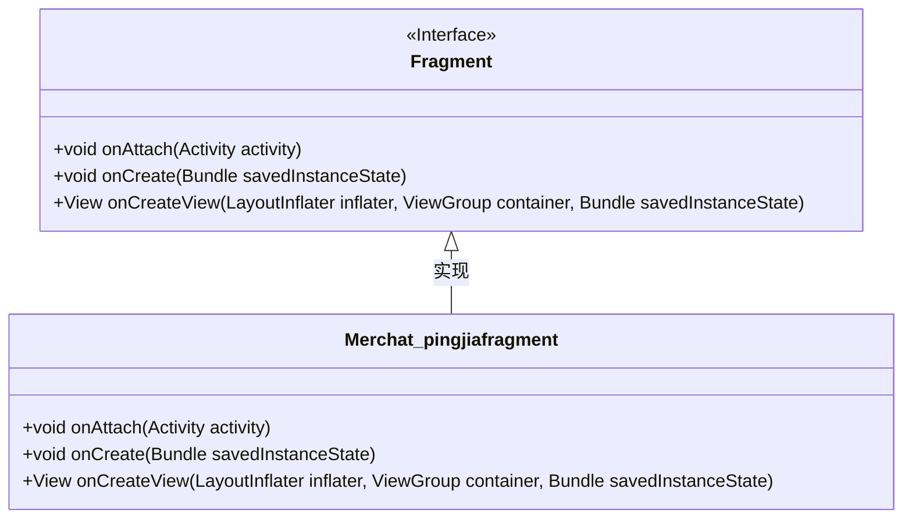
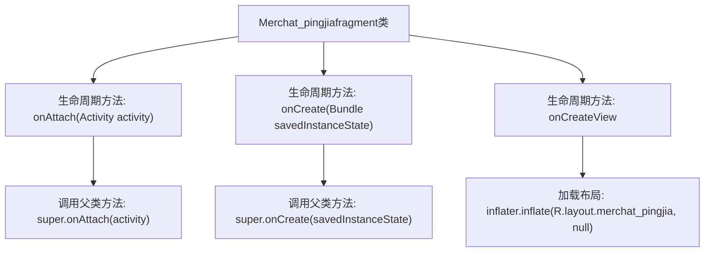

# 基础信息

|      |      |
|------|------|
| 名称 | Merchat_pingjiafragment |
| 编码语言 | .java |
| 代码路径 | happycat/src/com/happycay/fragments/Merchat_pingjiafragment.java |
| 包名 | com.happycay.fragments |
| 依赖项 | ['com.example.happucat.R', 'android.app.Activity', 'android.os.Bundle', 'android.support.v4.app.Fragment', 'android.view.LayoutInflater', 'android.view.View', 'android.view.ViewGroup'] |
| 概述说明 | Merchat_pingjiafragment类继承Fragment，重写onAttach、onCreate和onCreateView方法，加载merchat_pingjia布局。 |

# 说明

这是一个名为Merchat_pingjiafragment的Android Fragment类，继承自Fragment基类。它重写了三个关键生命周期方法：onAttach在Fragment与Activity关联时调用，onCreate在Fragment创建时初始化，onCreateView用于加载并返回merchat_pingjia布局文件定义的界面视图。该类未实现具体业务逻辑，仅完成基础框架搭建。

# 类列表 Class Summary

| 名称   | 类型  | 说明 |
|-------|------|-------------|
| Merchat_pingjiafragment | class | Merchat_pingjiafragment类继承Fragment，重写onAttach、onCreate和onCreateView方法，加载merchat_pingjia布局。 |

## 类 Merchat_pingjiafragment

|      |      |
|------|------|
| 访问范围 | public |
| 类型 | class |
| 名称 | Merchat_pingjiafragment |
| 说明 | Merchat_pingjiafragment类继承Fragment，重写onAttach、onCreate和onCreateView方法，加载merchat_pingjia布局。 |

### UML类图

这段类图展示了Merchat_pingjiafragment类继承自Android的Fragment接口，并实现了三个关键生命周期方法：onAttach用于关联Activity，onCreate用于初始化操作，onCreateView用于加载布局。该类通过inflater.inflate方法加载R.layout.merchat_pingjia布局资源，体现了Android Fragment的基本实现模式，其中Merchat_pingjiafragment作为具体实现类，必须重写Fragment接口定义的核心生命周期方法。

### 内部方法调用关系图

这段代码展示了一个Android Fragment的实现类Merchat_pingjiafragment，主要包含三个核心生命周期方法：onAttach()在Fragment与Activity关联时调用，onCreate()在Fragment创建时初始化数据，onCreateView()负责加载并返回Fragment的UI布局。流程图清晰地展示了各方法的调用顺序和层级关系，其中每个方法都先调用父类实现再执行自定义逻辑，特别是onCreateView()通过LayoutInflater加载merchat_pingjia.xml布局文件完成界面渲染。

### 字段列表 Field List

| 名称  | 类型  | 说明 |
|-------|-------|------|

### 方法列表

| 名称  | 类型  | 说明 |
|-------|-------|------|
| onAttach | void | Android组件生命周期方法，在Fragment附加到Activity时调用，需调用父类实现。 |
| onCreateView | View | 重写Fragment的onCreateView方法，使用inflater加载布局文件merchat_pingjia并返回视图。 |
| onCreate | void | Android Activity生命周期方法onCreate，调用父类方法并初始化。 |

