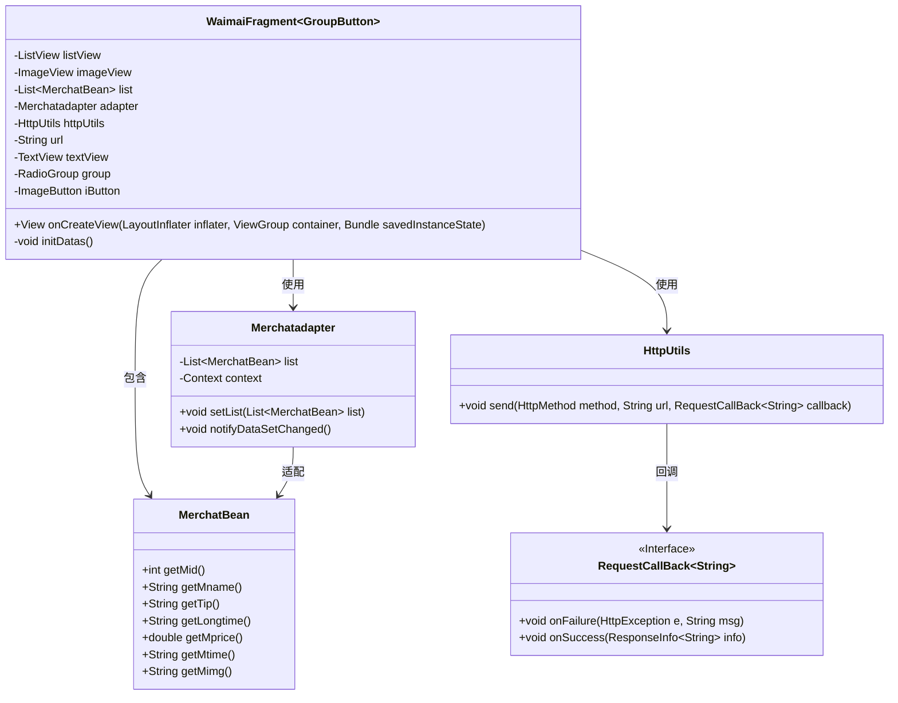
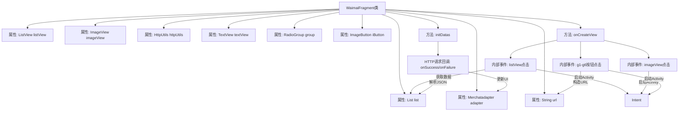

# 基础信息

|      |      |
|------|------|
| 名称 | WaimaiFragment |
| 编码语言 | .java |
| 代码路径 | happycat/src/com/happycay/fragments/WaimaiFragment.java |
| 包名 | com.happycay.fragments |
| 依赖项 | ['java.lang.reflect.Type', 'java.util.ArrayList', 'java.util.List', 'com.example.happucat.R', 'com.example.happucat.R.layout', 'com.google.gson.Gson', 'com.google.gson.reflect.TypeToken', 'com.happycat.MainActivity', 'com.happycat.MerchatDataActivity', 'com.happycat.SyJsActivity', 'com.happycat.WaiMAIMainActivity', 'com.happycat.Bean.Goods', 'com.happycat.Bean.MerchatBean', 'com.happycat.adapter.Merchatadapter', 'com.happycat.adapter.Myadapter', 'com.happycat.util.MyApplication', 'com.lidroid.xutils.HttpUtils', 'com.lidroid.xutils.bitmap.PauseOnScrollListener', 'com.lidroid.xutils.exception.HttpException', 'com.lidroid.xutils.http.RequestParams', 'com.lidroid.xutils.http.ResponseInfo', 'com.lidroid.xutils.http.callback.RequestCallBack', 'com.lidroid.xutils.http.client.HttpRequest.HttpMethod', 'android.R.raw', 'android.app.Activity', 'android.content.Intent', 'android.opengl.Visibility', 'android.os.Bundle', 'android.support.v4.app.Fragment', 'android.support.v4.app.FragmentManager', 'android.support.v4.app.FragmentTransaction', 'android.text.StaticLayout', 'android.util.Log', 'android.view.LayoutInflater', 'android.view.View', 'android.view.View.OnClickListener', 'android.view.ViewGroup', 'android.widget.AdapterView', 'android.widget.ImageButton', 'android.widget.ImageView', 'android.widget.ListView', 'android.widget.RadioGroup', 'android.widget.AdapterView.OnItemClickListener', 'android.widget.RadioGroup.OnCheckedChangeListener', 'android.widget.TextView'] |
| 概述说明 | 外卖Fragment类，包含列表视图、点击事件处理、网络请求及数据解析功能，支持跳转不同分类页面。 |

# 说明

WaimaiFragment是一个继承自Fragment的类，用于实现外卖功能界面。它包含ListView、ImageView等控件，通过HTTP请求获取商家数据并显示。ListView的点击事件会跳转到商家详情页，传递商家ID、名称、配送费等信息。界面还包含多个按钮（如ppkc、zc等），点击会跳转到不同分类的商家列表页。数据通过Gson解析JSON，并使用自定义适配器Merchatadapter展示。若数据为空，显示提示文本。整体实现了外卖商家的浏览和分类查看功能。

# 类列表 Class Summary

| 名称   | 类型  | 说明 |
|-------|------|-------------|
| WaimaiFragment | class | 外卖Fragment类，包含列表视图、点击事件处理及数据加载功能，通过HTTP请求获取商家数据并展示，支持分类跳转和详情页导航。 |

## 类 WaimaiFragment

|      |      |
|------|------|
| 访问范围 | public |
| 类型 | class |
| 名称 | WaimaiFragment |
| 说明 | 外卖Fragment类，包含列表视图、点击事件处理及数据加载功能，通过HTTP请求获取商家数据并展示，支持分类跳转和详情页导航。 |

### UML类图

这段代码展示了一个Android外卖应用片段(WaimaiFragment)的类结构，它继承自Fragment类并使用了泛型GroupButton。该片段主要包含一个商家列表(ListView)和多个交互组件，通过HttpUtils从服务器获取商家数据(MerchatBean)，并使用Merchatadapter进行数据适配。类图清晰地展示了各组件间的依赖关系，包括数据获取、适配器更新和事件处理等核心功能。WaimaiFragment通过监听用户点击事件，可以跳转到不同活动(Activity)并传递相应参数。

### 内部方法调用关系图

这段代码是Android外卖模块的Fragment实现，主要包含界面初始化和事件处理逻辑。流程图展示了类结构关系和数据流向：通过onCreateView初始化视图组件并设置点击监听，包括列表项点击、通知图标点击和6个分类按钮点击；initDatas方法负责初始化适配器并发送HTTP请求获取商家数据，通过Gson解析响应后更新列表。所有点击事件最终都会构造包含不同参数的Intent跳转到对应Activity。

### 字段列表 Field List

| 名称  | 类型  | 说明 |
|-------|-------|------|
| url | String | 私有字符串变量url，用于存储网址。 |
| list = new ArrayList<MerchatBean>() | List<MerchatBean> | 创建名为list的ArrayList，存储MerchatBean类型对象。 |
| httpUtils | HttpUtils | HttpUtils工具类实例声明。 |
| iButton | ImageButton | 图像按钮控件iButton |
| imageView | ImageView | 声明一个ImageView类型的变量imageView。 |
| group | RadioGroup | RadioGroup是一个用于管理一组单选按钮的控件，确保用户只能选择其中一个选项。 |
| adapter | Merchatadapter | Merchatadapter类型的变量adapter。 |
| textView | TextView | 声明一个TextView类型的变量textView。 |
| listView | ListView | 声明一个ListView类型的变量listView。 |

### 方法列表

| 名称  | 类型  | 说明 |
|-------|-------|------|
| onCreateView | View | 代码实现外卖界面功能，包括列表点击跳转、按钮点击跳转及数据初始化。列表点击传递商户数据，按钮点击传递不同URL参数。若无数据则显示错误提示。 |
| initDatas | void | 初始化数据方法：创建适配器并设置列表视图，通过HTTP GET请求从服务器获取商户数据，使用Gson解析JSON响应并更新适配器列表。 |

