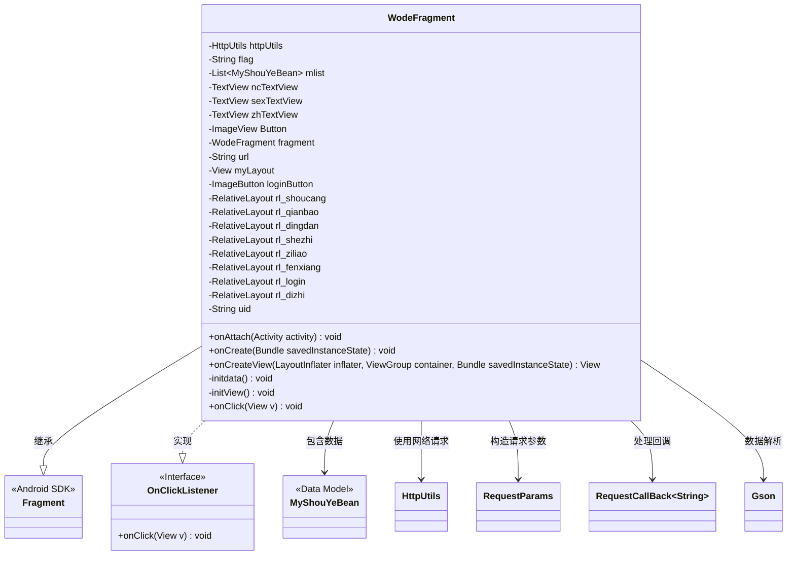
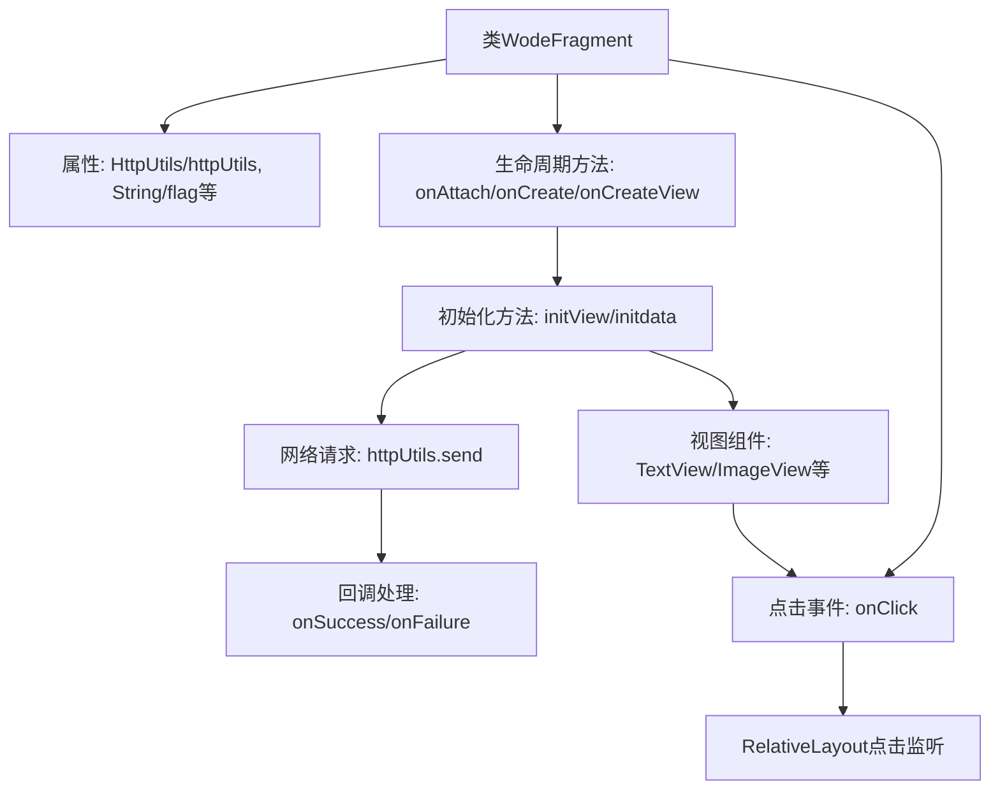
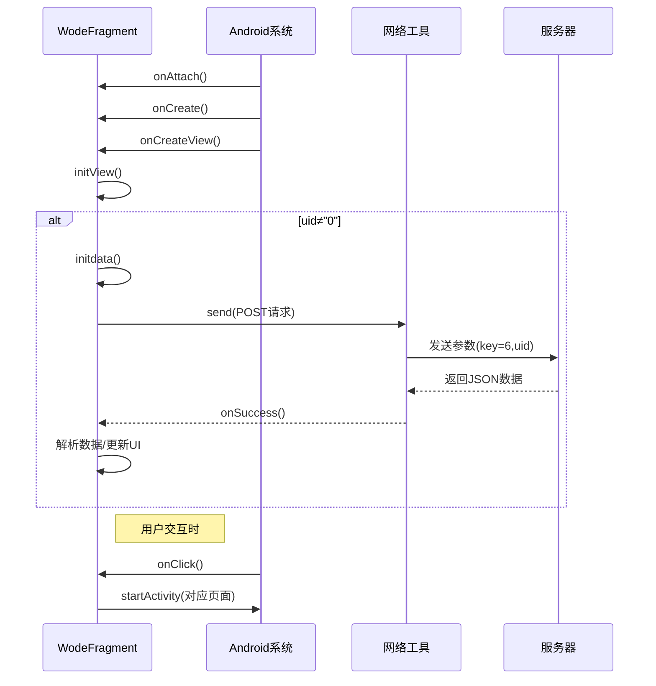

# 基础信息

|      |      |
|------|------|
| 名称 | WodeFragment |
| 编码语言 | .java |
| 代码路径 | happycat/src/com/happycay/fragments/WodeFragment.java |
| 包名 | com.happycay.fragments |
| 依赖项 | ['java.lang.reflect.Type', 'java.util.LinkedList', 'java.util.List', 'com.example.happucat.R', 'com.google.gson.Gson', 'com.google.gson.reflect.TypeToken', 'com.happycat.AddAddressActivity', 'com.happycat.AddressActivity', 'com.happycat.LoginActivity', 'com.happycat.MerchatDataActivity', 'com.happycat.MyCollectionActivity', 'com.happycat.MyinstallActivity', 'com.happycat.OrderActivity', 'com.happycat.QieHuanLoginActivity', 'com.happycat.ShareActivity', 'com.happycat.UserActivity', 'com.happycat.WalletActivity', 'com.happycat.Bean.MyShouYeBean', 'com.happycat.util.MyApplication', 'com.lidroid.xutils.HttpUtils', 'com.lidroid.xutils.exception.HttpException', 'com.lidroid.xutils.http.RequestParams', 'com.lidroid.xutils.http.ResponseInfo', 'com.lidroid.xutils.http.callback.RequestCallBack', 'com.lidroid.xutils.http.client.HttpRequest.HttpMethod', 'android.app.Activity', 'android.content.Intent', 'android.os.Bundle', 'android.support.v4.app.Fragment', 'android.util.Log', 'android.view.LayoutInflater', 'android.view.View', 'android.view.ViewGroup', 'android.view.View.OnClickListener', 'android.widget.ImageButton', 'android.widget.ImageView', 'android.widget.RelativeLayout', 'android.widget.TextView'] |
| 概述说明 | WodeFragment是一个Android Fragment，实现用户个人中心功能，包含用户信息展示、收藏、订单、钱包、设置、分享和地址管理等模块，通过HTTP请求获取用户数据并处理点击事件跳转对应页面。 |

# 说明

这是一个名为WodeFragment的Android Fragment类，实现了点击监听接口。主要功能包括初始化用户界面视图组件，如多个RelativeLayout布局、TextView和ImageView等。当用户ID不为0时，通过HTTP POST请求从服务器获取用户数据，解析JSON响应并更新UI显示用户信息（如头像、性别、昵称和账号）。类中还处理了多个点击事件，根据点击的不同视图跳转到对应的活动页面，如登录、用户资料、收藏、订单、钱包、设置、分享和地址管理等。整体实现了个人中心模块的核心功能。

# 类列表 Class Summary

| 名称   | 类型  | 说明 |
|-------|------|-------------|
| WodeFragment | class | WodeFragment是一个Android Fragment，实现用户个人中心功能，包含登录、资料、收藏、订单、钱包、设置、分享和地址管理等模块，通过HTTP请求获取用户数据并展示。 |

## 类 WodeFragment

|      |      |
|------|------|
| 访问范围 | public |
| 类型 | class |
| 名称 | WodeFragment |
| 说明 | WodeFragment是一个Android Fragment，实现用户个人中心功能，包含登录、资料、收藏、订单、钱包、设置、分享和地址管理等模块，通过HTTP请求获取用户数据并展示。 |

### UML类图

这段代码展示了一个Android Fragment类`WodeFragment`，它继承自`Fragment`并实现了`OnClickListener`接口。该类主要用于用户个人中心界面，包含多个RelativeLayout控件用于展示用户信息和功能入口。通过HttpUtils进行网络请求获取用户数据（MyShouYeBean），使用Gson解析JSON数据，并根据用户性别动态设置头像图标。onClick方法处理各种点击事件，跳转到不同功能模块如登录、订单、钱包等Activity。代码结构清晰体现了Android Fragment的生命周期管理和事件处理机制。

### 内部方法调用关系图

该流程图展示了Android Fragment的生命周期管理、视图初始化和网络请求逻辑。首先系统依次调用onAttach、onCreate和onCreateView方法，在onCreateView中初始化视图组件并绑定点击事件。当用户ID有效时，通过HttpUtils发起网络请求获取用户数据，成功回调后解析JSON并更新界面。时序图则详细描述了从Fragment创建到用户点击交互的完整过程，包括网络请求的异步处理机制和页面跳转逻辑。

### 字段列表 Field List

| 名称  | 类型  | 说明 |
|-------|-------|------|
| flag = "" | String | 字符串变量flag初始化为空。 |
| rl_shoucang | RelativeLayout | 私有相对布局控件rl_shoucang |
| httpUtils | HttpUtils | HttpUtils工具类实例声明。 |
| myLayout | View | 私有视图变量myLayout |
| zhTextView | TextView | 定义了三个TextView变量：ncTextView、sexTextView、zhTextView。 |
| rl_ziliao | RelativeLayout | 私有RelativeLayout控件rl_ziliao |
| rl_dingdan | RelativeLayout | 私有相对布局控件rl_dingdan |
| Button | ImageView | 图像视图按钮控件。 |
| fragment | WodeFragment | WodeFragment是一个代码片段变量声明。 |
| mlist | List<MyShouYeBean> | 定义了一个名为mlist的列表变量，存储MyShouYeBean类型的数据。 |
| loginButton | ImageButton | 登录按钮的图片按钮私有变量。 |
| rl_fenxiang | RelativeLayout | 私有相对布局控件rl_fenxiang |
| rl_login | RelativeLayout | 定义私有RelativeLayout控件rl_login。 |
| rl_qianbao | RelativeLayout | 私有相对布局控件rl_qianbao |
| rl_shezhi | RelativeLayout | 私有RelativeLayout控件rl_shezhi |
| rl_dizhi | RelativeLayout | 私有相对布局控件rl_dizhi。 |
| uid=MyApplication.SP_user_id+"" | String | 代码片段将应用全局变量SP_user_id转为字符串并赋值给uid变量。 |
| url | String | 声明一个私有字符串变量url。 |

### 方法列表

| 名称  | 类型  | 说明 |
|-------|-------|------|
| onCreate | void | Android Activity生命周期方法，调用父类onCreate初始化界面。 |
| onAttach | void | 重写Activity的onAttach方法，调用父类实现。 |
| onCreateView | View | Android Fragment的onCreateView方法，初始化布局myLayout并调用initView。若uid非0，执行initdata。返回布局视图。 |
| initdata | void | 方法initdata通过HTTP POST请求从服务器获取用户数据，解析JSON响应后更新UI，包括头像、性别图标和账号昵称显示。失败时记录错误日志。 |
| initView | void | 初始化界面视图，绑定多个TextView、ImageView、ImageButton和RelativeLayout控件，并设置点击监听器。 |
| onClick | void | 点击事件处理逻辑：根据不同按钮ID跳转对应页面，包括登录、用户、收藏、订单、钱包、设置、分享和地址页面，部分页面需检查用户ID条件。 |

