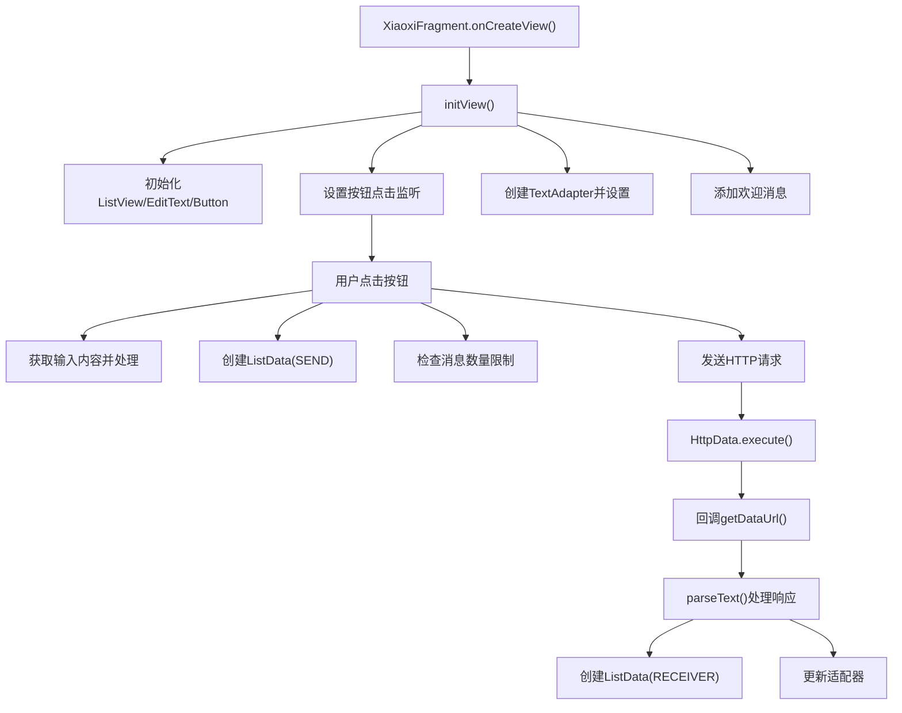
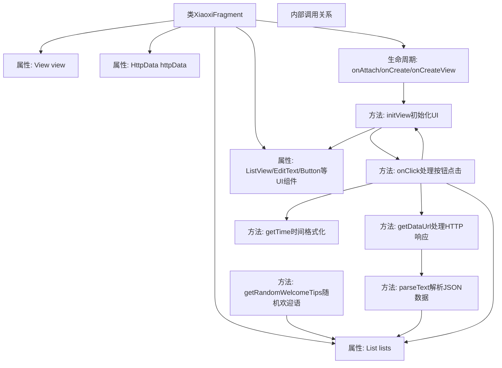
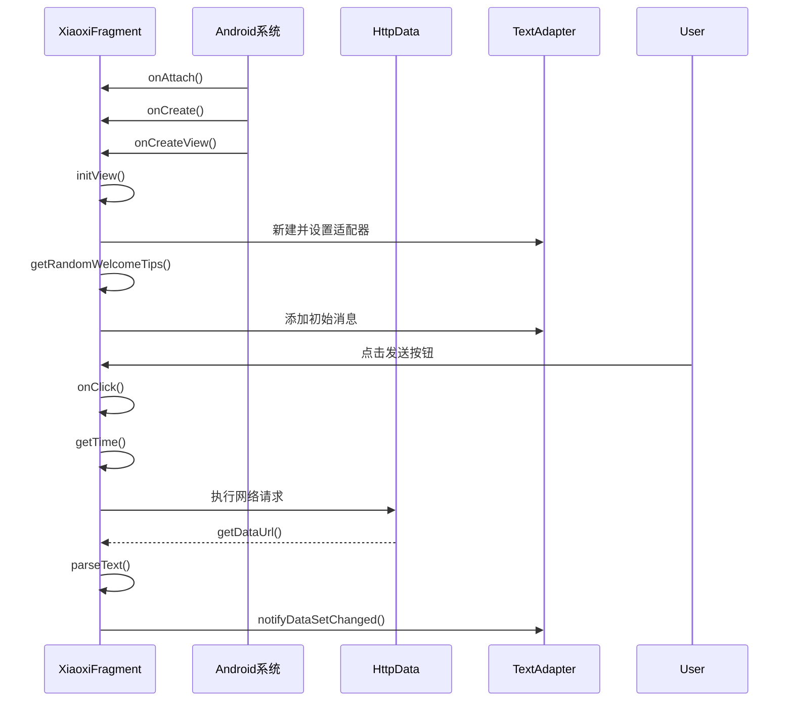

# 基础信息

|      |      |
|------|------|
| 名称 | XiaoxiFragment |
| 编码语言 | .java |
| 代码路径 | happycat/src/com/happycay/fragments/XiaoxiFragment.java |
| 包名 | com.happycay.fragments |
| 依赖项 | ['java.text.SimpleDateFormat', 'java.util.ArrayList', 'java.util.Date', 'java.util.List', 'org.json.JSONObject', 'com.example.happucat.R', 'com.happycat.tuling.HttpData', 'com.happycat.tuling.HttpGetDataListener', 'com.happycat.tuling.ListData', 'com.happycat.tuling.TextAdapter', 'android.app.Activity', 'android.os.Bundle', 'android.support.v4.app.Fragment', 'android.view.LayoutInflater', 'android.view.View', 'android.view.View.OnClickListener', 'android.view.ViewGroup', 'android.widget.Button', 'android.widget.EditText', 'android.widget.ListView'] |
| 概述说明 | XiaoxiFragment实现消息界面，包含发送接收功能，随机欢迎语，时间显示，消息列表管理及网络请求。 |

# 说明

XiaoxiFragment是一个继承Fragment的聊天界面类，实现了HttpGetDataListener和OnClickListener接口。主要功能包括初始化视图组件（ListView、EditText、Button）、处理用户发送消息、接收网络返回数据、随机显示欢迎语、管理聊天记录列表（限制30条）以及时间显示逻辑（超过5分钟显示时间戳）。通过HttpData类异步获取图灵机器人API的回复数据，使用TextAdapter适配器更新聊天列表。包含消息内容处理（去空格和换行符）和JSON数据解析功能。

# 类列表 Class Summary

| 名称   | 类型  | 说明 |
|-------|------|-------------|
| XiaoxiFragment | class | XiaoxiFragment实现消息收发功能，包含列表展示、随机欢迎语、时间处理及网络请求，适配器更新数据。 |


## 类 XiaoxiFragment

|      |      |
|------|------|
| 访问范围 | public |
| 类型 | class |
| 名称 | XiaoxiFragment |
| 说明 | XiaoxiFragment实现消息收发功能，包含列表展示、随机欢迎语、时间处理及网络请求，适配器更新数据。 |


### UML类图

```mermaid
classDiagram
    class XiaoxiFragment {
        -View view
        -HttpData httpData
        -List~ListData~ lists
        -ListData listData
        -ListView listView
        -EditText editText
        -Button button
        -String content_xiaoxi
        -TextAdapter adapter
        -String[] welcome_array
        -double currentTime
        -double oldTime
        +onAttach(Activity activity) void
        +onCreate(Bundle savedInstanceState) void
        +onCreateView(LayoutInflater inflater, ViewGroup container, Bundle savedInstanceState) View
        -initView() void
        +getDataUrl(String data) void
        -parseText(String str) void
        -getRandomWelcomeTips() String
        +onClick(View v) void
        -getTime() String
    }

    <<Interface>> HttpGetDataListener {
        +getDataUrl(String data) void
    }

    <<Interface>> OnClickListener {
        +onClick(View v) void
    }

    class HttpData {
        +HttpData(String url, HttpGetDataListener listener)
        +execute() void
    }

    class ListData {
        +String content
        +int type
        +String time
        +RECEIVER : int
        +SEND : int
        +ListData(String content, int type, String time)
    }

    class TextAdapter {
        +TextAdapter(List~ListData~ lists, Activity activity)
        +notifyDataSetChanged() void
    }

    XiaoxiFragment --> HttpData : 依赖
    XiaoxiFragment --> ListData : 包含
    XiaoxiFragment --> TextAdapter : 使用
    XiaoxiFragment ..|> HttpGetDataListener : 实现
    XiaoxiFragment ..|> OnClickListener : 实现
```



该代码实现了一个聊天界面Fragment，主要功能包括：初始化聊天UI组件、处理用户输入、发送HTTP请求获取机器人回复、管理聊天消息列表和时间显示。类图中XiaoxiFragment实现了两个接口，依赖HttpData处理网络请求，使用ListData存储消息和TextAdapter显示消息。流程图展示了从界面初始化到消息发送/接收的完整流程，包含用户交互和网络请求处理的关键步骤。


### 内部方法调用关系图





这段代码实现了一个Android聊天Fragment，主要功能包括：初始化聊天界面UI组件、处理用户输入消息、通过HTTP请求获取机器人回复、解析JSON响应数据、管理聊天消息列表以及时间格式化显示。流程图展示了类内部复杂的交互关系，包括生命周期方法、UI初始化、网络请求处理和事件响应等核心逻辑。时序图则详细描述了从Fragment创建到用户交互的完整过程，突出了系统组件与业务逻辑的协作时序。

### 字段列表 Field List

| 名称  | 类型  | 说明 |
|-------|-------|------|
| adapter | TextAdapter | 私有文本适配器实例adapter。 |
| oldTime=0 | double | 声明两个双精度变量：currentTime和oldTime（初始值为0）。 |
| listView | ListView | 私有ListView控件实例。 |
| lists | List<ListData> | 私有列表变量lists，存储ListData类型的集合。 |
| welcome_array | String [] | 声明一个私有字符串数组welcome_array。 |
| view | View | 私有视图对象变量view。 |
| editText | EditText | 私有文本输入框控件editText。 |
| listData | ListData | 声明一个私有ListData类型的变量listData。 |
| httpData | HttpData | 私有HTTP数据对象 |
| content_xiaoxi | String | 私有字符串变量content_xiaoxi |
| button | Button | 声明一个私有按钮变量button。 |

### 方法列表

| 名称  | 类型  | 说明 |
|-------|-------|------|
| getRandomWelcomeTips | String | 从资源数组随机获取欢迎语并返回。 |
| getDataUrl | void | 方法getDataUrl接收字符串data，打印数据并调用parseText处理。 |
| onCreateView | View | Android Fragment中onCreateView方法，加载布局R.layout.xiaoxi并初始化视图后返回。 |
| onClick | void | 点击事件处理：获取时间、消息内容并清空输入框，处理后加入列表。列表超过30条时移除旧数据，刷新适配器并发送HTTP请求到图灵API。 |
| parseText | void | 解析JSON字符串并封装数据到列表，更新适配器显示。异常时打印错误。 |
| onCreate | void | Android Activity的onCreate方法重写，调用父类方法初始化。 |
| initView | void | 初始化视图：获取列表、输入框和发送按钮控件，设置点击监听，创建适配器并绑定数据，添加欢迎消息。 |
| onAttach | void | 重写onAttach方法，调用父类实现。 |
| getTime | String | 获取当前时间，若与上次时间差超过5分钟则返回时间字符串，否则返回空。 |


