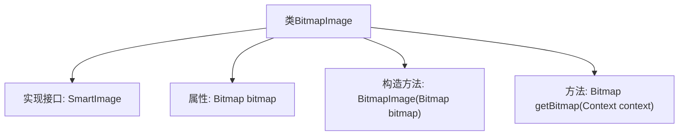

# 基础信息

|      |      |
|------|------|
| 名称 | BitmapImage |
| 编码语言 | .java |
| 代码路径 | happycat/src/image/BitmapImage.java |
| 包名 | None |
| 依赖项 | ['android.content.Context', 'android.graphics.Bitmap'] |
| 概述说明 | BitmapImage类实现SmartImage接口，封装Bitmap对象，提供构造函数和获取Bitmap的方法。 |

# 说明

BitmapImage类实现了SmartImage接口，包含一个Bitmap类型的私有成员变量bitmap。该类通过构造函数接收Bitmap对象并赋值给bitmap。提供了一个getBitmap方法，接收Context参数并返回存储的bitmap对象。该类主要用于封装位图数据，实现简单的图像获取功能。

# 类列表 Class Summary

| 名称   | 类型  | 说明 |
|-------|------|-------------|
| BitmapImage | class | BitmapImage类实现SmartImage接口，包含Bitmap对象，通过构造函数初始化，提供getBitmap方法返回该对象。 |


## 类 BitmapImage

|      |      |
|------|------|
| 访问范围 | public |
| 类型 | class |
| 名称 | BitmapImage |
| 说明 | BitmapImage类实现SmartImage接口，包含Bitmap对象，通过构造函数初始化，提供getBitmap方法返回该对象。 |


### UML类图

```mermaid
classDiagram
    class BitmapImage {
        -Bitmap bitmap
        +BitmapImage(Bitmap bitmap)
        +Bitmap getBitmap(Context context)
    }
    <<Interface>> SmartImage {
        <<Interface>>
        +Bitmap getBitmap(Context context)
    }
    BitmapImage ..|> SmartImage : 实现
```

这段类图展示了BitmapImage类与SmartImage接口的关系。BitmapImage实现了SmartImage接口，包含一个私有Bitmap类型字段bitmap，通过构造函数初始化，并提供了公有方法getBitmap来获取该位图。SmartImage作为接口定义了统一的图像获取规范，BitmapImage通过实现该接口确保对外提供一致的位图访问能力。图中清晰体现了接口与实现类的层级关系及方法契约。


### 内部方法调用关系图



这段代码展示了一个BitmapImage类，它实现了SmartImage接口。类中包含一个Bitmap类型的私有属性bitmap，通过构造方法初始化该属性，并提供了一个getBitmap方法用于获取bitmap对象。流程图清晰地呈现了类的结构，包括接口实现、属性声明、构造方法和成员方法之间的关系，体现了简单的封装设计模式。

### 字段列表 Field List

| 名称  | 类型  | 说明 |
|-------|-------|------|
| bitmap | Bitmap | 私有位图对象bitmap。 |

### 方法列表

| 名称  | 类型  | 说明 |
|-------|-------|------|
| getBitmap | Bitmap | 获取位图的方法，返回bitmap对象。 |


