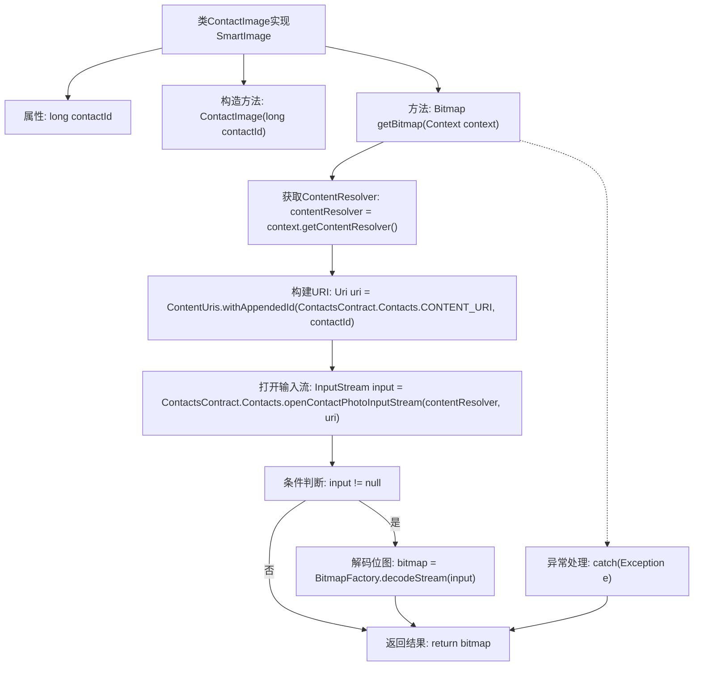

# 基础信息

|      |      |
|------|------|
| 名称 | ContactImage |
| 编码语言 | .java |
| 代码路径 | happycat/src/image/ContactImage.java |
| 包名 | None |
| 依赖项 | ['java.io.InputStream', 'android.content.ContentUris', 'android.content.ContentResolver', 'android.content.Context', 'android.provider.ContactsContract', 'android.graphics.Bitmap', 'android.graphics.BitmapFactory', 'android.net.Uri'] |
| 概述说明 | ContactImage类实现SmartImage接口，通过contactId获取联系人头像的Bitmap。构造函数接收contactId，getBitmap方法使用ContentResolver查询并返回头像。 |

# 说明

ContactImage类实现了SmartImage接口，用于获取联系人照片。该类包含一个长整型contactId成员变量，通过构造函数初始化。核心功能由getBitmap方法实现，该方法接收Context参数，通过ContentResolver查询指定contactId对应的联系人照片URI，使用openContactPhotoInputStream获取输入流并解码为Bitmap对象。若过程中发生异常会打印堆栈信息，最终返回Bitmap或null。

# 类列表 Class Summary

| 名称   | 类型  | 说明 |
|-------|------|-------------|
| ContactImage | class | ContactImage类实现SmartImage接口，通过contactId获取联系人照片并返回Bitmap对象。 |


## 类 ContactImage

|      |      |
|------|------|
| 访问范围 | public |
| 类型 | class |
| 名称 | ContactImage |
| 说明 | ContactImage类实现SmartImage接口，通过contactId获取联系人照片并返回Bitmap对象。 |


### UML类图

```mermaid
classDiagram
    class ContactImage {
        -long contactId
        +ContactImage(long contactId)
        +Bitmap getBitmap(Context context)
    }

    class SmartImage {
        <<Interface>>
        +Bitmap getBitmap(Context context)
    }

    ContactImage ..|> SmartImage : 实现
    ContactImage --> Context : 依赖
    ContactImage --> Bitmap : 返回
    ContactImage --> ContentResolver : 使用
    ContactImage --> Uri : 使用
    ContactImage --> InputStream : 使用
    ContactImage --> BitmapFactory : 使用

    // 外部类引用
    class Context {
        <<Android Framework>>
    }
    class Bitmap {
        <<Android Framework>>
    }
    class ContentResolver {
        <<Android Framework>>
    }
    class Uri {
        <<Android Framework>>
    }
    class InputStream {
        <<Java>>
    }
    class BitmapFactory {
        <<Android Framework>>
    }
```

类图描述：
ContactImage类实现了SmartImage接口，用于根据联系人ID获取联系人头像的Bitmap。它通过Android系统的ContentResolver访问联系人数据库，使用Uri定位具体联系人，通过InputStream读取照片数据并最终用BitmapFactory解码为Bitmap。整个过程涉及多个Android框架类的协作，并包含异常处理机制。


### 内部方法调用关系图



这段代码流程图展示了ContactImage类的工作流程，该类用于获取联系人照片的位图。流程从构造方法初始化contactId开始，通过getBitmap方法获取ContentResolver，构建联系人URI并尝试打开照片输入流。如果流存在则解码为位图，最后返回结果或处理异常。整个过程体现了Android联系人数据访问和图像处理的典型模式，包含资源获取、流操作和异常处理等关键步骤。

### 字段列表 Field List

| 名称  | 类型  | 说明 |
|-------|-------|------|
| contactId | long | 私有长整型变量contactId，用于存储联系人ID。 |

### 方法列表

| 名称  | 类型  | 说明 |
|-------|-------|------|
| getBitmap | Bitmap | 该方法通过联系人ID获取联系人头像，返回Bitmap对象。使用ContentResolver查询联系人照片流，解码为Bitmap。异常时打印日志，无照片返回null。 |


