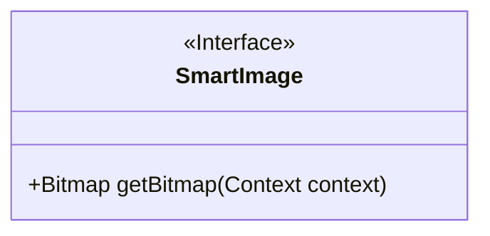
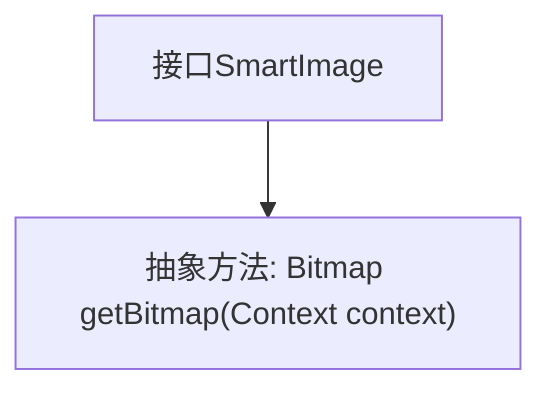

# 基础信息

|      |      |
|------|------|
| 名称 | SmartImage |
| 编码语言 | .java |
| 代码路径 | happycat/src/image/SmartImage.java |
| 包名 | None |
| 依赖项 | ['android.content.Context', 'android.graphics.Bitmap'] |
| 概述说明 | SmartImage接口定义了一个方法getBitmap，用于根据上下文获取Bitmap图像。 |

# 说明

这是一个名为SmartImage的公开接口，定义了一个方法getBitmap，该方法接收Context类型参数并返回Bitmap对象。接口用于规范获取位图图像的功能，要求实现类必须提供根据上下文获取位图的具体逻辑。

# 类列表 Class Summary

| 名称   | 类型  | 说明 |
|-------|------|-------------|
| SmartImage | interface | SmartImage接口定义了一个方法getBitmap，用于根据上下文获取Bitmap图像。 |

## 类 SmartImage

|      |      |
|------|------|
| 访问范围 | public |
| 类型 | interface |
| 名称 | SmartImage |
| 说明 | SmartImage接口定义了一个方法getBitmap，用于根据上下文获取Bitmap图像。 |

### UML类图

这段代码定义了一个名为SmartImage的接口，该接口声明了一个公有方法getBitmap，该方法接收一个Context类型的参数并返回一个Bitmap对象。作为接口，它使用<<Interface>>标记明确表示这是一个抽象类型，不包含具体实现。这个接口可能用于定义获取位图图像的标准方式，具体的实现类需要提供getBitmap方法的具体逻辑。接口设计简洁，专注于单一职责，适合作为图像获取功能的抽象基础。

### 内部方法调用关系图

这段代码定义了一个名为SmartImage的Java接口，该接口包含一个抽象方法getBitmap，该方法接收一个Context参数并返回Bitmap类型。接口在Java中用于定义行为规范，任何实现该接口的类都必须提供getBitmap方法的具体实现。该设计常用于需要根据不同上下文获取位图的场景，如图片加载框架中的图片获取策略。

### 字段列表 Field List

| 名称  | 类型  | 说明 |
|-------|-------|------|

### 方法列表

| 名称  | 类型  | 说明 |
|-------|-------|------|
| getBitmap | Bitmap | 获取上下文相关的位图对象。 |

