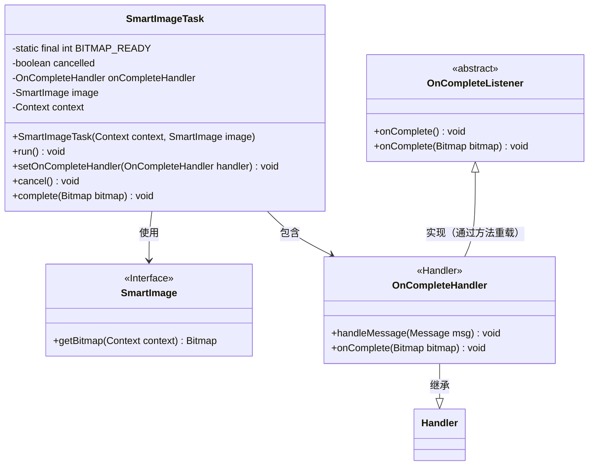
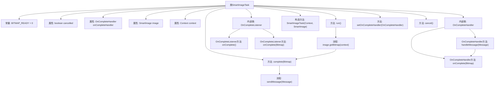

# 基础信息

|      |      |
|------|------|
| 名称 | SmartImageTask |
| 编码语言 | .java |
| 代码路径 | happycat/src/image/SmartImageTask.java |
| 包名 | None |
| 依赖项 | ['android.content.Context', 'android.graphics.Bitmap', 'android.os.Handler', 'android.os.Message'] |
| 概述说明 | SmartImageTask实现Runnable，处理图像加载任务，支持取消和完成回调，通过Handler传递Bitmap结果。 |

# 说明

SmartImageTask是一个实现Runnable接口的类，用于异步加载SmartImage的位图。它包含取消标志位cancelled、完成处理器onCompleteHandler、SmartImage对象和上下文context。OnCompleteHandler内部类通过handleMessage处理位图加载完成的消息，并调用onComplete方法。OnCompleteListener抽象类提供位图加载完成的回调，支持向后兼容。构造函数接收context和image对象。run方法执行位图加载并调用complete方法。setOnCompleteHandler设置完成处理器，cancel方法取消任务。complete方法在未取消时通过处理器发送位图就绪消息。

# 类列表 Class Summary

| 名称   | 类型  | 说明 |
|-------|------|-------------|
| SmartImageTask | class | SmartImageTask是一个Runnable类，用于异步加载图像。包含取消功能、完成处理器和监听器，支持获取Bitmap和处理完成回调。 |

## 类 SmartImageTask

|      |      |
|------|------|
| 访问范围 | public |
| 类型 | class |
| 名称 | SmartImageTask |
| 说明 | SmartImageTask是一个Runnable类，用于异步加载图像。包含取消功能、完成处理器和监听器，支持获取Bitmap和处理完成回调。 |

### UML类图

类图描述：
这段代码展示了一个异步图像处理任务的结构，核心是SmartImageTask类实现了Runnable接口，通过SmartImage接口获取位图，并使用Handler机制进行线程间通信。包含两个回调处理类：OnCompleteHandler继承自Android的Handler类用于消息处理，OnCompleteListener是抽象类提供两种回调方式。整体设计体现了Android异步任务处理的典型模式，支持取消操作和灵活的回调处理。

### 内部方法调用关系图

这段代码描述了一个异步图像处理任务类SmartImageTask，包含两个内部处理器类。主要流程是通过run()方法获取位图后，通过Handler机制异步通知完成状态。当任务未被取消且处理器存在时，complete()方法会发送包含位图的消息，触发onComplete回调。内部类OnCompleteHandler处理消息并调用抽象方法，而OnCompleteListener提供两种回调方式（带/不带位图参数）实现向后兼容。整体实现了线程安全的图像加载和回调机制。

### 字段列表 Field List

| 名称  | 类型  | 说明 |
|-------|-------|------|
| cancelled = false | boolean | 声明一个布尔变量cancelled，初始值为false。 |
| BITMAP_READY = 0 | int | 定义静态常量BITMAP_READY，值为0，表示位图准备就绪状态。 |
| image | SmartImage | 私有变量image，类型为SmartImage。 |
| onCompleteHandler | OnCompleteHandler | 私有完成事件处理器变量onCompleteHandler。 |
| context | Context | 私有上下文对象变量声明。 |

### 方法列表

| 名称  | 类型  | 说明 |
|-------|-------|------|
| cancel | void | 方法cancel()将布尔变量cancelled设为true。 |
| run | void | 方法重写run()，检查image非空时调用complete()传入其位图，并清空context。 |
| setOnCompleteHandler | void | 设置完成处理函数，将传入的handler赋值给onCompleteHandler。 |
| complete | void | 方法complete接收Bitmap参数，若未取消且存在完成处理器，则发送包含位图的消息。 |

