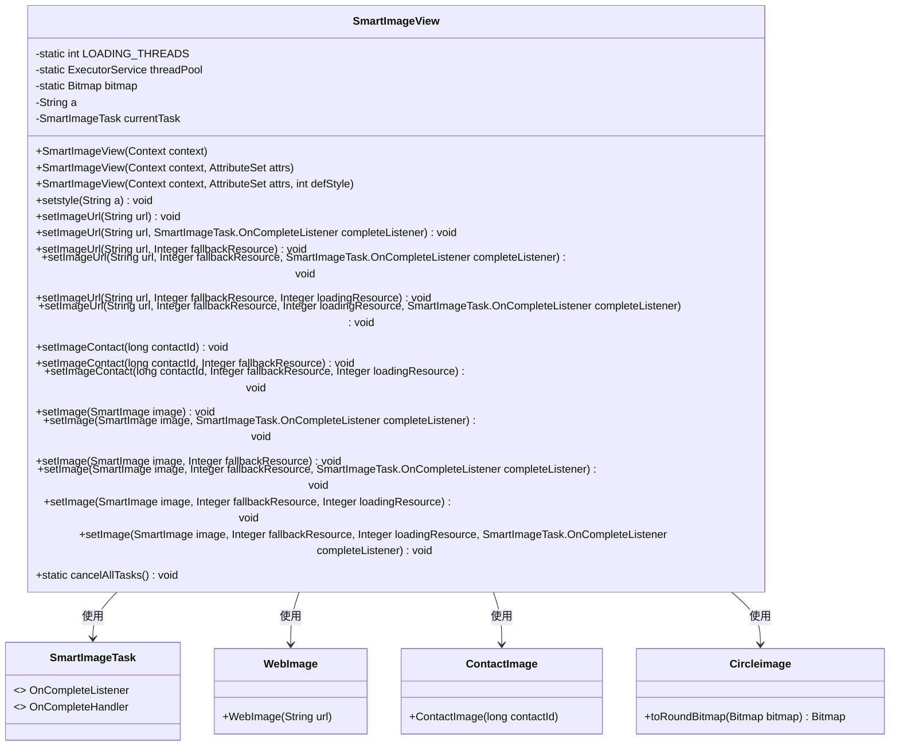
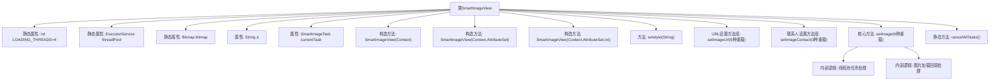

# 基础信息

|      |      |
|------|------|
| 名称 | SmartImageView |
| 编码语言 | .java |
| 代码路径 | happycat/src/image/SmartImageView.java |
| 包名 | None |
| 依赖项 | ['android.content.Context', 'android.graphics.Bitmap', 'android.util.AttributeSet', 'android.widget.ImageView', 'java.util.concurrent.ExecutorService', 'java.util.concurrent.Executors', 'com.happycat.view.Circleimage'] |
| 概述说明 | SmartImageView扩展ImageView，支持多线程加载网络图片，可设置圆形样式、占位图和回调监听，提供取消任务功能。 |

# 说明

SmartImageView是一个继承自ImageView的自定义视图类，主要用于异步加载和显示图像。它支持通过URL或联系人ID加载图像，并提供多种配置选项，如备用资源、加载中资源和完成监听器。类内部使用固定大小的线程池（4个线程）来管理图像加载任务，确保高效处理并发请求。加载过程中可显示占位图，失败时显示备用图。此外，该类支持圆形图像处理功能（通过设置style为"circle"），并允许取消所有正在执行的任务。所有图像加载操作均在后台线程执行，避免阻塞主线程。

# 类列表 Class Summary

| 名称   | 类型  | 说明 |
|-------|------|-------------|
| SmartImageView | class | SmartImageView扩展自ImageView，支持通过URL或联系人ID异步加载图片，提供加载中、失败回退资源及圆形裁剪功能，使用线程池管理任务。 |

## 类 SmartImageView

|      |      |
|------|------|
| 访问范围 | public |
| 类型 | class |
| 名称 | SmartImageView |
| 说明 | SmartImageView扩展自ImageView，支持通过URL或联系人ID异步加载图片，提供加载中、失败回退资源及圆形裁剪功能，使用线程池管理任务。 |

### UML类图

类图描述：SmartImageView是一个继承自ImageView的自定义视图类，主要用于异步加载网络图片或联系人图片，支持多种配置选项如加载中/失败占位图、圆形裁剪等。它通过线程池管理SmartImageTask任务，与WebImage、ContactImage等图片源交互，并使用Circleimage实现圆形效果。类结构体现了职责分离，图片加载逻辑与UI更新通过回调机制解耦。

### 内部方法调用关系图

该流程图展示了SmartImageView类的完整结构，这是一个Android自定义图片加载控件。类包含4个构造方法、1个属性设置方法和3组核心功能方法（URL加载、联系人加载和通用加载），通过线程池实现异步图片加载。特别值得注意的是setImage方法实现了完整的加载流程控制，包括加载中/失败状态处理、圆形图片转换和回调通知机制，最后通过静态方法cancelAllTasks提供全局任务取消功能。

### 字段列表 Field List

| 名称  | 类型  | 说明 |
|-------|-------|------|
| bitmap | Bitmap | 声明一个静态位图变量bitmap。 |
| threadPool = Executors.newFixedThreadPool(LOADING_THREADS) | ExecutorService | 创建固定大小的线程池，线程数量由LOADING_THREADS常量定义。 |
| a=null | String | 声明字符串变量a并初始化为null。 |
| currentTask | SmartImageTask | 当前智能图像处理任务实例。 |
| LOADING_THREADS = 4 | int | 定义了4个线程用于加载任务的静态常量。 |

### 方法列表

| 名称  | 类型  | 说明 |
|-------|-------|------|
| setImageUrl | void | 设置图片URL方法：接收URL、备用资源和完成监听器，调用setImage加载网络图片。 |
| setImage | void | 设置图片方法，接收智能图片、备用资源和加载资源参数，内部调用四参数方法，最后一个参数为null。 |
| setImage | void | 设置图片方法：加载时显示预设图，取消旧任务，创建新任务处理图片，支持圆形裁剪，失败显示备用图，完成后回调监听器。 |
| cancelAllTasks | void | 取消所有任务并重置线程池。先立即关闭现有线程池，再创建新的固定大小线程池。 |
| setImage | void | 设置图片方法，接收SmartImage对象和备用资源ID，调用重载方法处理。 |
| setImageUrl | void | 设置图片URL方法，支持备用资源和加载中资源，可设置完成监听器。 |
| setImageUrl | void | 设置图片URL方法，通过URL创建WebImage对象并赋值。 |
| setstyle | void | 设置字符串样式的方法，将输入参数赋值给成员变量a。 |
| setImage | void | 设置图片方法，接收SmartImage对象、备用资源ID和完成监听器，内部调用重载方法。 |
| setImageUrl | void | 方法setImageUrl接收URL和备用资源参数，调用setImage方法加载网络图片，失败时使用备用资源。 |
| setImage | void | 设置图像方法，接受一个SmartImage对象作为参数，并调用重载方法，其他参数设为null。 |
| setImageContact | void | 方法`setImageContact`设置联系人图像，参数为联系人ID和备用资源ID，调用`setImage`方法处理。 |
| setImage | void | 设置图片方法，接收图片和完成监听器，调用重载方法传入空参数。 |
| setImageUrl | void | 设置图片URL方法：传入URL、备用资源和加载资源参数，调用setImage方法加载网络图片。 |
| setImageUrl | void | 设置图片URL，通过WebImage加载并触发完成监听。 |
| setImageContact | void | 方法setImageContact接收contactId参数，调用setImage方法并传入新建的ContactImage对象，该对象以contactId初始化。 |
| setImageContact | void | 设置联系人图像方法，参数包括联系人ID、备用资源和加载资源，调用setImage方法实现。 |

