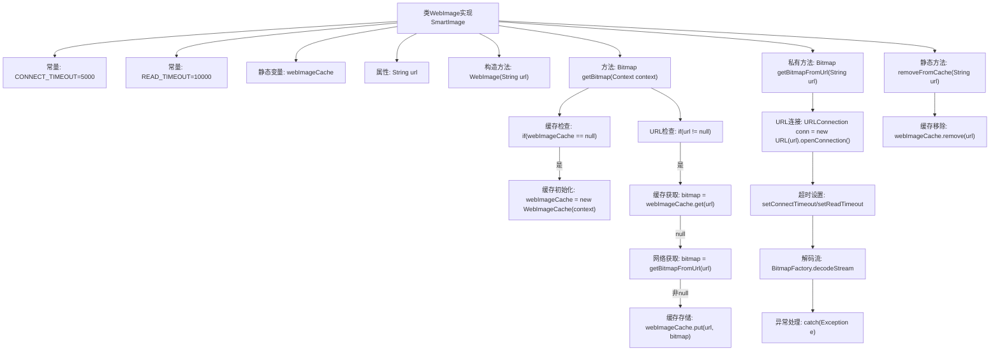

# 基础信息

|      |      |
|------|------|
| 名称 | WebImage |
| 编码语言 | .java |
| 代码路径 | happycat/src/image/WebImage.java |
| 包名 | None |
| 依赖项 | ['java.io.InputStream', 'java.net.URL', 'java.net.URLConnection', 'android.content.Context', 'android.graphics.Bitmap', 'android.graphics.BitmapFactory'] |
| 概述说明 | WebImage类实现SmartImage接口，通过URL获取图片并缓存。支持连接和读取超时设置，优先从缓存获取图片，未命中则下载并缓存。提供清除缓存功能。 |

# 说明

WebImage类实现了SmartImage接口，用于从网络URL加载图片。它包含两个静态超时参数：连接超时5000毫秒和读取超时10000毫秒。使用单例模式的WebImageCache缓存图片数据。构造函数接收URL字符串。getBitmap方法优先从缓存获取图片，若不存在则调用getBitmapFromUrl下载并缓存。下载过程通过URLConnection实现，设置超时后解码为Bitmap。提供removeFromCache方法清除指定URL的缓存。注意避免Context泄漏，延迟初始化缓存实例。

# 类列表 Class Summary

| 名称   | 类型  | 说明 |
|-------|------|-------------|
| WebImage | class | WebImage类实现SmartImage接口，通过URL加载网络图片并缓存。支持连接超时5秒和读取超时10秒设置，优先从缓存获取图片，未命中则下载并缓存。提供清除缓存功能。 |


## 类 WebImage

|      |      |
|------|------|
| 访问范围 | public |
| 类型 | class |
| 名称 | WebImage |
| 说明 | WebImage类实现SmartImage接口，通过URL加载网络图片并缓存。支持连接超时5秒和读取超时10秒设置，优先从缓存获取图片，未命中则下载并缓存。提供清除缓存功能。 |


### UML类图

```mermaid
classDiagram
    class WebImage {
        -static final int CONNECT_TIMEOUT
        -static final int READ_TIMEOUT
        -static WebImageCache webImageCache
        -String url
        +WebImage(String url)
        +Bitmap getBitmap(Context context)
        -Bitmap getBitmapFromUrl(String url)
        +static void removeFromCache(String url)
    }

    <<Interface>> SmartImage
    SmartImage <|-- WebImage

    class WebImageCache {
        +Bitmap get(String key)
        +void put(String key, Bitmap bitmap)
        +void remove(String key)
    }

    WebImage --> WebImageCache : 使用
    WebImage --> URLConnection : 依赖
    WebImage --> BitmapFactory : 依赖
```

这段代码展示了一个实现SmartImage接口的WebImage类，主要用于从网络URL加载图片并缓存。类图清晰地呈现了WebImage与WebImageCache的关联关系，以及WebImage对URLConnection和BitmapFactory的依赖。WebImage通过静态缓存机制优化性能，先检查缓存再决定是否从网络下载，同时提供了超时控制和缓存清理功能。整个设计遵循了避免内存泄漏和网络请求优化的原则。


### 内部方法调用关系图



这段代码实现了一个网络图片加载器，主要功能包括：通过URL异步加载网络图片、使用内存缓存提高性能、设置网络超时参数、异常处理等。流程图展示了完整的图片加载流程，包括缓存检查、网络请求、图片解码和缓存管理四个核心环节，其中缓存机制采用惰性初始化策略，网络请求遵循超时控制原则，整体设计考虑了内存泄漏防护和异常处理。

### 字段列表 Field List

| 名称  | 类型  | 说明 |
|-------|-------|------|
| webImageCache | WebImageCache | 私有静态Web图片缓存实例。 |
| url | String | 私有字符串变量url |
| READ_TIMEOUT = 10000 | int | 定义私有静态常量READ_TIMEOUT，值为10000毫秒。 |
| CONNECT_TIMEOUT = 5000 | int | 定义私有静态常量CONNECT_TIMEOUT，值为5000毫秒，表示连接超时时间。 |

### 方法列表

| 名称  | 类型  | 说明 |
|-------|-------|------|
| getBitmap | Bitmap | 该方法通过缓存机制获取网络图片。若缓存未初始化则创建，优先从缓存读取图片，若不存在则从URL下载并存入缓存，最后返回图片。避免上下文泄漏。 |
| getBitmapFromUrl | Bitmap | 从URL获取Bitmap图像，设置连接和读取超时，异常时返回null。 |
| removeFromCache | void | 该方法用于从缓存中移除指定URL的图片，首先检查缓存是否存在，存在则移除对应URL的条目。 |


