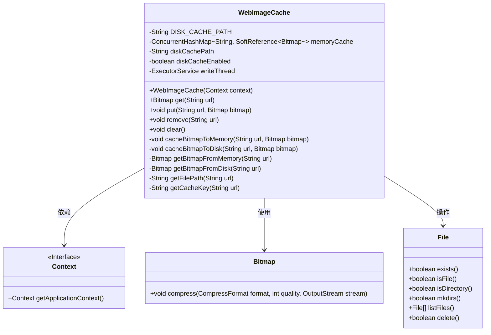
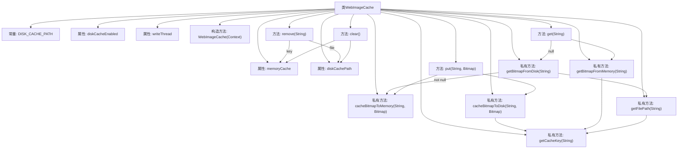
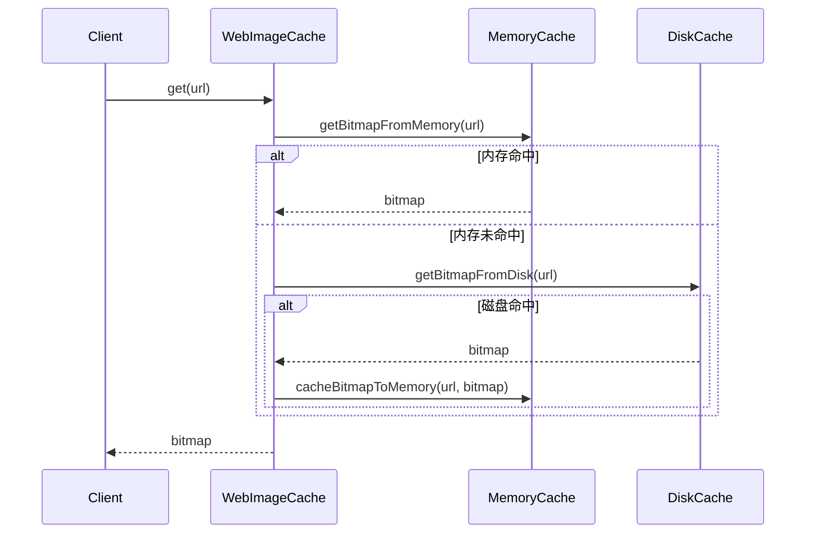

# 基础信息

|      |      |
|------|------|
| 名称 | WebImageCache |
| 编码语言 | .java |
| 代码路径 | happycat/src/image/WebImageCache.java |
| 包名 | None |
| 依赖项 | ['java.io.BufferedOutputStream', 'java.io.File', 'java.io.FileNotFoundException', 'java.io.FileOutputStream', 'java.io.IOException', 'java.lang.ref.SoftReference', 'java.util.concurrent.ConcurrentHashMap', 'java.util.concurrent.ExecutorService', 'java.util.concurrent.Executors', 'android.content.Context', 'android.graphics.Bitmap', 'android.graphics.Bitmap.CompressFormat', 'android.graphics.BitmapFactory'] |
| 概述说明 | WebImageCache类实现图片缓存功能，支持内存和磁盘存储，提供获取、添加、删除和清空缓存方法。内存使用ConcurrentHashMap和软引用，磁盘存储异步写入。 |

# 说明

WebImageCache类实现了一个双层级图片缓存系统，包含内存缓存和磁盘缓存。内存缓存使用ConcurrentHashMap存储SoftReference包装的Bitmap对象，磁盘缓存路径由应用缓存目录和固定路径组成。类提供了get、put、remove和clear等核心方法，支持从内存或磁盘获取图片，以及将图片缓存到内存和磁盘。磁盘写入操作通过单线程池异步执行，确保性能。内存缓存使用软引用避免内存溢出，磁盘缓存通过PNG格式压缩存储。键值处理采用URL特殊字符替换方案确保文件名有效性。

# 类列表 Class Summary

| 名称   | 类型  | 说明 |
|-------|------|-------------|
| WebImageCache | class | WebImageCache类实现图片缓存功能，包含内存和磁盘缓存，支持获取、添加、删除和清空操作。内存使用ConcurrentHashMap存储软引用Bitmap，磁盘缓存通过线程池异步写入。 |

## 类 WebImageCache

|      |      |
|------|------|
| 访问范围 | public |
| 类型 | class |
| 名称 | WebImageCache |
| 说明 | WebImageCache类实现图片缓存功能，包含内存和磁盘缓存，支持获取、添加、删除和清空操作。内存使用ConcurrentHashMap存储软引用Bitmap，磁盘缓存通过线程池异步写入。 |

### UML类图

该类图展示了WebImageCache的双层缓存架构（内存+磁盘）及其核心协作关系。WebImageCache通过ConcurrentHashMap实现内存缓存，使用SoftReference包装Bitmap防止内存泄漏；磁盘缓存通过File类操作实现，采用单线程池异步写入。类包含完整的缓存生命周期管理方法（get/put/remove/clear），通过URL标准化处理确保缓存键唯一性，同时处理了文件操作和线程安全的各类边界情况，如空URL检测、目录存在性校验和IO异常处理等。

### 内部方法调用关系图

该流程图展示了WebImageCache类的完整结构，包含内存缓存(ConcurrentHashMap)和磁盘缓存(文件系统)的双层存储机制。核心方法get()实现了三级缓存策略：先查内存，未命中则查磁盘，命中后回写内存。put()方法同步更新两级缓存，remove()和clear()提供缓存清理能力。私有方法处理缓存键转换和文件路径生成，writeThread确保磁盘写入的异步性。时序图则具体展示了get()方法的调用流程和缓存查询顺序。

### 字段列表 Field List

| 名称  | 类型  | 说明 |
|-------|-------|------|
| diskCachePath | String | 私有字符串变量，用于存储磁盘缓存路径。 |
| writeThread | ExecutorService | 私有线程池服务，用于执行写入任务。 |
| diskCacheEnabled = false | boolean | 私有布尔变量diskCacheEnabled初始值为false，表示磁盘缓存未启用。 |
| memoryCache | ConcurrentHashMap<String, SoftReference<Bitmap>> | 内存缓存使用ConcurrentHashMap存储字符串键和Bitmap软引用，确保线程安全并自动回收内存。 |
| DISK_CACHE_PATH = "/web_image_cache/" | String | 定义静态常量字符串，值为磁盘缓存路径"/web_image_cache/"。 |

### 方法列表

| 名称  | 类型  | 说明 |
|-------|-------|------|
| cacheBitmapToMemory | void | 缓存位图到内存，使用URL生成键，存储为软引用。 |
| put | void | 该方法将位图缓存到内存和磁盘，接收URL作为键、位图作为值。 |
| getBitmapFromMemory | Bitmap | 从内存缓存中获取指定URL对应的Bitmap，若存在则返回，否则返回null。 |
| cacheBitmapToDisk | void | 该方法将位图异步缓存到磁盘，使用后台线程写入PNG文件，路径由URL生成，启用缓存时执行，确保流关闭。 |
| getBitmapFromDisk | Bitmap | 从磁盘缓存获取位图：检查缓存启用后，通过URL生成文件路径，若文件存在则解码为位图并返回。 |
| clear | void | 清除内存和文件缓存：清空内存缓存，删除磁盘缓存目录下的所有文件。 |
| get | Bitmap | 该方法通过内存和磁盘缓存获取图片，若磁盘存在则回写内存，最终返回位图。 |
| remove | void | 该方法用于移除指定URL的缓存，包括内存和文件缓存。若URL为空则直接返回。先移除内存缓存，再检查并删除对应的磁盘缓存文件。 |
| getCacheKey | String | 生成缓存键方法：若URL为空则抛异常，否则替换特殊字符为+并合并连续+。 |
| getFilePath | String | 方法根据URL生成文件路径，拼接磁盘缓存路径和URL的缓存键。 |

